# Computational Light Laboratory bridges student potential into scientific success across 2026 with global academic and industrial partners

_Written by [Kaan Akşit](https://kaanaksit.com), 15 December 2026_

## A year at a glance: 2026

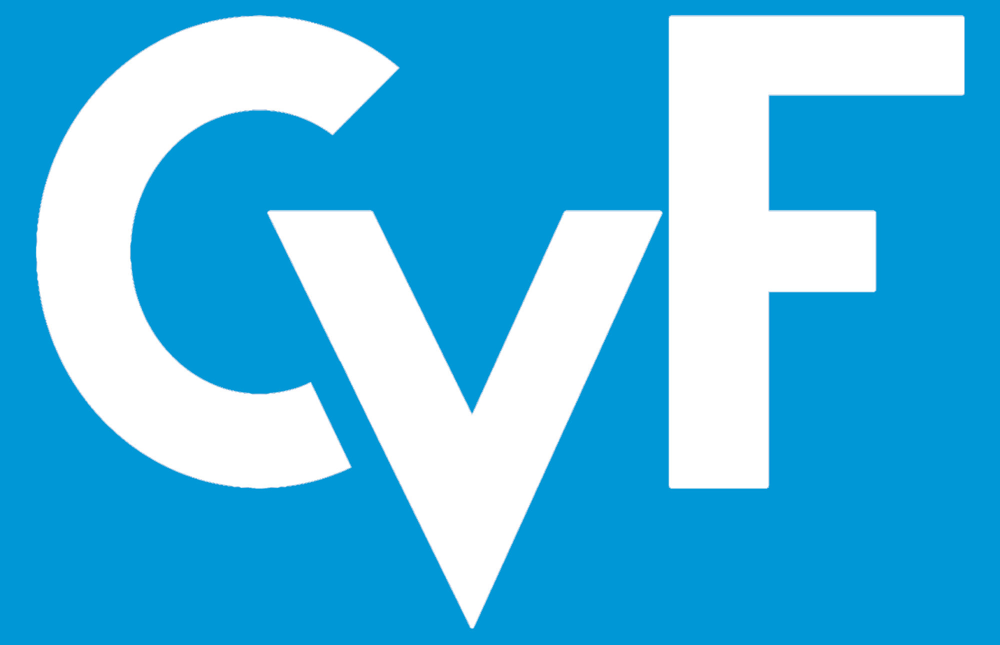
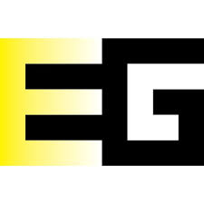
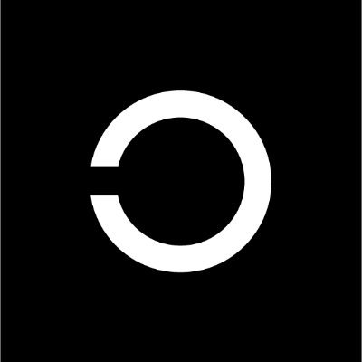
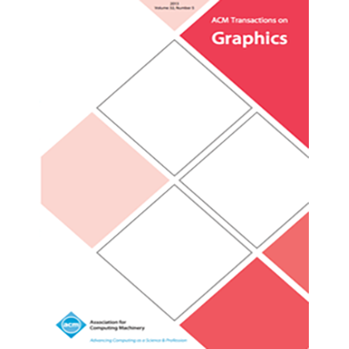
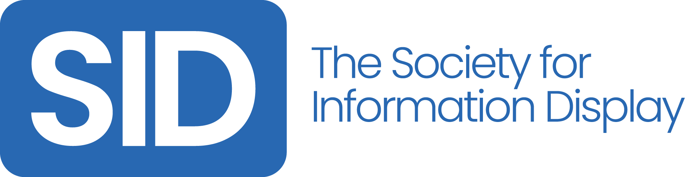

[**Computational Light Laboratory**](https://complightlab.com) continues its journey under the leadership of [Kaan Akşit](https://kaanaksit.com).
Our students and interns carried ambitious ideas into high-impact publications at leading venues, including ACM SIGGRAPH 2026, ACM Transactions on Graphics, the European Conference on Computer Vision (ECCV 2026), Eurographics 2026, and the Conference on Computer Vision and Pattern Recognition (CVPR) 2026.
This work advanced the frontiers of computational displays, perceptual graphics, and deep learning for imaging.
Kaan also represents the laboratory on the wider stage, with an invited talk at the Society of Information Display Display Week 2026 and an article for Optica.

This document introduces a selection of our 2026 work and the people behind it.
Our stories are not limited to those reported here, and many more remain in the works.
For a complete list of our publications, visit [the publications page of Kaan](https://www.kaanaksit.com/publications/).

## Yicheng Zhan
[**Yicheng Zhan**](https://albertgary.github.io/) is a Ph.D. student in the Computational Light Laboratory at the University College London.
In 2026, Yicheng delivered a first-author complex-valued holography result at ECCV 2026, and a complex-valued holographic radiance field in ACM Transactions on Graphics that was presented at the SIGGRAPH 2026.
He also completed his final viva voce examination, and he spent part of the year as a research intern at Meta.

### Complex-Valued 2D Gaussian Representation for Computer-Generated Holography
!!! example end "[**Complex-Valued 2D Gaussian Representation for Computer-Generated Holography**](../publications/complex_valued_2d_gaussians.md)"
    Presented by [Yicheng Zhan](https://albertgary.github.io/), [Xiangjun Gao](https://gaoxiangjun.github.io/), [Long Quan](https://home.cse.ust.hk/~quan/), and [Kaan Akşit](https://kaanaksit.com).

    Presented at ECCV 2026 in Malmö, Sweden, on 8 to 12 September 2026.

<figure markdown>
  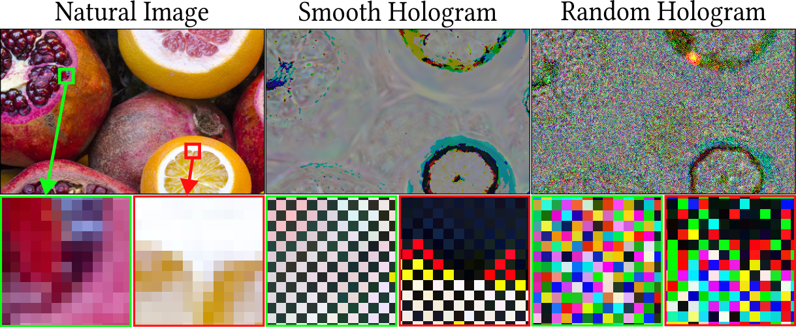{ width="700" }
  <figcaption>Our method assembles a hologram from complex-valued 2D Gaussians, an atom of light that reaches the Gabor limit on joint space-frequency concentration.</figcaption>
</figure>

Holograms are hard to represent, because every pixel carries wave information, and the patterns look like noise.
Yicheng asks whether a hologram can be assembled from a few well-chosen building blocks, and answers with the complex-valued 2D Gaussian, a primitive that packs the most information into the least space and frequency.
Optimizing a hologram as a cloud of these primitives shrinks the parameter search space by 5 to 1.
A differentiable rasterizer and a GPU-optimized propagation kernel cut VRAM usage by 30% and optimization time by 50%.
The result is up to 13 dB higher PSNR than prior Gaussian-based methods, and up to 3200x faster rendering, while matching the quality of state-of-the-art computer-generated holography.
For more technical details, including the manuscript, arXiv preprint, and code, visit the [project website](../publications/complex_valued_2d_gaussians.md).

### Complex-Valued Holographic Radiance Fields
!!! example end "[**Complex-Valued Holographic Radiance Fields**](../publications/complex_valued_holographic_radiance_fields.md)"
    Presented by [Yicheng Zhan](https://albertgary.github.io/), [Dong-Ha Shin](https://dhsh.in/), [Seung-Hwan Baek](https://www.shbaek.com/), and [Kaan Akşit](https://kaanaksit.com).

    Published in ACM Transactions on Graphics and presented at ACM SIGGRAPH 2026 in Los Angeles, United States of America, on 19 to 23 July 2026.

<figure markdown>
  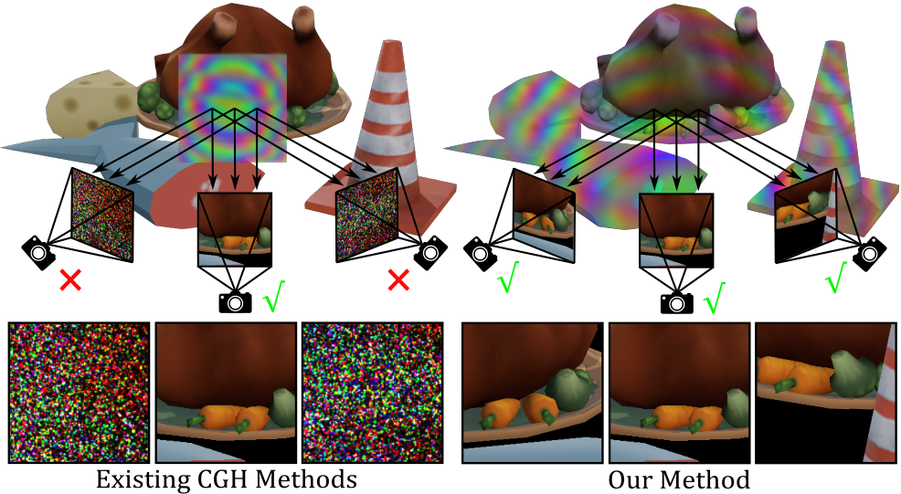{ width="900" }
  <figcaption>Our method unifies complex-valued Gaussians and holographic rendering in a single scene representation.</figcaption>
</figure>

Yicheng and his coauthors propose complex-valued holographic radiance fields, a method that optimizes scenes without relying on intensity-based intermediaries.
Their work treats amplitude and phase as intrinsic scene properties, which removes the need for expensive per-view holographic rendering.
The approach accelerates holographic rendering by 30x to 10,000x, while maintaining image quality on par with state-of-the-art methods.
The result is a promising step toward bridging the wave properties of light with the 3D geometry of scenes.
For more technical details, including the manuscript, supplementary materials, and code, visit the [project website](../publications/complex_valued_holographic_radiance_fields.md).

## Runze (Aiden) Cheng
[**Runze (Aiden) Cheng**](https://aidcheng.github.io/) is a Master's student at the University of Cambridge and a collaborator in our laboratory.
In 2026, Aiden led the design of a clustered codebook scheme for compressing 2D Gaussian image representations, and his work was presented at ACM SIGGRAPH 2026.

### Clustered Codebook Quantization for 2D Gaussian-based Image Compression
!!! example end "[**Clustered Codebook Quantization for 2D Gaussian-based Image Compression**](../publications/clustercodebook2DGS.md)"
    Presented by [Runze (Aiden) Cheng](https://aidcheng.github.io/), [Yicheng Zhan](https://albertgary.github.io/), [Josef Spjut](https://josef.spjut.me/), and [Kaan Akşit](https://kaanaksit.com).

    Presented under the poster program at ACM SIGGRAPH 2026 in Los Angeles, United States of America, on 19 to 23 July 2026.

    **Invited** to the Technical Paper Talk Panel.

<figure markdown>
  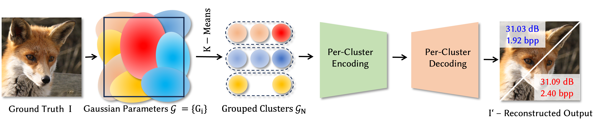{ width="900" }
  <figcaption>Our method partitions Gaussian primitives into homogeneous groups before quantization to improve rate-distortion efficiency.</figcaption>
</figure>

Gaussian-based image representations model content with compact parametric primitives, yet storing many floating-point attributes per primitive degrades rate-distortion efficiency.
Their key idea is to cluster Gaussian primitives into homogeneous groups before codebook training, so that each codebook models a narrower parameter distribution.
Their extensive experiments show that the method decreases bits per pixel by 20% compared with the baseline, while maintaining visual quality on par.
Following the poster, Aiden was invited to the Technical Paper Talk Panel at the same conference.
Aiden will continue his academic journey at the University of Cambridge, where he plans to work under the guidance of [Rafał Mantiuk](https://www.cl.cam.ac.uk/~rkm38/).
For more technical details, including the manuscript, poster, and code, visit the [project website](../publications/clustercodebook2DGS.md).

## Xiaoyue (Merry) Fan
[**Xiaoyue (Merry) Fan**](https://merryxyfan.github.io/) is a Master's student at the University College London and a collaborator in our laboratory.
In 2026, Merry built a double-phase hologram compression method on 2D Gaussians, and the work was accepted to Eurographics 2026.

### Compressing Double Phase Holograms using 2D Gaussians
!!! example end "[**Compressing Double Phase Holograms using 2D Gaussians**](../publications/compressing_double_phase_gs.md)"
    Presented by [Xiaoyue (Merry) Fan](https://merryxyfan.github.io/), [Yicheng Zhan](https://albertgary.github.io/), [Amrita Mazumdar](https://amritamaz.net/), and [Kaan Akşit](https://kaanaksit.com).

    Accepted to the poster program at Eurographics 2026, to be presented in Aachen, Germany.

<figure markdown>
  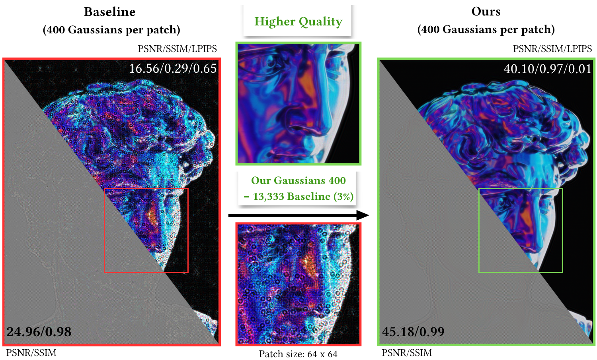{ width="900" }
  <figcaption>Our method decomposes double-phase holograms into two components and compresses each with a reduced set of 2D Gaussians.</figcaption>
</figure>

Double-phase holograms carry dense high-frequency patterns, and effective compression of them remains an open problem for practical holographic displays.
Merry decomposes phase-only holograms into two components based on their intrinsic checkerboard pattern, and optimizes each component with a reduced set of 2D Gaussians.
In the best case, their approach reduces the number of primitives to 3% of the baseline, achieving a 26% compression ratio, while preserving a mean PSNR of 43.39 dB in the reconstructed scenes.
For more technical details, including the manuscript, poster, and code, visit the [project website](../publications/compressing_double_phase_gs.md).

## Jihao (Geo) Gu
[**Jihao (Geo) Gu**](https://momiji-bit.github.io/) is a collaborator in the Computational Light Laboratory.
In 2026, Jihao proposed a text-guided framework for understanding subtle video anomalies, and the work received an honorable mention award at a CVPR 2026 workshop.

### Text-guided Fine-Grained Video Anomaly Understanding
!!! example end "[**Text-guided Fine-Grained Video Anomaly Understanding**](../publications/text_guided_video_anomaly_understanding.md)"
    Presented by [Jihao (Geo) Gu](https://momiji-bit.github.io/), [Kun Li](https://scholar.google.com/citations?user=UQ_bInoAAAAJ), [He Wang](https://drhewang.com/), and [Kaan Akşit](https://kaanaksit.com).

    Presented at the Second Workshop on Subtle Visual Computing at CVPR 2026 in Denver, Colorado, United States of America, in June 2026.

    **Honorable Mention Award** at the same workshop.

<figure markdown>
  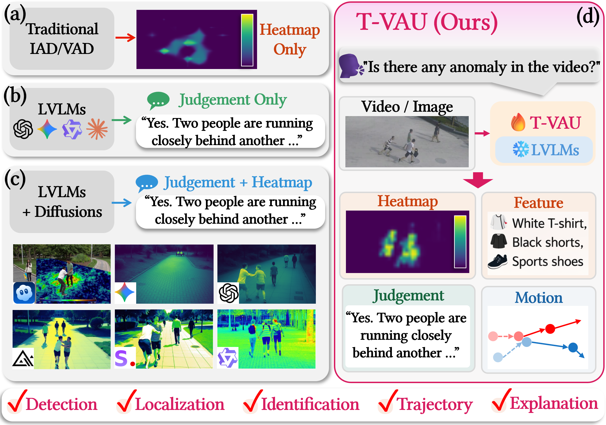{ width="900" }
  <figcaption>Our framework grounds subtle anomaly evidence into multimodal reasoning with pixel-level spatio-temporal heatmaps.</figcaption>
</figure>

Subtle abnormal events in video often appear as weak spatio-temporal cues that conventional detectors overlook.
Jihao and the team couple an Anomaly Heatmap Decoder with a Region-aware Anomaly Encoder, so that a large vision-language model can detect, localize, and explain anomalies in a single reasoning pipeline.
Their target-level fine-grained dataset provides aligned annotations of appearance, spatial localization, and motion trajectory.
Their experiments show consistent gains in anomaly localization and textual reasoning on both evaluated benchmarks.
For more technical details, including the manuscript, code, and dataset, visit the [project website](../publications/text_guided_video_anomaly_understanding.md).

## Tianwen Zhou
[**Tianwen Zhou**](https://zhoutianwen.com/) is a collaborator in the Computational Light Laboratory.
In 2026, Tianwen built a learned framework for editing physiological signals in video while preserving visual fidelity, and the work was presented at a CVPR 2026 workshop.

### Editing Physiological Signals in Videos Using Latent Representations
!!! example end "[**Editing Physiological Signals in Videos Using Latent Representations**](../publications/physiolatent.md)"
    Presented by [Tianwen Zhou](https://zhoutianwen.com/), [Akshay Paruchuri](https://akshayparuchuri.com/), [Josef Spjut](https://josef.spjut.me/), and [Kaan Akşit](https://kaanaksit.com).

    Presented at the Second Workshop on Subtle Visual Computing at CVPR 2026 in Denver, Colorado, United States of America, in June 2026.

<figure markdown>
  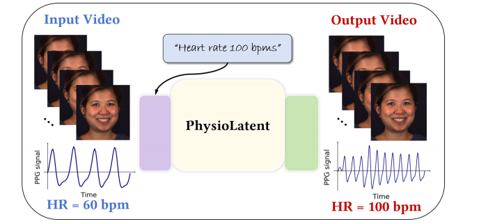{ width="900" }
  <figcaption>Our framework edits remote photoplethysmography signals in the latent space of a pretrained video model.</figcaption>
</figure>

Camera-based heart-rate estimation is convenient, yet it can leak sensitive health and emotional state from facial video.
Tianwen and the team edit these physiological signals by fusing a target heart-rate prompt with a video latent built by a pretrained 3D Variational Autoencoder.
Temporal self-attention with Adaptive Layer Normalization models the strong temporal coherence of the signals, and Feature-wise Linear Modulation in the decoder preserves subtle physiological variations.
Across benchmark datasets, their approach maintains a mean PSNR of 38.96 dB and an SSIM of 0.98, with a mean heart-rate modulation error of 10.00 bpm.
For more technical details, including the manuscript, arXiv preprint, and code, visit the [project website](../publications/physiolatent.md).

## Maha Sahloul
[**Maha Sahloul**](http://linkedin.com/in/maha-sahloul-52501422b) is a Master's student at Medipol University and a collaborator in our laboratory.
In 2026, Maha introduced an all-optical scheme for selective target highlighting in augmented reality microscopy, and the work was selected as the cover of an Optica journal issue.

### All-optical selective target highlighting for augmented reality microscopy
!!! example end "[**All-optical selective target highlighting for augmented reality microscopy**](https://opg.optica.org/optcon/abstract.cfm?URI=optcon-5-8-2708)"
    Authored by [Maha Sahloul](http://linkedin.com/in/maha-sahloul-52501422b), [Kaan Akşit](https://kaanaksit.com), and [M. Fatih Toy](https://biocil.github.io/).

    Published in Optics Continuum, Volume 5, Issue 8, in August 2026, and selected as the cover of that issue.

<figure markdown>
  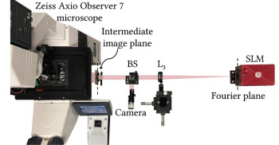{ width="900" }
  <figcaption>Our all-optical phase optimization selectively enhances a target class on a spatial light modulator without per-frame computation.</figcaption>
</figure>

Augmented reality microscopes overlay virtual information on captured images, but the usual approach requires continuous scene analysis and heavy computation.
Maha and the team introduce an all-optical alternative with a precomputed library of phase maps, where each phase map enhances a specific shape or size class.
Leveraging the shift-invariant property of Fourier optical systems, their masks keep a target object highlighted through in-plane translation, without an explicit tracking algorithm.
The result enables continuous real-time observation based on object size or shape.
For the full article, visit the [publisher site](https://opg.optica.org/optcon/abstract.cfm?URI=optcon-5-8-2708).

## Kaan Akşit
In 2026, [**Kaan Akşit**](https://kaanaksit.com) represented the laboratory on the wider stage.
Kaan also continues to serve as an Associate Editor for ACM Transactions on Graphics, and as a chair for the Optica Intelligent Interfaces and Display Technology group.
Our doctoral students continued to advance their research, and [Ziyang Chen](https://ziyang.space/) also completed his viva voce examination during the year.

### Invited talk at the Society of Information Display Display Week 2026
Kaan presented an invited talk titled **AI-Driven Optics, Catalyst of Future Computing, Imaging and Display Technology** at [Display Week 2026](https://www.displayweek.org/).
The talk surveys how learned methods shape the next generation of imaging and display systems, from holographic rendering to perceptually guided graphics.

### An article for Optica
Kaan also contributes an article for Optica on the role of learned methods in computational displays, computational imaging, and perceptual graphics.
This work reflects our long-term commitment to understanding how humans perceive light, and how we can build displays and cameras with that understanding in mind.

## Alumni
Several of our students and interns completed their studies with us in 2026, and moved to new academic and professional opportunities.
We are grateful for the effort they put in, and we wish them the best in their next chapters.

- [Efe Tekin](https://www.servetefetekin.com/) worked on agentic adaptive difficulty adjustment in auto-shooter games, and he will begin a Master of Science at Imperial College London.
- [Joshua Soh](https://www.linkedin.com/in/joshua-soh-4a507533b/) worked on low-level image processing using agentic image editing workflows, and he will begin a Master of Science at Imperial College London.

## Visits
A team of researchers from the Jena based research center of Huawei visited the Computational Light Laboratory on 17 September 2026.
They discussed potential routes to collaborate on computational displays, computational imaging, and related systems.

### Huawei Jena research center
[**Huawei Research Center Germany and Austria**](https://huaweiresearchcentergermanyaustria.teamtailor.com/)

<figure markdown>
  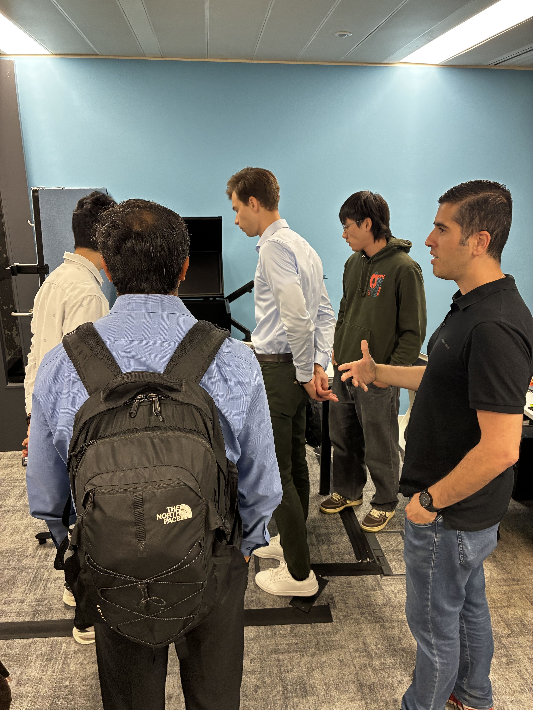{ width="400", align=left }
  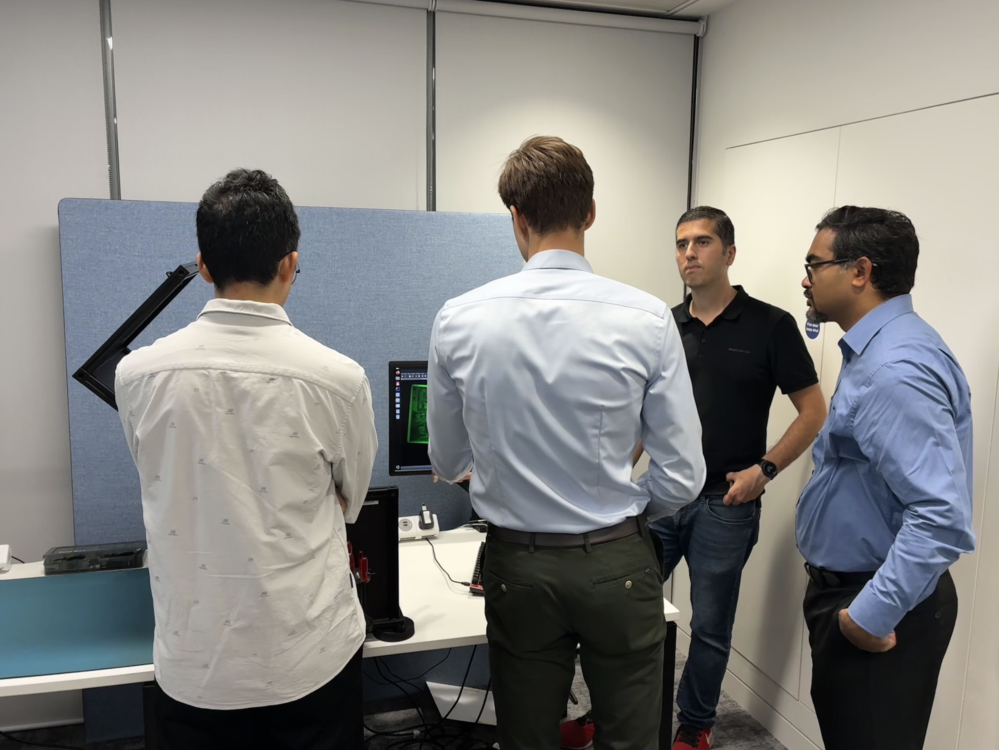{ width="400", align=left }
</figure>

### Professor Hakan Urey of Koç University
[**Hakan Urey**](https://mems.ku.edu.tr/hurey/) of [Koç University](https://ku.edu.tr) visited the Computational Light Laboratory on 21 September 2026.
Professor Urey is the co-supervisor of [Zicong Peng](https://scholar.google.com/citations?user=lpi8DvIAAAAJ&hl=zh-CN), our doctoral student at Koç University, and a long-term collaborator on holographic displays and computer-generated holography.

<figure markdown>
  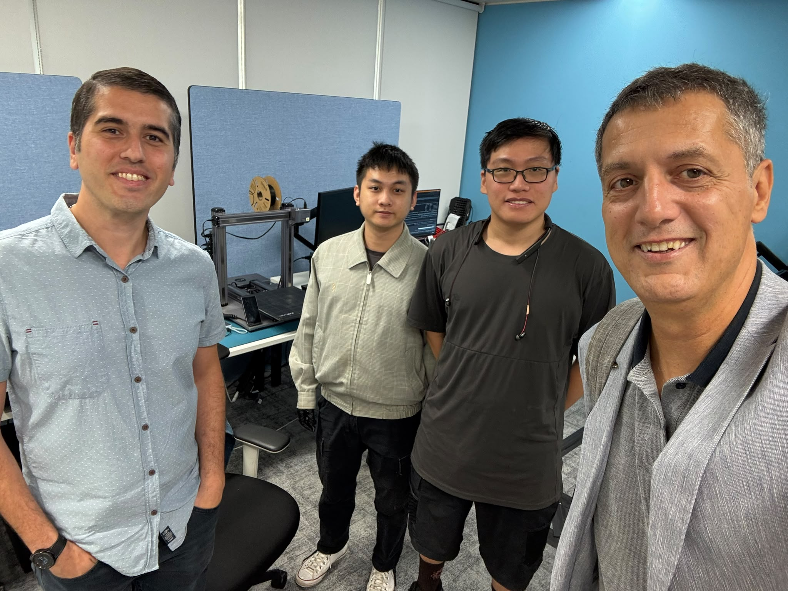{ width="400", align=left }
  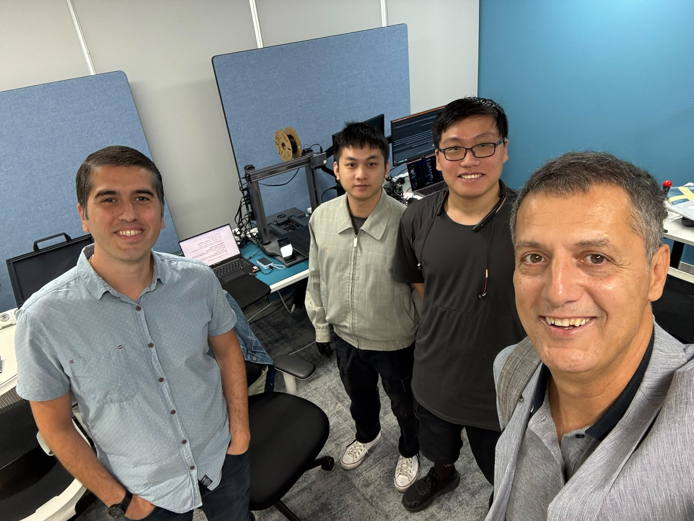{ width="400", align=left }
</figure>

### MSc viva presentations at UCL
On 9 September 2026, three of our students from the [MSc Scientific and Data Intensive Computing](https://www.ucl.ac.uk/study/prospective-students/graduate/courses/scientific-and-data-intensive-computing-msc) program at the University College London presented their master theses, supervised by [Kaan Akşit](https://kaanaksit.com).

Yuchen Xiang presented her thesis titled **A Three-Stage Large Language Model Framework for Student-Supervisor Matching**.

<figure markdown>
  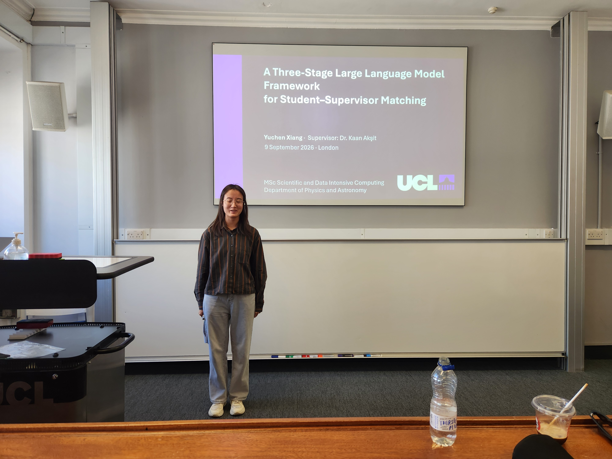{ width="600" }
</figure>

Qian Liu presented his thesis titled **Personalized Eyewear Fitting Guided by Photogrammetry and Facial Landmarks**.

<figure markdown>
  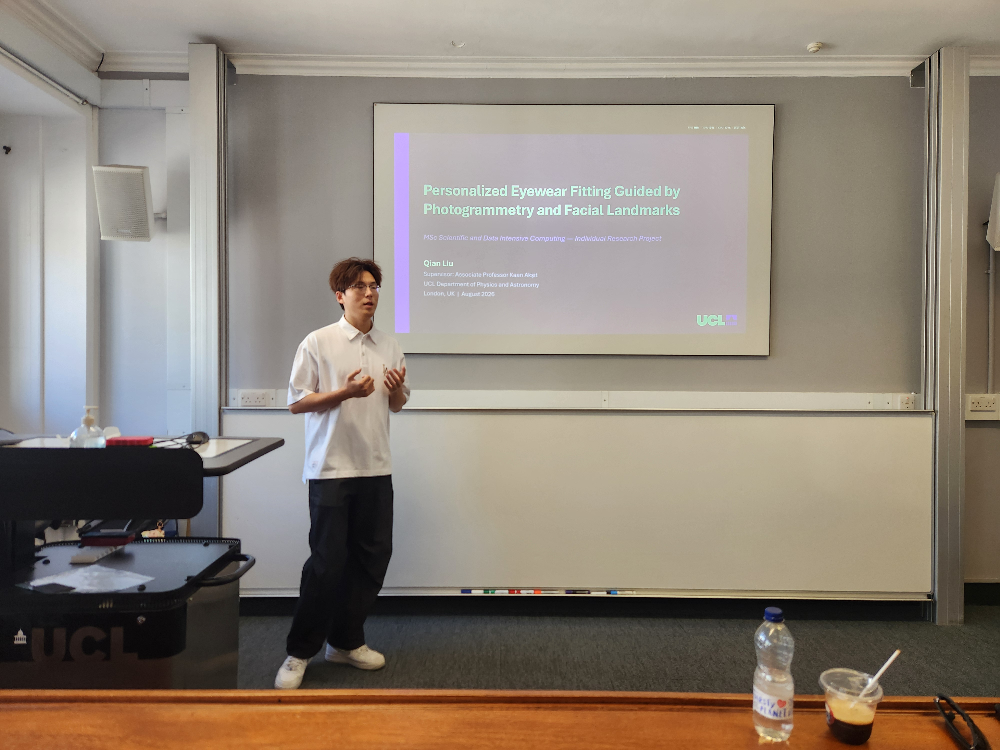{ width="600" }
</figure>

Ziang Shi presented his thesis on **gameplay-native signals for AI-enabled player modelling**, covering keyboard and mouse actions, gameplay video, and game-state telemetry.

<figure markdown>
  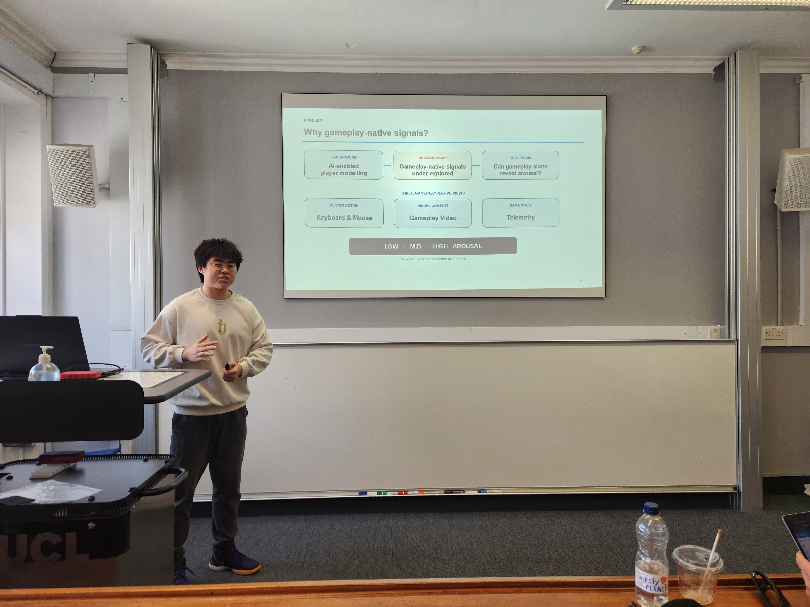{ width="600" }
</figure>

Group photographs from the viva day.

<figure markdown>
  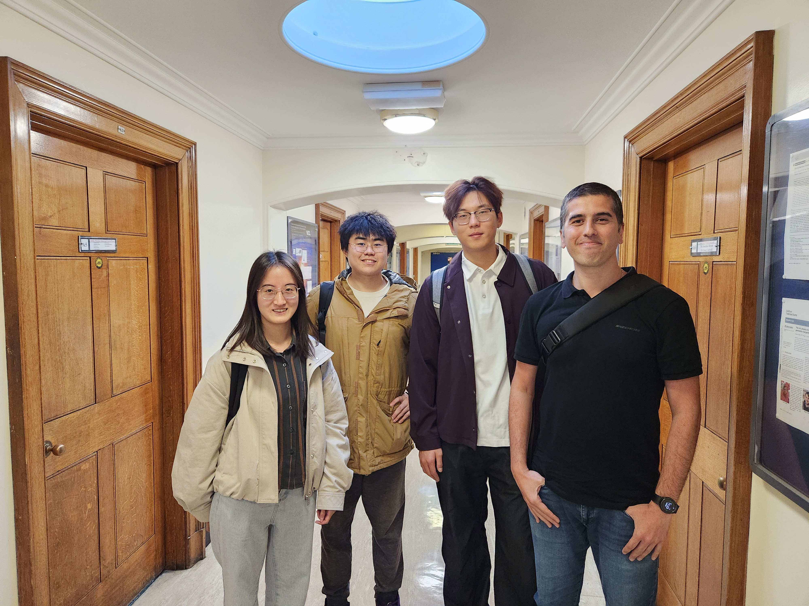{ width="400", align=left }
  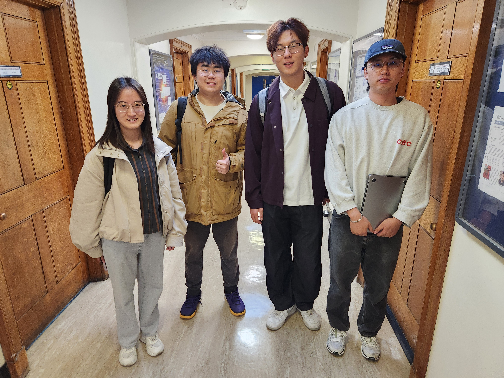{ width="400", align=left }
  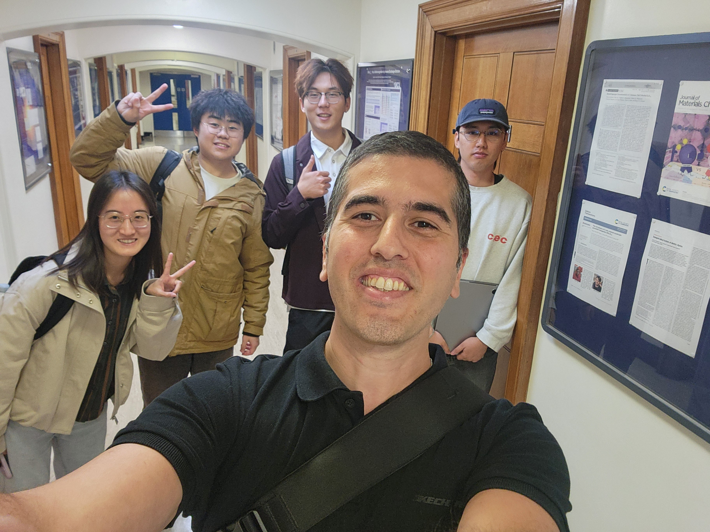{ width="400", align=left }
</figure>

## In progress
The following 2026 results are still being finalized, and their full details, including titles, coauthors, and project pages, will be added to this document as soon as they are available.

* [Xiaoyue (Merry) Fan](https://merryxyfan.github.io/) with a technical communications paper at ACM SIGGRAPH Asia 2026.
* [Tong Wu](https://tongwu-research.github.io/) with a technical communications paper at ACM SIGGRAPH Asia 2026.
* Haolong with a technical communications paper at ACM SIGGRAPH Asia 2026.
* [Xinyao Zhuang](https://www.linkedin.com/in/xinyao-zhuang-silvianz/) with a poster at ACM SIGGRAPH Asia 2026.

## Outreach
We host a Slack group with more than 250 members.
This Slack group focuses on the topics of rendering, perception, displays and cameras.
The group is open to the public, and you can become a member by following [this link](../outreach/index.md).

## Contact Us
!!! Warning
    Please reach us through [email](mailto:kaanaksit@kaanaksit.com) to provide your feedback and comments.
