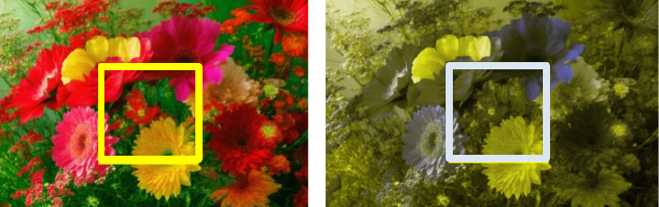

# They Still See Color

_Written by the [Optica Intelligent Interfaces and Display Technology Group](https://www.optica.org/get_involved/technical_groups/iapd/display_technology_(it)/) committee: [**Kai-Han Chang**](https://scholar.google.com/citations?user=qaKcyrYAAAAJ&hl=en), [**Andrzej Kaczorowski**](https://www.drandrzejka.com/), [**Yuge (Esther) Huang**](https://www.linkedin.com/in/yuge-esther-huang-730740124/) and [**Kaan Akşit**](https://kaanaksit.com), 25 September 2026_

## Color Blindness?

The everyday term color blindness implies that a person sees no color at all.
That implication is almost never correct.
The accurate term is Color Vision Deficiency, abbreviated CVD, and most people with it see color.
They simply cannot reliably tell certain hues apart from one another.
This is not a niche concern.
The standard model for simulating the condition estimates that it affects approximately 200 million people worldwide [^@machado2009_cvd_simulation].
Within that population, a commonly cited figure is that about 8 percent of men and 0.5 percent of women of Northern European descent are affected.

## What is affected?
Human color vision is trichromatic, built from three classes of cone photoreceptors sensitive to long, medium, and short wavelengths.
CVD most often reduces the long and medium classes, because their absorption curves overlap so strongly that red and green discrimination is the most fragile.
Because the genes encoding the long and medium cones sit on the X chromosome, the condition appears far more often in men.
It is a spectrum, not a switch.
Some people are dichromats, with one cone class missing.
Far more are anomalous trichromats, with one cone class present but shifted.
Seeing essentially no color at all, achromatopsia, is rare.

## How is CVD diagnosed?
A well-known screening tool is the Ishihara Test, developed in 1917 and still widely used today.
Each plate shows a circular field of dots of varying sizes. A figure formed by the dots, separates from the background by hue, while brightness stays roughly constant, a design called pseudoisochromatic.
A viewer with normal color vision can naturally read an embedded number, while a viewer with color deficiency will misread it or see no figure at all.
The test also depends on faithful color reproduction, since a poorly calibrated screen or printer can undo the pseudoisochromatic effect the plates rely on.

## What does it look like?
The two panels below show the same image under normal vision and under a protanopia simulation.
Vivid, saturated blooms collapse into a muted, low-contrast image, and hues that were distinct become undifferentiated.
This is the practical consequence that matters for design.
The color contrast and hue differentiation that a typical viewer can rely on are simply not present for a person with CVD.

## Designing for everyone
Three practical consequences follow, and each has a way to check it.

- Do not rely on color alone. Add a second channel, such as a label, an icon, a pattern, or a shape, so that the information survives when hue differentiation is lost.
- Hold enough contrast. Choose separations in lightness and saturation that persist under CVD simulation, rather than assuming that a red and a green will read apart. This is consistent with accessibility contrast guidance.
- Verify computationally. Simulate protanopia and deuteranopia using standard physiological models [^@machado2009_cvd_simulation], color metric approaches [^@abasi2020_colour_edge_metrics], or libraries such as DaltonLens [^@burrus2021_daltonlens] and Colour [^@colourdevelopers2025_colour_science], and check that the signal survives under the simulation.

Our own recent work takes that verification a step further. It quantifies how much local structure and color survive in images generated by generative image models, and it finds that prompting a model to be accessible does not reliably make its output accessible [^@zhuang2026_color_accessibility_diffusion].
That result supports the central advice of this note, namely that accessibility should be checked rather than assumed.

## Take aways
Color blindness is better described as Color Vision Deficiency, a deficiency rather than an absence, and a spectrum rather than a binary.
It affects a large share of the audiences that any display reaches, and it imposes a real, measurable constraint on design, on displays, and on generated imagery.
