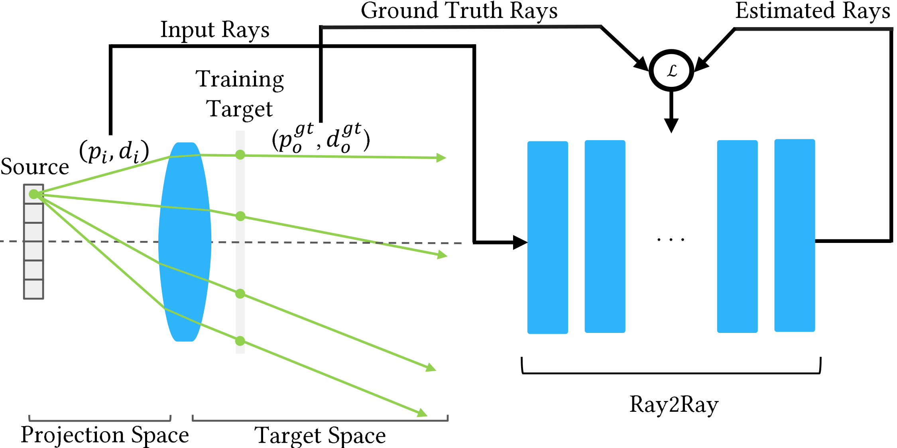

# A year at a glance: Computational Light Laboratory bridges student potential into scientific success with industrial partners

_Written by [**Kaan Akşit**](https://kaanaksit.com), 1 December 2025_

## Learned Display Radiance Fields with Lensless Cameras
!!! example end "[**Learned Display Radiance Fields with Lensless Cameras**](../publications/lensless_display_radiance_field.md)"
    **Presented by:** [**Ziyang Chen**](https://ziyang.space/), [Yuta Itoh](https://augvislab.github.io/people/yuta-itoh) and [Kaan Akşit](https://kaanaksit.com)

    **Location:** Hong Kong, China

    **Time:** 08:00 am - 06:00 pm, 15-18 December 2025

    **Session:** [**Technical Communications Track**](https://asia.siggraph.org/2025/program/posters/)

[Ziyang Chen](https://ziyang.space/), a second-year Ph.D. student in the Computational Light Laboratory, is making significant strides in the fields of **computational imaging**, **computational displays** and **deep learning**.
Ziyang's innovative research on “Learned Display Radiance Fields with Lensless Cameras” has been accepted as a technical communications paper at the prestigious **ACM SIGGRAPH Asia 2025**, the premier conference for computer graphics and interactive techniques.

<figure markdown>
  { width="900" }
  <figcaption>our work co-designs a lensless camera and an Implicit Neural Representation based algorithm for capturing display characteristics from various viewpoints.</figcaption>
</figure>

Ziyang's work represents a cutting-edge approach to integrating lensless cameras with advanced radiance field techniques to build a new easy-to-use display calibration tool, pushing the boundaries of how we capture and render visual information from a traditional or an immersive display. 
Ziyang’s dedication to his research is further evidenced by his proactive planning to present his findings in Hong Kong of China, where Ziyang will also engage with leading experts and expand his professional network.
Beyond the conference, Ziyang Chen will also visit our close collaborator [**Dr. Yuta Itoh**](https://augvislab.github.io/people/yuta-itoh) of [**Institute of Science Tokyo**](https://www.isct.ac.jp) in Tokyo to foster international collaborative research visits, underscores his potential as a future leader in computational imaging and interactive technologies.

## Foveation Improves Payload Capacity in Steganography
!!! example end "[**Foveation Improves Payload Capacity in Steganography**](../publications/foveated_steganography.md)"
    **Presented by:** [**Lifeng Qiu Lin**](https://github.com/Gnefil), [**Henry Kam**](http://gulpinhenry.github.io/), [Qi Sun](http://qisun.me/) and [Kaan Akşit](https://kaanaksit.com)

    **Location:** Hong Kong, China

    **Time:** 08:00 am - 06:00 pm, 15-18 December 2025

    **Session:** [**Poster Track**](https://asia.siggraph.org/2025/program/posters/)

[Lifeng Qiu Lin](https://github.com/Gnefil) and [Henry Kam](http://gulpinhenry.github.io/) exemplify the power of international collaboration and innovative research in perceptual graphics and steganography.
Henry, who joined our Computational Light Laboratory as a remote intern in February 2024, focused on leveraging **human visual perception** to increase the capacity for imperceptibly hiding information in images, a breakthrough with applications in digital watermarking and immersive technologies.
Meanwhile, Lifeng, a Master’s student in Artificial Intelligence at University College London, developed a method to increase data storage in images by up to five times, building on insights from the human visual system and Henry's earlier findings in the context of Lifeng's master thesis.
Their collaboration culminated in a novel, learned approach using variational autoencoders  to embed additional data in images by exploiting peripheral vision degradation.

<figure markdown>
  { width="900" }
  <figcaption>With support of efficient latent representations and foveated rendering, we trained models that improve existing capacity limits from 100 to 500 bits.</figcaption>
</figure>

This joint work was accepted as a poster, “Foveation Improves Payload Capacity in Steganography,” at **ACM SIGGRAPH Asia 2025**, the premier venue for computer graphics and interactive technologies.
Beyond research, both Henry and Lifeng demonstrated exceptional collaborative and teaching skills, organizing regular meetings, sharing knowledge with the broader lab, and contributing to educational resources on human visual perception.
Their success from independent research to high-impact publication showcases the transformative potential of curiosity, teamwork, and perseverance in academic and professional growth.
Lifeng Qiu Lin continues his academic journey as a visiting student at the prestigious [**Tsinghua University**](https://www.tsinghua.edu.cn) under the supervision of [**Dr. Xiaolin Hu**](https://www.xlhu.cn/), while Henry Kam is finalizing his master studies under the supervision [**Dr. Qi Sun**](http://qisun.me/) at [**New York University**](https://nyu.edu).

## Learned Single-Pass Multitasking Perceptual Graphics for Immersive Displays
!!! example end "[**Learned Single-Pass Multitasking Perceptual Graphics for Immersive Displays**](../publications/multitasking_perceptual_graphics.md)"
    **Presented by:** [**Doğa Yılmaz**](https://yilmazdoga.net/), [He Wang](https://drhewang.com/), [Towaki Takikawa](https://tovacinni.github.io/), [Duygu Ceylan](https://www.duygu-ceylan.com/) and [Kaan Akşit](https://kaanaksit.com)

    **Location:** Dublin, Ireland

    **Time:** 4:30 pm - 6:00 pm, 31 October 2025

    **Session:** [**Regular Papers**](https://acmmm2025.org/accepted-regular-papers/)

[Doğa Yılmaz](https://yilmazdoga.net/) reached Kaan Akşit via email around mid-September in 2023, expressing his interest in becoming a research intern at the Computational Light Laboratory.
These early discussions between Kaan and Doğa have led to identifying Doğa's motivations in research and long-term plans involving obtaining a Ph.D. degree at reputable universities in the United Kingdom and Northern Ireland.
Specifically, Kaan and Doğa have agreed to collaborate on themes of **perceptual graphics** and **deep learning methods** aimed at applications such as virtual reality.
During Doğa's internship at the Computational Light Laboratory, he demonstrated persistent motivation and progress toward developing multitasking convolutional neural networks and perceptual graphics methods. His work involved studying human vision and exploring rendering techniques for immersive displays that cater to human observers in a highly realistic manner.
These studies included foveated rendering methods used in virtual reality headsets, chromastereopsis rendering for pseudo-3D effects on all display types, denoising techniques for improving image quality, and quantization methods for low-and-high dynamic images.

<figure markdown>
  { width="900" }
  <figcaption> Given RGB images and text-prompts, our model performs text-described perceptual tasks in a single inference step.</figcaption>
</figure>

A significant achievement during his internship was the development of a single deep learning model that could modify images according to text prompts. This enabled **a unified approach for computer graphics applications across immersive displays** such as virtual reality headsets, augmented reality glasses, and 3D desktop displays.
Doğa's well-established development and carefully written documentation led him to submit his work to the prestigious **ACM Multimedia 2025 conference**, which subsequently accepted it in their regular paper track. This accomplishment not only resulted in a high-tier publication but also provided solid evidence for his Ph.D. applications.
Currently, Doğa is a first-year Ph.D. student supervised by [**Dr. He Wang**](https://drhewang.com/) at the [**University College London**](https://www.ucl.ac.uk)'s computer science department.
Doğa's academic progress and achievements through his internship, as well as his success in publishing and securing a Ph.D. admission, demonstrate an exemplary success story for students aiming to enhance their academic profiles through hard work and persistence.

## Assessing Learned Methods for Hologram Compression
!!! example end "[**Assessing Learned Models for Phase-only Hologram Compression**](../publications/assess_hologram_compression.md)"
    **Presented by:** [**Zicong Peng**](https://scholar.google.com/citations?user=lpi8DvIAAAAJ&hl=zh-CN), [Yicheng Zhan](https://albertgary.github.io/), [Josef Spjut](https://josef.spjut.me/), and [Kaan Akşit](https://kaanaksit.com)

    **Location:** Convention Centre, Vancouver, BC, Canada

    **Time:** Monday-Thursday, 10-14 August 2025

    **Session:** [**Poster Track**](https://s2025.conference-schedule.org/presentation/?id=pos_195&sess=sess404)

[Zicong Peng](https://scholar.google.com/citations?user=lpi8DvIAAAAJ&hl=zh-CN) demonstrated exceptional motivation and outstanding implementation skills throughout his master’s thesis work.
Zicong dove into a topic entirely new to him: **"Deep Learning based Compression methods for Holographic Displays"**.
These displays are an emerging field with transformative potential for next-generation augmented reality glasses, virtual reality headsets, and desktop 3D displays.
Firstly, Zicong quickly mastered the replication of established hologram simulation algorithms involving light propagation techniques in free space, and learned to simulate holograms as if displayed using a holographic display.
Through a rigorous series of experiments, Zicong generated structured guidance on the performance of learned hologram compression algorithms.
In this context, Zicong is focused on Variational Autoencoder and Neural Implicit Representation structures.
Zicong's well prepared documentation and assessments formulated the basis of a submission to the prestigious **SIGGRAPH 2025 Poster Track**.

<figure markdown>
  { width="700" }
  <figcaption>We evaluate the performance of four common learned models utilizing Implicit Neural Representation (INR) and Variational Autoencoder (VAE) structures for compressing phase-only holograms in holographic displays.</figcaption>
</figure>

Zicong further elevated the quality of his work by collaborating with industrial and academic partners, including [Josef Spjut](https://josef.spjut.me/) of NVIDIA, [Yicheng Zhan](https://albertgary.github.io/) of UCL and [Kaan Akşit](https://kaanaksit.com).
As of **10 August 2025**, Zicong Peng's work was accepted and presented at **[SIGGRAPH 2025](https://s2025.conference-schedule.org/presentation/?id=pos_195&sess=sess404)**.
Zicong’s journey serves as an exemplary model for beginners in any scientific field, proving that motivation, attentive mentorship, and active engagement with the collaborators can lead to remarkable success.
Throughout this process, he developed a robust technical skillset, a deep understanding of scientific methodology, and improved communication skills—opening doors to future Ph.D. studentship opportunities in [**Koç University**](https://ku.edu.tr) under the guidance of Professor [**Hakan Urey**](https://mysite.ku.edu.tr/hurey/).

## Implicit Neural Representations for Optical Raytracing
!!! example end "[**Efficient Proxy Raytracer for Optical Systems using Implicit Neural Representations**](https://github.com/shiasin/Efficient-Proxy-Raytracer-for-Optical-Systems-using-Implicit-Neural-Representations)"
    **Presented by:** [Shive Sinaei](https://www.xr.sys.es.osaka-u.ac.jp/en/team/), [**Chuanjun Zheng**](https://scholar.google.com.hk/citations?user=9Jk_LC8AAAAJ&), [Kaan Akşit](https://kaanaksit.com), and [Daisuke Iwai](https://daisukeiwai.org/).

    **Location:** Convention Centre, Vancouver, BC, Canada

    **Time:** Monday-Thursday, 10-14 August 2025

    **Session:** [**Poster Track**](https://s2025.conference-schedule.org/presentation/?id=pos_198&sess=sess406)

[**Chuanjun Zheng**](https://scholar.google.com.hk/citations?user=9Jk_LC8AAAAJ) concluded his remote internship in our laboratory, collaborating with external partners from the [University of Osaka](https://www.osaka-u.ac.jp/en), more specifically [Professor Daisuke Iwai's team](https://daisukeiwai.org/).
During this collaboration, Chuanjun mentored first year Ph.D. student [Shiva Sinaei](https://www.xr.sys.es.osaka-u.ac.jp/en/team/) by sharing insights from his earlier experimtns on implicit neural representations.
Together, Chuanjun and Shiva identified an implicit neural representation capable of modeling optical lenses as a learned component.

<figure markdown>
  { width="700" }
  <figcaption>We propose Ray2Ray, a novel method that leverages implicit neural representations to model optical systems with greater efficiency, eliminating the need for surface-by-surface computations in a single pass end-to-end model.</figcaption>
</figure>

Their work demonstrated that this learned lens representation could accurately raytrace optical beams for simple imaging tasks, an interesting starting point for a more complete investigation in the future.
Chuanjun and Shiva's work, as of **10 August 2025**, was accepted and presented at **[SIGGRAPH 2025](https://s2025.conference-schedule.org/presentation/?id=pos_198&sess=sess406)**.
As Chuanjun wraps up his internship, Chuanjun is set to begin a new chapter at the [**University of Hawai'i at Mānoa**](https://manoa.hawaii.edu/), where Chuanjun will work under the supervision of [**Dr. Huaijin (George) Chen**](https://hgchen.com/).

## Outreach
We host a Slack group with more than 250 members.
This Slack group focuses on the topics of rendering, perception, displays and cameras.
The group is open to public and you can become a member by following [this link](../outreach/index.md).

## Contact Us
!!! Warning
    Please reach us through [email](mailto:kaanaksit@kaanaksit.com) to provide your feedback and comments.
