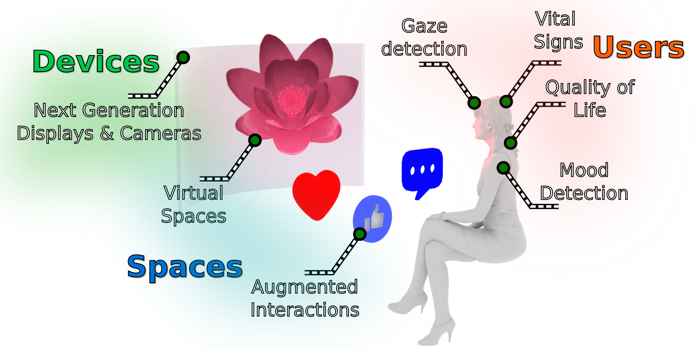

# Welcome

**You have reached the website for the Computational Light Laboratory (CLL).**

!!! Info
    The computational light laboratory is part of [Computer Science Department](https://www.ucl.ac.uk/computer-science/) at [University College London](https://www.ucl.ac.uk).
    [Kaan Akşit](https://kaanaksit.com) leads the computational light laboratory.
    Computational light laboratory is located at `room G06, 169 Euston Road, London NW1 2AE, United Kingdom`.

## Highlighted Presentations

<iframe width="240" height="155" src="https://www.youtube.com/embed/kqOQLFaTZwU" title="YouTube video player" frameborder="0" allow="accelerometer; autoplay; clipboard-write; encrypted-media; gyroscope; picture-in-picture; web-share" allowfullscreen></iframe>
<iframe width="240" height="155" src="https://www.youtube.com/embed/5tG8SaJGpUc" title="YouTube video player" frameborder="0" allow="accelerometer; autoplay; clipboard-write; encrypted-media; gyroscope; picture-in-picture" allowfullscreen></iframe>
<iframe width="240" height="155" src="https://www.youtube.com/embed/dDs0rAXX2yk" title="YouTube video player" frameborder="0" allow="accelerometer; autoplay; clipboard-write; encrypted-media; gyroscope; picture-in-picture; web-share" allowfullscreen></iframe>

## Our Research Focus
The computational light laboratory conducts [research and development](../publications) in light related sciences, including computer-generated holography, computer graphics, computational imaging, computational displays and visual perception.
We share our scientific output in the form of [published articles and papers](https://complightlab.com/publications/).
Our primary software toolkit to tackle our research problems is public and open-source.
We host our toolkit as [Odak](https://github.com/kunguz/odak) in GitHub.
We translate our scientific output to actual [lecture modules](../teaching), and we create [useful documentation](../documentation) for our research and development.

To read more about our recent activities, please visit our [recent timeline](../timeline).
Our research focus in terms of applications is depicted in the below conceptual figure.

    

## Announcements and Useful Information

!!! Info
    Our laboratory organizes weekly seminars. To get more information about these seminars, please [click here](../seminars).

!!! Info
    Our laboratory hosts a research hub in the form of a public Slack group. To get more information about these seminars, please [click here](../research_hub).

!!! Question
    If you are interested in joining our group as an intern, an undergraduate student, a master student, a PhD student, a postdoctoral researher or a visiting researcher, please do not hesitate to reach out to [Kaan Akşit](mailto:k.aksit@ucl.ac.uk).
