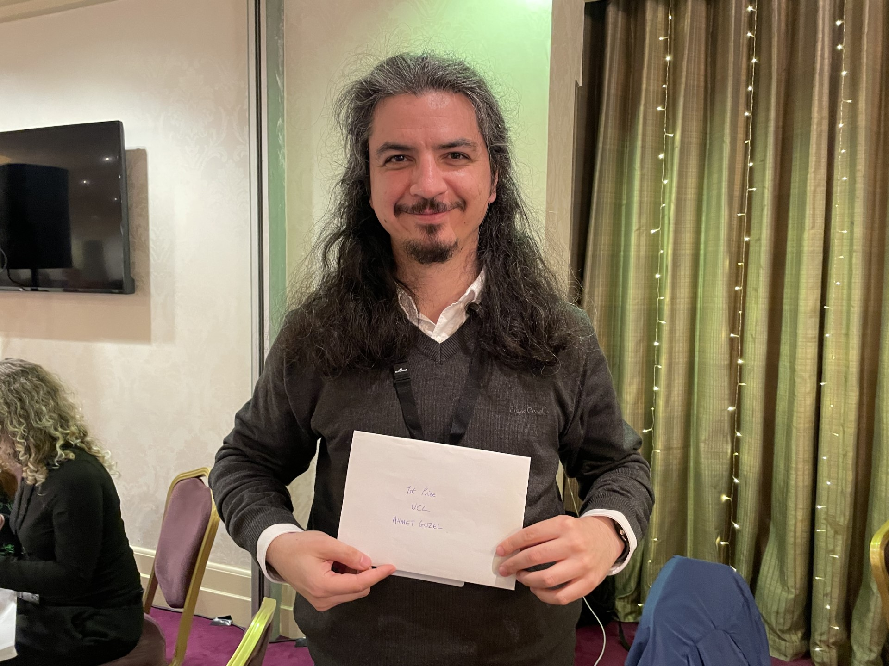

## Introduction
???+ Question "Who are we?"
    Lead by [Kaan Akşit](https://kaanaksit.com), the computational light laboratory conducts [research and development](publications/index.md) in light related sciences, including computer-generated holography, computer graphics, computational imaging, computational displays and visual perception.
    We share our scientific output in the form of [published articles and papers](publications/index.md).
    Our primary software toolkit to tackle our research problems is public and open-source.
    We host our toolkit as [Odak](https://github.com/kunguz/odak) in GitHub.
    We translate our scientific output to actual [lecture modules](teaching/index.md), and we create [useful documentation](documentation/index.md) for our research and development.
    To read more about our recent activities, please visit our [recent timeline](timeline/index.md).
    Our research focus in terms of applications is depicted in the below conceptual figure.
    

        
    

??? Question "Interested in registering to our seminars and discussion group?"
    Our laboratory organizes weekly seminars, and hosts a research hub in the form of a public Slack group.

    [Subscribe to our mailing list and slack group](outreach){ .md-button .md-button--primary }

??? Question "Where are we located?"
    The computational light laboratory is part of [Computer Science Department](https://www.ucl.ac.uk/computer-science/) at [University College London](https://www.ucl.ac.uk).
    Computational light laboratory is located at `room G06, 169 Euston Road, London NW1 2AE, United Kingdom`.

??? Question "Interested in joining our research group?"
    If you are interested in joining our group as an intern, an undergraduate student, a master student, a PhD student, a postdoctoral researher or a visiting researcher, please do not hesitate to reach out to [Kaan Akşit](mailto:k.aksit@ucl.ac.uk).

## Research Highlights

  
 

  

    
Multi-color holograms improve brightness in holographic displays (SIGGRAPH ASIA 2023)

  
 

  

    
Ahmet Güzel received the best power award at UKRI AI CDT conference.

  
 

  

    
HoloBeam: Paper-Thin Near-Eye Displays (IEEE VR 2023)

  
 

  

    
Realistic Defocus Blur for Multiplane Computer-Generated Holography (IEEE VR 2023)

  
 

  

    
ChromaCorrect: Perceptual Prescription Correction in Virtual Reality (Optics Express)

  
 

  

    
Optimizing vision and visuals (SIGGRAPH 2022)

  
 

  

    
Unrolled Primal-Dual Networks for Lensless Imaging (Optics Express)

  
 

  

    
Metameric Varifocal Holograms (IEEE VR 2022)

  
 

  

    
Learned Holographic Light Transport (Applied Optics)

  
 

  

    
Telelife: the future of remote living (Frontiers in VR)

  
 

  

    
SensiCut: material-aware laser cutting using speckle sensing and deep learning (UIST 2021)

  
 

  

    
Beaming Displays (IEEE VR 2021)

