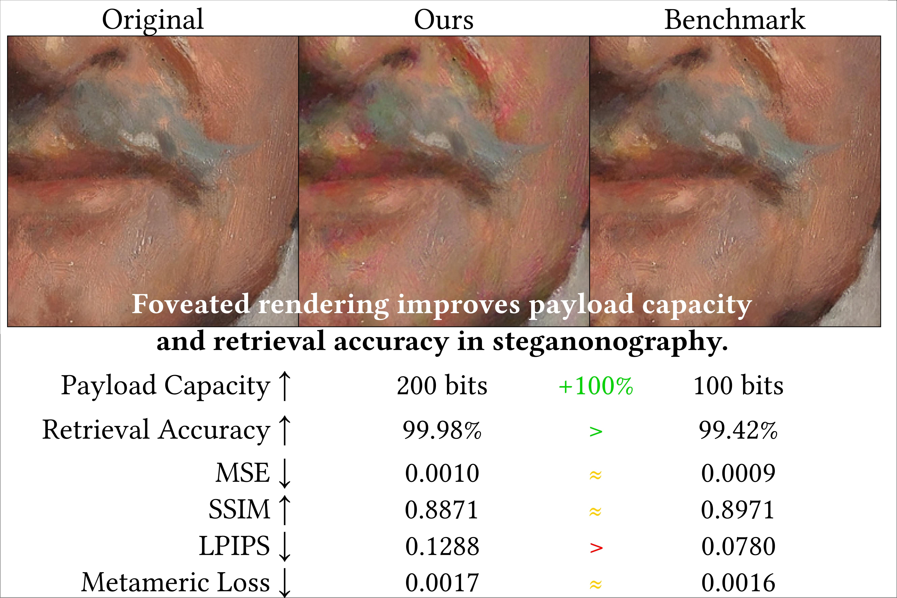

# Research Highlights
<head>
  <link rel="stylesheet" href="https://cdnjs.cloudflare.com/ajax/libs/font-awesome/5.15.3/css/all.min.css" integrity="sha512-iBBXm8fW90+nuLcSKlbmrPcLa0OT92xO1BIsZ+ywDWZCvqsWgccV3gFoRBv0z+8dLJgyAHIhR35VZc2oM/gI1w==" crossorigin="anonymous" referrerpolicy="no-referrer" />
</head>

<body>
  

    

      <button
        class="carousel-button carousel-button_previous"
        data-carousel-button-previous
      >
        
      </button>
      <button
        class="carousel-button carousel-button_next"
        data-carousel-button-next
      >
        
      </button>
    

    

      

        

        <h3>
        <a href="publications/lensless_display_radiance_field/">
        <b>Learned Display Radiance Fields with Lensless Cameras</b>
        </a>
        </h3>
        <h4>
        <b>ACM SIGGRAPH Asia 2025 Technical Communications</b>
        </h4>
         
        

      

      

        

        <h3>
        <a href="publications/foveated_steganography/">
        <b>Foveation Improves Payload Capacity in Steganography</b>
        </a>
        </h3>
        <h4>
        <b>ACM SIGGRAPH Asia 2025 Poster</b>
        </h4>
        
        

      

      

        

        <h3>
        <a href="publications/multitasking_perceptual_graphics/">
        <b>Learned Single-Pass Multitasking Perceptual Graphics for Immersive Displays</b>
        </a>
        </h3>
        <h4>
        <b>ACM Multimedia 2025</b>
        </h4> 
        
        

      

      

        

        <h3>
        <a href="publications/assess_hologram_compression/">
        <b>Assessing Learned Models for Phase-only Hologram Compression</b>
        </a>
        </h3>
        <h4>
        <b>ACM SIGGRAPH 2025 poster</b>
        </h4>
        
        

      

      

        

        <h3>
        <a href="publications/focal_surface_light_transport/">
        <b>Focal Surface Holographic Light Transport using Learned Spatially Adaptive Convolutions</b>
        </a>
        </h3>
        <h4>
        <b>ACM SIGGRAPH Asia 2024 Technical Communications</b>
        </h4>
        
        

      

      

        

        <h3>
        <a href="publications/spec_track/">
        <b>SpecTrack: Learned Multi-Rotation Tracking via Speckle Imaging</b>
        </a>
        </h3>
        <h4>
        <b>ACM SIGGRAPH 2024 poster</b>
        </h4>
        
        

      

      

        

        <h3>
        <a href="publications/multi_color/">
        <b>Multi-color Holograms Improve Brightness in Holographic Displays</b>
        </a>
        </h3>
        <h4>
        <b>ACM SIGGRAPH Asia 2023 Technical Papers</b>
        </h4>
        
        

      

      

        

        <h3>
        <a href="chromacorrect">
        <b>ChromaCorrect: Prescription Correction in Virtual Reality Headsets through Perceptual Guidance</b>
        </a>
        </h3>
        <h4>
        <b>Optica Biomedical Optics Express 2023</b>
        </h4>
        
        

      

      

        

        <h3>
        <a href="publications/holobeam/">
        <b>HoloBeam: Paper-Thin Near-Eye Displays</b>
        </a>
        </h3>
        <h4>
        <b>IEEE VR 2023 Technical Papers</b>
        </h4>
        
        

      

      

        

        <h3>
        <a href="publications/realistic_defocus_cgh/">
        <b>Realistic Defocus Blur for Multiplane Computer-Generated Holography</b>
        </a>
        </h3>
        <h4>
        <b>IEEE VR 2023 Technical Papers</b>
        </h4>
        
        

      

    

  

</body>

## Introduction
???+ Question "Who are we?"
    Led by [Kaan Akşit](https://kaanaksit.com), the Computational light laboratory conducts [research and development](publications/index.md) in light-related sciences, including computer-generated holography, computer graphics, computational imaging, computational displays, and visual perception.
    We share our scientific output in the form of [published articles and papers](publications/index.md).
    Our primary software toolkit to tackle our research problems is public and open-source.
    We host our toolkit as [Odak](https://kaanaksit.com/odak) in GitHub.
    We translate our scientific output to actual [lecture modules](teaching/index.md), and we create [useful documentation](documentation/index.md) for our research and development.
    To read more about our recent activities, please visit our [recent timeline](timeline/index.md).
    Our research focus in terms of applications is depicted in the below conceptual figure.
    

        
    

???+ Question "Interested in registering to our seminars and discussion group?"
    Our laboratory organizes weekly seminars, and hosts a research hub in the form of a public Slack group.

    [Subscribe to our mailing list and slack group](outreach/index.md){ .md-button .md-button--primary }

???+ Question "Where are we located?"
    The computational light laboratory is part of [Computer Science Department](https://www.ucl.ac.uk/computer-science/) at [University College London](https://www.ucl.ac.uk).
    Computational light laboratory is located at `room G06, 169 Euston Road, London NW1 2AE, United Kingdom of Great Britain and Northern Ireland`.
    
    <iframe src="https://www.google.com/maps/embed?pb=!1m18!1m12!1m3!1d2482.260134976213!2d-0.13419492299176314!3d51.526788409286425!2m3!1f0!2f0!3f0!3m2!1i1024!2i768!4f13.1!3m3!1m2!1s0x48761b2572def3b3%3A0x87d130881cf6bb1a!2s169%20Euston%20Rd.%2C%20London%20NW1%202AE!5e0!3m2!1sen!2suk!4v1699452471450!5m2!1sen!2suk" width="600" height="450" style="border:0;" allowfullscreen="" loading="lazy" referrerpolicy="no-referrer-when-downgrade"></iframe>

???+ Question "Interested in joining our research group?"
    If you are interested in joining our group as an intern, an undergraduate student, a master student, a Ph.D. student, a postdoctoral researher or a visiting researcher, please do not hesitate to reach out to [Kaan Akşit](https://kaanaksit.com).

