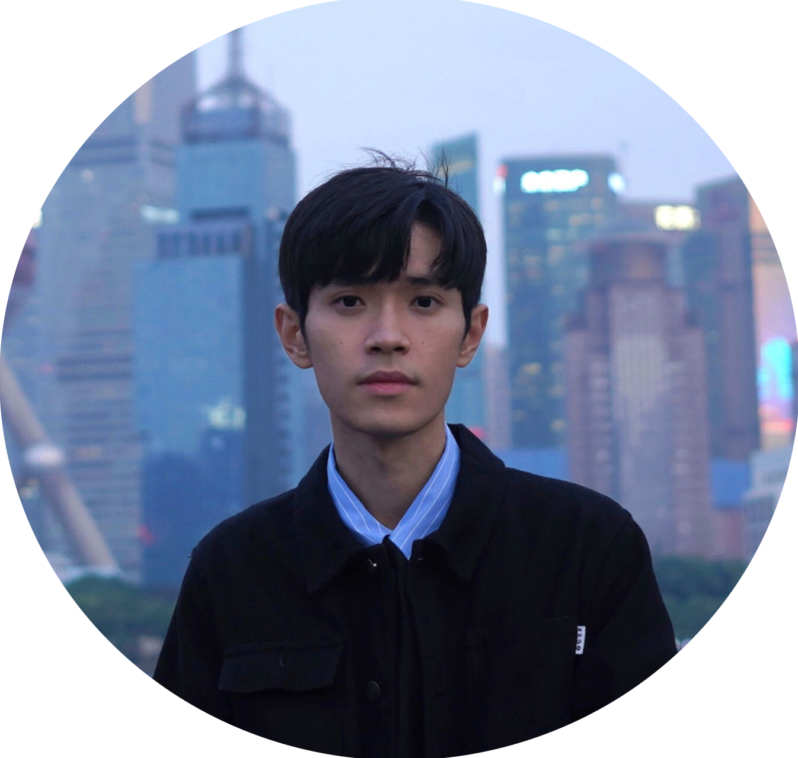

# People
This page will give you a complete of our current members.
At the end of the page, you will also find our alumni list as a separate section.

## Current members
All our current members are located in `169 Euston Road, London NW1 2AE, United Kingdom`.

### Faculty

[Kaan Akşit](https://kaanaksit.com)

Associate Professor of Computational Light

:material-email: [E-mail](mailto:k.aksit@ucl.ac.uk)

:material-office-building: Office: R409
 

### Doctoral students

[Yicheng Zhan](https://github.com/AlberTgarY)

PhD Student

:material-email: [E-mail](mailto:ucaby83@ucl.ac.uk)

:material-office-building: Office: R404.188
 

[Ziyang Chen](https://www.linkedin.com/in/ziyang-chen-064ba8173/)

PhD Student

:material-email: [E-mail](mailto:ucabzc8@ucl.ac.uk)

:material-office-building: Office: R404.187
 

## Interns

[Doğa Yılmaz](https://yilmazdoga.net)

MSc Student ([Özyeğin University](https://www.ozyegin.edu.tr/))

:material-email: [E-mail](mailto:yilmaz.doga@gmail.com)

:material-office-building: Office: Virtual
 

[Chuanjun Zheng](https://scholar.google.com.hk/citations?user=9Jk_LC8AAAAJ&)

MSc Student ([Shenzhen University](https://en.szu.edu.cn/))

:material-email: [E-mail](mailto:chuanjunzhengcs@gmail.com)

:material-office-building: Office: Virtual
 

[Koray Kavaklı](https://scholar.google.com/citations?user=rn6XtO4AAAAJ&hl=en)

PhD Student ([Koç University](https://www.ku.edu.tr/))

:material-email: [E-mail](mailto:K.Kavakli@cs.ucl.ac.uk)

:material-office-building: Office: Virtual
 

## Alumni

### Post-Doctoral Researchers
- [David Robert Walton](https://drwalton.github.io/), `Investigation on perceptually guided display technology,` 2021-2022, Next: Lecturer at Birmingham City University.

### Master Students
- [Ziyang Chen](https://www.linkedin.com/in/ziyang-chen-064ba8173/), `Speckle imaging with a lensless camera`, 2023, Next: PhD student at University College London.
- [Jeanne Beyazian](https://www.linkedin.com/in/jeanne-beyazian/), `Hologram Compression`, 2022, Next: Computer Vision Developer at Glimpse Analytics.
- [Yilin Qu](https://www.linkedin.com/in/yilin-qu-b0a599149/), `Predicting Next Frames of a RGBD video,` 2022, Next: Machine Learning Software Engineer at Qualcomm Incorporated.
- [Gbemisola Akinola-Alli](https://www.linkedin.com/in/gbemisola-akinola-alli-313090149/), `Differentiable Ray Tracing for Designing Optical Parts,` 2022, Next: Senior Engineer at MBDA.
- [Oliver Kingshott](https://www.linkedin.com/in/oliland/), `Learned Point-spread Functions for Lensless Imaging,` 2021, Next: PhD Student at University College London.
- [Koray Kavaklı](https://scholar.google.com/citations?user=rn6XtO4AAAAJ&hl=en&oi=ao), `Towards Improving Visual Quality in Computer-Generated Holography,` 2021, Next: PhD Student at Koç University.
- Chengkun Li, `Neural Optical Beam Propagation,` 2021, Next: -.
- Yuze Yang, `Learned 3D Representations: Point Cloud, Depth Maps and Holograms,` 2021, Next: -.

### Research Interns
- [Ahmet Hamdi Güzel](https://aguzel.github.io/),`Perceptual Prescription Correction,` 2022-2024, Next: PhD Student at University College London.
- [Yichen Zou](https://www.linkedin.com/in/yichen-zou-9b7116240/), `3D Dataset generation,` 2022, Next: Graduate Student at McGill Univesity.
- [Nerea Sainz De La Maza](https://www.linkedin.com/in/nerea-sainz-de-la-maza/), `Printable camera casing design,` 2022, Next: Bachelor of Science at University College London.
- [Kerem Eroğlu](https://www.linkedin.com/in/kerem-ero%C4%9Flu-52b065241/), `Embedding data to images,` 2022, Next: MEng at University College London.
- [Serhat Aksoy](https://www.linkedin.com/in/serhat-aksoy/), `Volume rendering tool,` 2022, Next: Bachelor of Science at Istanbul Technical University.
- [Debosmit Neogi](https://www.linkedin.com/in/debosmit-neogi/), `Compressing RGBD data,` 2022, Next: Master of Science at University at Buffalo.
- Josh Kaizer, as a part of [In2Science UK programme](https://in2scienceuk.org/), 2022, Next: -.
- Abubakar Sharif, as a part of [In2Science UK programme](https://in2scienceuk.org/), 2022, Next: -.
