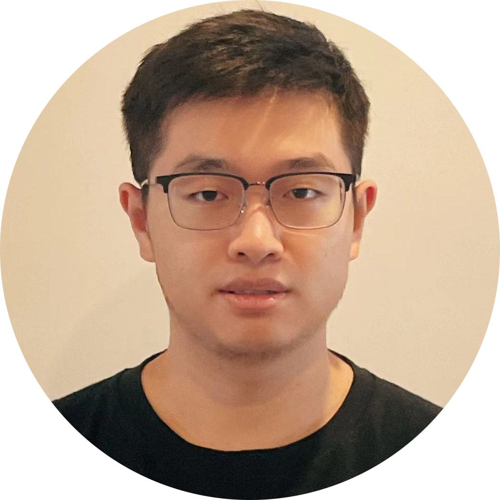
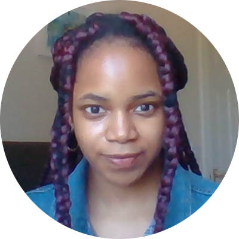

# People
This page will give you a complete of our current members.
At the end of the page, you will also find our alumni list as a separate section.

## Current members
All our current members are located in `169 Euston Road, London NW1 2AE, United Kingdom`.

### Faculty

[Kaan Akşit](https://kaanaksit.com)

Associate Professor of Computational Light

:material-email: [E-mail](mailto:k.aksit@ucl.ac.uk)

:material-office-building: Office: R409
 

### Doctoral students

[Koray Kavaklı](https://scholar.google.com/citations?user=rn6XtO4AAAAJ)

PhD student

:material-email: E-mail

:material-office-building: Office: R404.189
 

### Interns

[Yilin Qui](https://github.com/YILINQ)

Master Student

:material-email: [E-mail](mailto:yilin.qu.21@ucl.ac.uk)

 

[Gbemisola Akinola-Alli](https://www.linkedin.com/in/gbemisola-akinola-alli-313090149/)

Master Student

:material-email: [E-mail](mailto:xxxxxx.akinola-alli.21@ucl.ac.uk)

 

[Praveen Selvaraj](https://in.linkedin.com/in/pravsels)

Master student

:material-email: [E-mail](mailto:praveen.selvaraj.21@ucl.ac.uk)

 

[Jeanne Beyazian](https://www.linkedin.com/in/jeanne-beyazian/)

Master student

:material-email: [E-mail](mailto:jeanne.beyazian.21@ucl.ac.uk)

 

[Ahmet Güzel](https://aguzel.github.io)

Master Student

:material-email: [E-mail](mailto:od20ahg@leeds.ac.uk)

 

[Yichen Zou](https://www.linkedin.com/in/yichen-zou-9b7116240/)

Undergraduate student

:material-email: [E-mail](mailto:18yz293@queensu.ca)

 

[Debosmit Neogi](https://debosmit-neogi.github.io/portfolio/about/)

Undergraduate student

:material-email: [E-mail](mailto:debosmit.cse@gmail.com)

 

[Nerea Sainz De La Maza](https://www.linkedin.com/in/nerea-sainz-de-la-maza-482796221/)

Undergraduate student

:material-email: [E-mail](mailto:nerea.melon.21@ucl.ac.uk)

 

[Kerem Eroğlu](https://www.linkedin.com/mwlite/in/kerem-ero%C4%9Flu-52b065241)

Undergraduate Student

:material-email: [E-mail](mailto:keremeroglu555@gmail.com)

 

## Alumni

### 2021

#### Master Students
- Oliver Kingshott, `Learned Point-spread Functions for Lensless Imaging`.
- Koray Kavaklı, `Towards Improving Visual Quality in Computer-Generated Holography`.
- Chengkun Li, `Neural Optical Beam Propagation`.
- Yuze Yang, `Learned 3D Representations: Point Cloud, Depth Maps and Holograms`.

