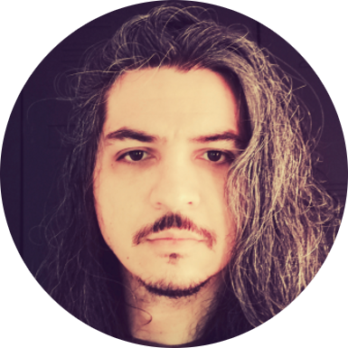

# People
This page will give you a complete of our current members.
At the end of the page, you will also find our alumni list as a separate section.

## Current members
All our current members are located in `169 Euston Road, London NW1 2AE, United Kingdom`.

### Faculty

[Kaan Akşit](https://kaanaksit.com)

Associate Professor of Computational Light

:material-email: [E-mail](mailto:k.aksit@ucl.ac.uk)

:material-office-building: Office: R409
 

### Doctoral students

[Koray Kavaklı](https://scholar.google.com/citations?user=rn6XtO4AAAAJ)

PhD student

:material-email: [E-mail](mailto:K.Kavakli@cs.ucl.ac.uk)

:material-office-building: Office: R404.188
 

[Ahmet Güzel](https://aguzel.github.io)

PhD Student

:material-email: [E-mail](mailto:od20ahg@leeds.ac.uk)

:material-office-building: Office: R404.189
 

## Alumni

### 2022

#### Post-Doctoral Researchers
- [David Robert Walton](https://drwalton.github.io/), `investigation on perceptually guided display technology`.

#### Master Students
- Jeanne Beyazian, `Hologram Compression`.
- Yilin Qu, `Predicting Next Frames of a RGBD video`.
- Gbemisola Akinola-Alli, `Differentiable Ray Tracing for Designing Optical Parts`.

#### Interns
- Yichen Zou, `3D Dataset generation`.
- Nerea Sainz De La Maza, `Printable camera casing design`.
- Kerem Eroğlu, `Embedding data to images`.
- Serhat Aksoy, `Volume rendering tool`.
- Debosmit Neogi, `Compressing RGBD data`.
- Josh Kaizer, as a part of [In2Science UK programme](https://in2scienceuk.org/).
- Abubakar Sharif, as a part of [In2Science UK programme](https://in2scienceuk.org/).

### 2021

#### Master Students
- Oliver Kingshott, `Learned Point-spread Functions for Lensless Imaging`.
- Koray Kavaklı, `Towards Improving Visual Quality in Computer-Generated Holography`.
- Chengkun Li, `Neural Optical Beam Propagation`.
- Yuze Yang, `Learned 3D Representations: Point Cloud, Depth Maps and Holograms`.

