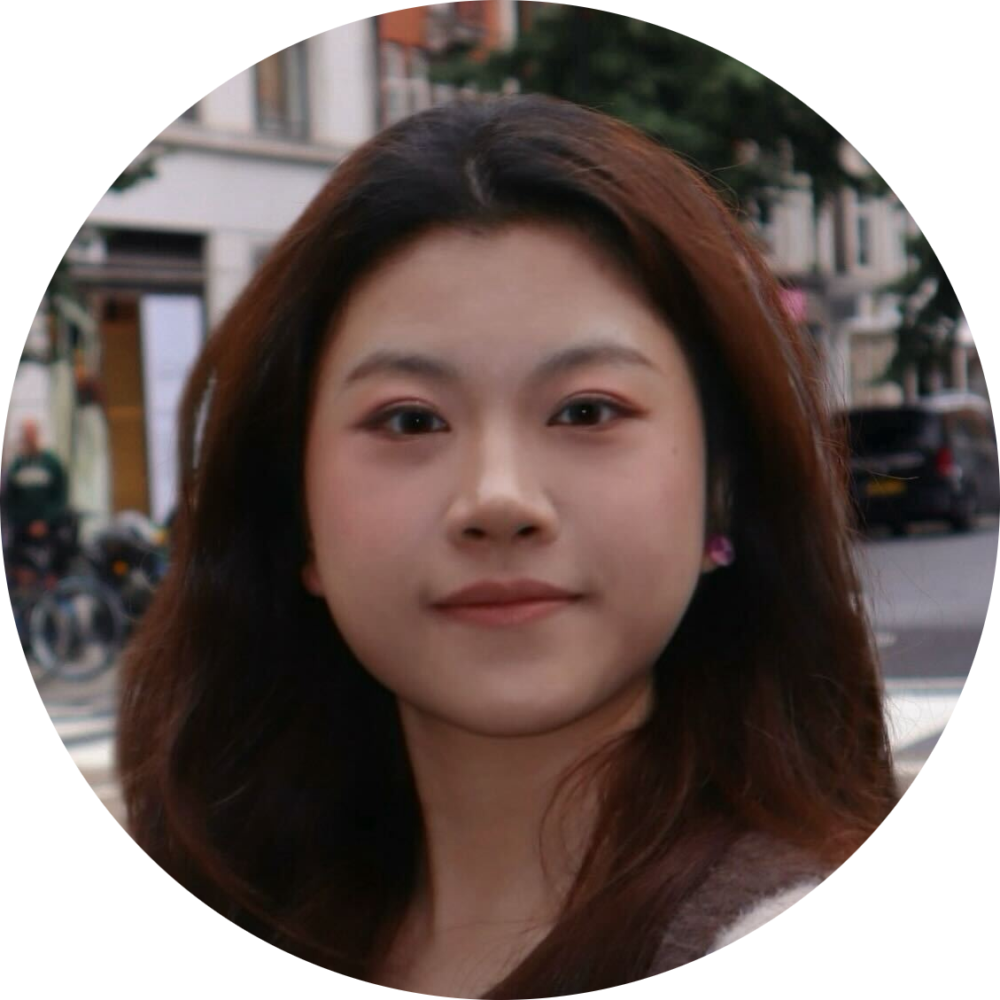

# People
This page will give you a complete of our current members.
At the end of the page, you will also find our alumni list as a separate section.

## Current members
All our current members are located in `169 Euston Road, London NW1 2AE, United Kingdom`.

### Faculty

[Kaan Akşit](https://kaanaksit.com)

Associate Professor of Computational Light

:material-email: [E-mail](mailto:kaanaksit@kaanaksit.com)

:material-office-building: Office: R409
 

### Doctoral students

[Yicheng Zhan](https://albertgary.github.io/)

Ph.D. Student ([University College London](https://www.ucl.ac.uk))

:material-email: [E-mail](mailto:ucaby83@ucl.ac.uk)

:material-office-building: Office: R404.188
 

[Ziyang Chen](https://ziyang.space/)

Ph.D. Student ([University College London](https://www.ucl.ac.uk))

:material-email: [E-mail](mailto:ucabzc8@ucl.ac.uk)

:material-office-building: Office: R404.187
 

## Interns

[Lifeng Qiu Lin](https://github.com/Gnefil)

MSc Student ([University College London](https://www.ucl.ac.uk))

:material-email: [E-mail](mailto:lifeng.qiu.lin.lq@gmail.com)

:material-office-building: Office: Hybrid (R404.186)
 

[Xiaoyue (Merry) Fan](http://www.linkedin.com/in/merryxyfan)

MSc Student ([University College London](https://www.ucl.ac.uk))

:material-email: [E-mail](mailto:merryxyfan@gmail.com)

:material-office-building: Office: Hybrid (R404.186)
 

[Zicong Peng](https://scholar.google.com/citations?user=lpi8DvIAAAAJ&hl=zh-CN)

MSc Student ([University College London](https://www.ucl.ac.uk))

:material-email: [E-mail](mailto:zicong.peng.24@ucl.ac.uk)

:material-office-building: Office: Hybrid (R404.186)
 

[Henry Kam](http://gulpinhenry.github.io/)

MSc Student ([New York University](https://www.nyu.edu))

:material-email: [E-mail](mailto:h3nrykam@gmail.com)

:material-office-building: Office: Virtual
 

[Chuanjun Zheng](https://scholar.google.com.hk/citations?user=9Jk_LC8AAAAJ&)

MSc Student ([Shenzhen University](https://en.szu.edu.cn/))

:material-email: [E-mail](mailto:chuanjunzhengcs@gmail.com)

:material-office-building: Office: Virtual
 

## Alumni

### Post-Doctoral Researchers
- [David Robert Walton](https://drwalton.github.io/), `Investigation on perceptually guided display technology,` 2021-2022, Next: Lecturer at Birmingham City University.

### Master and Bachelor Students
<!-- C -->
- [Chengkun Li](https://www.linkedin.com/in/chengkunli96?lipi=urn%3Ali%3Apage%3Ad_flagship3_profile_view_base_contact_details%3B2yhAyESzSLaR7ttRM5dANQ%3D%3D), `Neural Optical Beam Propagation,` 2021, Next: Ph.D. student at the Chinese University of Hong Kong.
- [Chuanjun Zheng](https://scholar.google.com.hk/citations?user=9Jk_LC8AAAAJ&), `Focal Surface Holographic Light Transport using Learned Spatially Adaptive Convolutions`, 2025, Next: Ph.D. student at University of Hawaiʻi at Mānoa. 
- [Chung-Yu (Kevin) Wei](https://www.linkedin.com/in/chung-yu-wei-75339b251/), `Novel 3D Representations for assessing damages in cars`, 2025, Next: Research Intern at Tractable.
<!-- G -->
- [Gbemisola Akinola-Alli](https://www.linkedin.com/in/gbemisola-akinola-alli-313090149/), `Differentiable Ray Tracing for Designing Optical Parts,` 2022, Next: Senior Engineer at MBDA.
<!-- H -->
- [Hongbin Zhang](https://www.linkedin.com/in/hongbin-zhang-60a36a372/), `2D Gaussian Splatting with Lensless Cameras`, 2025, Next: -.
<!-- J -->
- [Jeanne Beyazian](https://www.linkedin.com/in/jeanne-beyazian/), `Hologram Compression`, 2022, Next: Computer Vision Developer at Glimpse Analytics.
- [Jiasheng Yang](https://www.linkedin.com/in/%E4%BD%B3%E6%99%9F-%E6%9D%A8-31ba76225/), `Localization aware Steganography`, 2025, Next: Research Intern at University College London.
- [Jiayi Wang](https://github.com/Chloe1428/), `Modeling Keystroke Dynamics via Pairwise Timing Estimation`, 2025, Next: -.
- [Jihao (Geo) Gu](https://momiji-bit.github.io/), `Text-guided Fine-Grained Video Anomaly Detection`, 2025, Next: Research Intern at University College London.
- [Jingxuan Zhong](https://orcid.org/0009-0000-3539-4482), `Summaries Improve Consistency in LLM-based NPCs`, 2025, Next: M.Sc. Student at University College London.
- Junhao Cheng, `Migrating Differentiable Rendering to Latent Space for designing immersive displays`, 2025, Next: High-School teacher.
<!-- K -->
- [Lifeng Qiu Lin](https://github.com/Gnefil), `Foveation Improves Payload Capacity in Steganography`, 2025, Next: Visiting Researcher at Tsinghua University.
<!-- O -->
- [Oliver Kingshott](https://www.linkedin.com/in/oliland/), `Learned Point-spread Functions for Lensless Imaging,` 2021, Next: Ph.D. Student at University College London.
<!-- P -->
- [Pengze Li](https://linsonng.github.io/), `Text to hologram`, 2024, Next: -.
<!-- T -->
- [Tianwen Zhou](https://zhoutianwen.com/), `Editing Physiological Signals in Videos Using Latent Representations,` 2025, Next: Researcher in Huawei Technology Ltd. 
- [Toma Kolev](https://www.linkedin.com/in/toma-kolev-18b550149/), `Learned methods for Lensless cameras,` 2025, Next: Software Engineer at Smartsoft Healthcare. 
<!-- W -->
- [Weijie Xie](https://www.harridan13.com/), `Learned Method for Computer Generated Hologram`, 2024, Next: Intern Researcher at University College London.
<!-- X -->
- [Xiaoyue (Merry) Fan](http://www.linkedin.com/in/merryxyfan), `Compressing Double-Phase Holograms using 2D Gaussians`, 2025, Next: Research Intern at University College London.
- [Xinyao Zhuang](https://www.linkedin.com/in/xinyao-zhuang-silvianz/), `Prompt-Driven Color Accessibility in Image Generation`, 2025, Next: Research Intern at University College London.
- [Xinyu (Lina) Gu](https://www.linkedin.com/in/xinyu-gu-497b43218/), `Novel 3D Representations for assessing damages in cars`, 2025, Next: Research Intern at Tractable.
<!-- Y -->
- [Yilin Qu](https://www.linkedin.com/in/yilin-qu-b0a599149/), `Predicting Next Frames of a RGBD video,` 2022, Next: Machine Learning Software Engineer at Qualcomm Incorporated.
- Yuze Yang, `Learned 3D Representations: Point Cloud, Depth Maps and Holograms,` 2021, Next: -.
<!-- Z -->
- [Zhiren Zan](https://github.com/Koma002), `Detecting Fabrication Defects from images using multi-modal Large Language Models`, 2024, Next: -. 
- [Zicong Peng](https://scholar.google.com/citations?user=lpi8DvIAAAAJ&hl=zh-CN), `Assessing Learned Models for Phase-only Hologram Compression`, 2025, Next: Ph.D. student at Koç University.
- [Zhuoxuan Jiang](https://orcid.org/0009-0004-5073-7753), `Enhancing Color and Brightness Contrast in Diffusion-Based Image Generation via Prompt Engineering`, 2025, NExt: -.
- [Ziyang Chen](https://ziyang.space/), `Speckle imaging with a lensless camera`, 2023, Next: Ph.D. student at University College London.

### Research Interns
- Abubakar Sharif, as a part of [In2Science UK programme](https://in2scienceuk.org/), 2022, Next: -.
- [Ahmet Hamdi Güzel](https://aguzel.github.io/),`Perceptual Prescription Correction,` 2022-2024, Next: Ph.D. Student at University College London.
- [Debosmit Neogi](https://www.linkedin.com/in/debosmit-neogi/), `Compressing RGBD data,` 2022, Next: Master of Science at University at Buffalo.
- [Doğa Yılmaz](https://yilmazdoga.net/), `Learned Single-Pass Multitasking Perceptual Graphics for Immersive Displays`, 2024, Next: Ph.D. student at University College London.
- [Henry Kam](http://gulpinhenry.github.io/), `Foveation Improves Payload Capacity in Steganography`, 2025, Next: Graduate student at New York University.
- [Kerem Eroğlu](https://www.linkedin.com/in/kerem-ero%C4%9Flu-52b065241/), `Embedding data to images,` 2022, Next: MEng at University College London.
- [Koray Kavaklı](https://scholar.google.com/citations?user=rn6XtO4AAAAJ&hl=en&oi=ao), `Towards Improving Visual Quality in Computer-Generated Holography,` 2021, Next: Ph.D. Student at Koç University.
- [Nerea Sainz De La Maza](https://www.linkedin.com/in/nerea-sainz-de-la-maza/), `Printable camera casing design,` 2022, Next: Bachelor of Science at University College London.
- [Serhat Aksoy](https://www.linkedin.com/in/serhat-aksoy/), `Volume rendering tool,` 2022, Next: Bachelor of Science at Istanbul Technical University.
- Josh Kaizer, as a part of [In2Science UK programme](https://in2scienceuk.org/), 2022, Next: -.
- [Yichen Zou](https://www.linkedin.com/in/yichen-zou-9b7116240/), `3D Dataset generation,` 2022, Next: Graduate Student at McGill Univesity.
