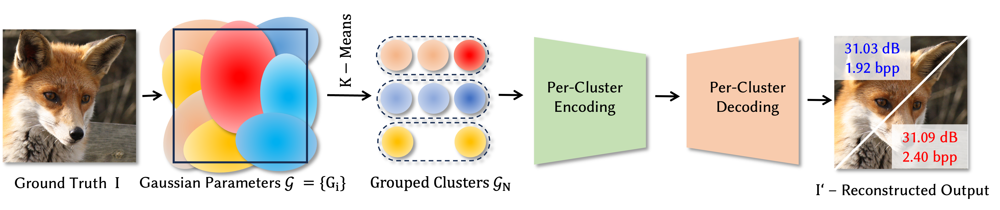
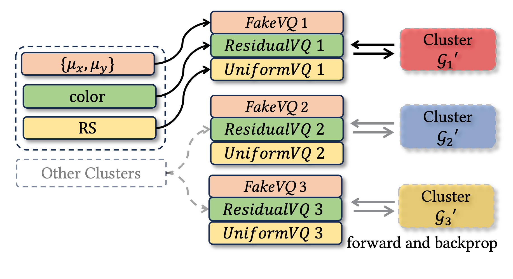
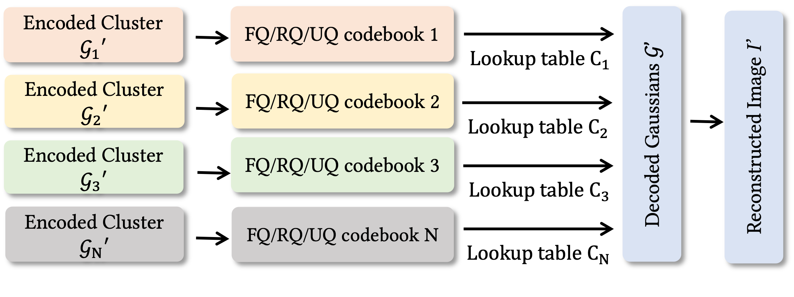
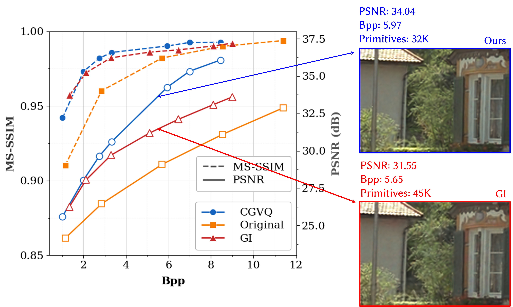
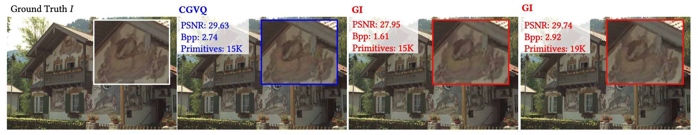

# Clusterd Codebook Quantization for 2D Gaussian-based Image Compression

## People
<table class=""  style="margin: 10px auto;">
  <tbody>
    <tr>
      <td>  &nbsp;&nbsp;&nbsp;&nbsp;</td>
      <td>  &nbsp;&nbsp;&nbsp;&nbsp;</td>
      <td>  &nbsp;&nbsp;&nbsp;&nbsp;</td>
      <td>  &nbsp;&nbsp;&nbsp;&nbsp;</td>
    </tr>
    <tr>
      <td>
<a href="https://aidcheng.github.io/">Runze (Aiden) Cheng</a>1
</td>
      <td>
<a href="https://albertgary.github.io/">Yicheng Zhan</a>1
</td>
      <td>
<a href="https://josef.spjut.me/">Josef Spjut</a>2
</td>
      <td>
<a href="https://kaanaksit.com">Kaan Akşit</a>1
</td>
    </tr>
  </tbody>
</table>

1University College London,
2NVIDIA

<b>ACM Transactions on Graphics</b>

<b>(Presented at SIGGRAPH 2026)</b>

??? info ":material-tag-text: Bibtex"
            @inproceedings{cheng2026clustered,
            author    = {Cheng, Runze and Zhan, Yicheng and Spjut, Josef and Ak{\c{s}}it, Kaan},
            title     = {Clustered Codebook Quantization for 2D Gaussian-based Image Compression},
            booktitle = {Special Interest Group on Computer Graphics and Interactive Techniques Conference Posters},
            series    = {SIGGRAPH Posters '26},
            year      = {2026},
            publisher = {Association for Computing Machinery},
            address   = {New York, NY, USA},
            doi       = {10.1145/3799825.3818700},
            }

## Resources
:material-file-code: [Manuscript](https://www.kaanaksit.com/assets/pdf/ChengEtAl_SIGGRAPH2026_Cluster_codebook_quantization_for_2d_gaussian_bassed_image_compression.pdf)
:material-file-code: [Supplementary Material](https://www.kaanaksit.com/assets/pdf/ChengEtAl_SIGGRAPH2026_Supplementary_Cluster_codebook_quantization_for_2d_gaussian_bassed_image_compression.pdf)
:material-file-code: [Poster](https://www.kaanaksit.com/assets/pdf/ChengEtAl_SIGGRAPH2026_Poster_Cluster_codebook_quantization_for_2d_gaussian_bassed_image_compression.pdf)
:material-file-code: [Code](https://github.com/complight/Cluster_Guided_Vector_Quantization)

## Video
<video controls>
<source src="https://www.kaanaksit.com/assets/video/ChengEtAlSiggraph2026CGVQ.mp4" id="“ type="video/mp4">
</video>

##Abstract

<figure markdown>
  { width="820" }
</figure>

Gaussian-based image representations effectively model image con
tent using compact parametric primitives while preserving high
visual fidelity, yet storing a large number of
floating-point parameters per primitive degrades rate-distortion
efficiency at higher fidelity targets. To improve the rate-distortion
performance in Gaussian representation, we present our CGVQ,
a Gaussian primitive based image compression method. Our key
idea is to partition Gaussian parameters further into homogeneous
groups prior to quantization, enabling higher compression effi
ciency and accurate parameter reconstruction. In practice, our ex
tensive experiments show that CGVQ decreases the bpp by 20%↓
with respect to our baseline [GaussianImage](https://github.com/Xinjie-Q/GaussianImage), while main-
taining on-par visual quality.

## Motivation

2D Gaussians provide a flexible and GPU-friendly way to represent images, with compact parametric primitives that can render visual content efficiently and independently of resolution.
Yet accurate reconstruction still requires many Gaussian primitives, and each primitive carries several floating-point attributes, including position, rotation-scale, and color. As image details become richer, these parameters quickly increase the storage cost.
Prior GaussianImage-style compression reduces this cost with vector quantization, but a single global codebook must model the wide variance of natural image parameters, often causing quantization errors and visible artifacts.
Our insight is simple: for a fixed codebook capacity, narrower parameter distributions are easier to quantize. By clustering Gaussian primitives before codebook training, CGVQ enables localized codebooks that better preserve reconstruction quality at lower bitrate.

## Method

### Encoding
Given an input image, we first fit it with a set of 2D Gaussian primitives, where each primitive stores position, rotation-scale, and color attributes. CGVQ then applies K-Means to partition these primitives into homogeneous clusters based on a concatenated rotation-scale and color feature vector, grouping Gaussians with similar appearance and anisotropy before quantization

In the encoding step, each cluster is compressed independently with dedicated codebooks for different Gaussian attributes. Specifically, position is encoded with a 16-bit floating-point quantization-aware estimator, rotation-scale is compressed using uniform vector quantization, and color is encoded with residual vector quantization for finer residual refinement. These parameter-specific codebooks are trained per cluster, allowing CGVQ to exploit the lower variance of each grouped distribution.

<figure markdown>
  { width="420" }
</figure>

### Decoding

During decoding, each cluster is reconstructed through codebook lookup, and all decoded Gaussian primitives are composed together to render the final reconstructed image.

<figure markdown>
  { width="620" }
</figure>

## Result

On the Kodak dataset, CGVQ achieves a better rate-distortion trade-off than the GaussianImage baseline. Across the evaluated bitrate range, our clustered codebook design improves both PSNR and MS-SSIM at comparable Bpp, with the advantage becoming more evident in the high-quality regime above 30 dB.

<figure markdown>
  { width="620" }
</figure>

Qualitatively, CGVQ also preserves finer image details under the same primitive budget. With 15K Gaussian primitives, CGVQ improves PSNR by 1.68 dB over GI, and reaches visual quality comparable to GI using 19K primitives. This shows that clustering Gaussian parameters before quantization can reduce redundancy while maintaining accurate reconstruction.

<figure markdown>
  { width="820" }
</figure>

## Performance Trade-off

Increasing the number of clusters improves reconstruction quality by narrowing the parameter distribution for each codebook. This gain comes with higher bitrate and slower encoding/decoding, showing a trade-off between compression fidelity and computational efficiency.

| Primitives-Clusters | PSNR ↑ | MS-SSIM ↑ | Bpp ↓ | Encoding (s) ↓ | Decoding (s) ↓ | Decoding FPS ↑ |
|:--:|:--:|:--:|:--:|:--:|:--:|:--:|
| 10000-1  | 26.02 | 0.9529 | 1.32 | 32.57  | 0.00418 | 239.2 |
| 10000-4  | 28.01 | 0.9732 | 1.75 | 149.83 | 0.00940 | 106.4 |
| 10000-8  | 28.13 | 0.9738 | 2.00 | 255.11 | 0.01460 | 68.5 |
| 10000-16 | 28.16 | 0.9738 | 2.51 | 488.18 | 0.02530 | 39.5 |
||||||||
| 20000-1  | 29.33 | 0.9796 | 2.64 | 34.32  | 0.00750 | 133.3 |
| 20000-4  | 30.71 | 0.9864 | 3.19 | 168.86 | 0.01340 | 74.6 |
| 20000-8  | 30.90 | 0.9866 | 3.45 | 285.18 | 0.01870 | 53.5 |
| 20000-16 | 31.18 | 0.9869 | 4.01 | 531.33 | 0.03000 | 33.3 |

## Acknowledgements
This work builds upon [GaussianImage](https://github.com/Xinjie-Q/GaussianImage), which serves as the backbone implementation and baseline for our method. We thank the authors for making their code publicly available.

## Outreach
We host a Slack group with more than 250 members on rendering, perception, displays and cameras.
The group is open to the public — join via [this link](../outreach/index.md).

## Contact Us
!!! Warning
    Please reach us through [email](mailto:kaanaksit@kaanaksit.com) to provide your feedback and comments.
