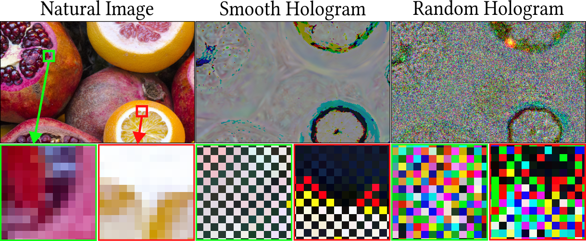
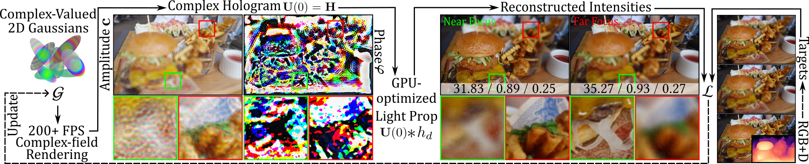
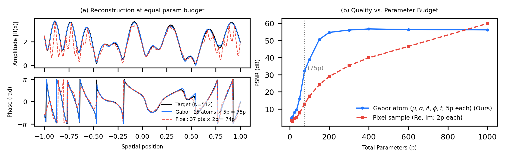
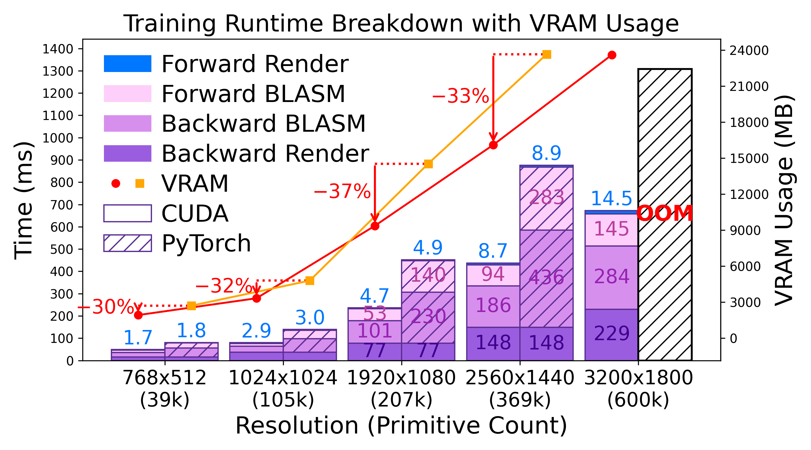
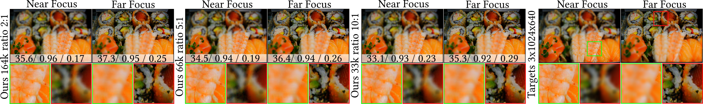
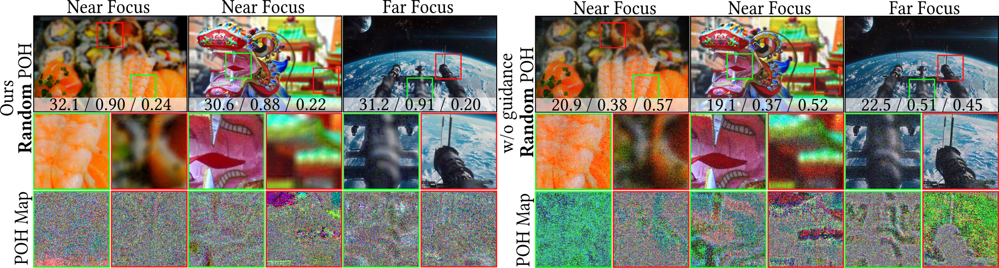

# Complex-Valued 2D Gaussian Representation for Computer-Generated Holography

## People
<table class=""  style="margin: 10px auto;">
  <tbody>
    <tr>
      <td>  &nbsp;&nbsp;&nbsp;&nbsp;</td>
      <td>  &nbsp;&nbsp;&nbsp;&nbsp;</td>
      <td>  &nbsp;&nbsp;&nbsp;&nbsp;</td>
      <td>  &nbsp;&nbsp;&nbsp;&nbsp;</td>
    </tr>
    <tr>
      <td>
<a href="https://albertgary.github.io/">Yicheng Zhan</a>1
</td>
      <td>
<a href="https://gaoxiangjun.github.io/">Xiangjun Gao</a>2
</td>
      <td>
<a href="https://home.cse.ust.hk/~quan/">Long Quan</a>2
</td>
      <td>
<a href="https://kaanaksit.com">Kaan Akşit</a>1
</td>
    </tr>
  </tbody>
</table>

1University College London,
2Hong Kong University of Science and Technology (HKUST)

<b>European Conference on Computer Vision (ECCV) 2026</b>

## Resources
:material-file-document-outline: [arXiv](https://arxiv.org/abs/2511.15022)
:material-file-code: [Code](https://github.com/complight/Complex-Valued_2D_Gaussian_Representation)

??? info ":material-tag-text: Bibtex"
        @article{zhan2025complexvalued2d,
        author = {Zhan, Yicheng and Gao, Xiangjun and Quan, Long and Ak\c{s}it, Kaan},
        title = {Complex-Valued 2D Gaussian Representation for Computer-Generated Holography},
        journal = {arXiv preprint arXiv:2511.15022},
        year = {2025},
        url = {https://arxiv.org/abs/2511.15022},
        }

## Abstract
Holograms are hard to represent, as every pixel carries wave information, and the patterns look like noise. We ask whether a hologram can instead be assembled from a few well-chosen building blocks, and answer with the **complex-valued 2D Gaussian**: a primitive that, following Gabor's theory, packs the most information into the least space and frequency.
Optimizing a hologram as a cloud of these primitives shrinks the parameter search space by 5:1, while a differentiable rasterizer paired with a GPU-optimized propagation kernel cuts VRAM by 30% and optimization time by 50%.
The result is up to 13 dB higher PSNR than prior Gaussian-based methods and up to 3200× faster rendering, all while matching the quality of state-of-the-art computer-generated holography.

## Motivation
A photograph records only how bright each point is. A hologram must also capture how light interferes and diffracts, and that extra information turns into dense, high-frequency, seemingly random pixel patterns.
Existing image representation methods are insufficient for this task: implicit and autoencoder models smooth away the very detail that defines a hologram, while recent Gaussian-based image models reproduce pixels yet ignore how light actually propagates.
We instead describe the hologram with a compact set of complex-valued 2D Gaussians, and fold light propagation directly into optimization, so the representation stays compact *and* physically grounded.

<figure markdown>
  { width="420" }
</figure>

## Method

### Pipeline
A set of complex-valued 2D Gaussians are rasterized into a complex hologram (amplitude and phase), propagated to several depth planes, and compared against RGB+D targets at each focus. Every step is differentiable, so the primitives are learned jointly.

<figure markdown>
  { width="820" }
</figure>

### Complex-Valued 2D Gaussian Primitive
The atom of our representation is a single complex-valued 2D Gaussian. Just **12 parameters**, position, scale, rotation, amplitude $\mathbf{c}_n$, phase $\mathbf{\varphi}_n$, and opacity $\alpha_n$, which describe both where it sits and the wave it carries. A naive alternative pairs two real Gaussians for the real and imaginary parts, costing 18 parameters and two passes; our unified form is leaner and writes the complex field at pixel $\mathbf{p}$ directly,

$$
\mathbf{H}_n(\mathbf{p}) = \alpha_n\, \mathbf{c}_n\, g_n(\mathbf{p})\, \exp\!\left(j\,\mathbf{\varphi}_n\right), \qquad
g_n(\mathbf{p}) = \exp\!\left(-\tfrac{1}{2}(\mathbf{p}-\mathbf{x}_n)^\top \Sigma_n^{-1} (\mathbf{p}-\mathbf{x}_n)\right),
$$

and summing every primitive forms the hologram, $\mathbf{H} = \sum_{n=1}^{N} \mathbf{H}_n$.

### Connection to Gabor's Theory
Since holography lives at the meeting point of space and frequency, *where* light is and *which way* it travels, and the two can never be pinned down at once. Gabor's uncertainty principle fixes this limit at $\Delta x\,\Delta f_x = \tfrac{1}{2}$, and the Gaussian is the **only** function that attains it. Our primitive is exactly the 2D form of Gabor's elementary signal,

$$
\psi(x) = \exp\!\left(-\beta^{2}(x-x_{0})^{2}\right)\cdot \exp\!\left(j(2\pi f_{0}x + \varphi)\right),
$$

making each primitive the efficient "atom of light". Fine detail does not come from contorting any single Gaussian, but emerges naturally as many of them overlap and as propagation imprints phase across the field.

<figure markdown>
  { width="520" }
</figure>

### Reconstruction and Optimization
To stay faithful to real optics, light propagation is part of training. We carry the field to a distance $d$ with the band-limited Angular Spectrum Method,

$$
\mathbf{U}(d) = \mathcal{F}^{-1}\!\left\{ H_d(f_x, f_y)\,\mathcal{F}\{\mathbf{H}\}\right\},
$$

where the band-limited transfer function is

$$
H_d(f_x, f_y) =
\begin{cases}
\exp\!\left(j2\pi d\sqrt{\tfrac{1}{\lambda^2} - (f_x^2 + f_y^2)}\right), & \text{if } f_x^2 + f_y^2 \leq \tfrac{1}{\lambda^2}, \\
0, & \text{otherwise.}
\end{cases}
$$

We then read out intensity $I_l = |\mathbf{U}(d_l)|^2$ on $L$ depth planes and supervise it with a reconstruction loss plus an SSIM term. To keep this loop fast, both complex tile-based rasterizer and the band-limited ASM are written as CUDA kernels.

### Phase-Only Hologram Conversion
Real displays are phase-only, so we treat our complex hologram as a single source of truth and convert it on demand: **Smooth POH** through double-phase amplitude coding, and **Random POH** by optimizing a random-phase field guided by our complex field — guidance that narrows the search and quiets noise.

## Results

### Runtime and Memory
The payoff starts with efficiency. Our CUDA kernel trims VRAM by 29–36% and runtime by 40–50% against a PyTorch baseline, and scales to 3200×1800 (5.8M pixels) without running out of memory.

<figure markdown>
  { width="460" }
</figure>

### vs. Representation Methods
Our method achieves the best performance. Implicit and autoencoder models collapse on hologram structure and prior Gaussian image models trail by a wide margin, while ours leads on metric with the fewest parameters.

| Method | PSNR ↑ | SSIM ↑ | LPIPS ↓ | Params |
|:--:|:--:|:--:|:--:|:--:|
| SIREN | 7.6 | 0.05 | 0.84 | 1.0 M |
| TAESD* | 11.6 | 0.09 | 0.79 | 2.5 M |
| Image-GS | 17.2 | 0.29 | 0.70 | 2.4 M |
| GaussianImage | 22.6 | 0.49 | 0.59 | 2.4 M |
| Instant-GI | 23.5 | 0.56 | 0.56 | 2.8 M |
| **Ours** | **30.7** | **0.86** | **0.33** | **0.8 M** |

<figure markdown>
  { width="820" }
</figure>

### vs. CGH Methods
It also holds its own against dedicated CGH methods. Both phase-only formats reconstruct crisp focus across depth, and rendering drops from 6840 ms (GWS) to **2.13 ms**, roughly 3200× faster at comparable or better quality.

| Method | PSNR ↑ | SSIM ↑ | LPIPS ↓ | Render (ms) |
|:--:|:--:|:--:|:--:|:--:|
| NH3D *(Smooth)* | 28.3 | 0.92 | 0.31 | 31 |
| GWS *(Smooth)* | 28.2 | 0.76 | 0.41 | 6840 |
| **Ours** *(Smooth)* | **29.0** | 0.81 | 0.38 | **2.13** |
| Wirtinger *(Random)* | 25.3 | 0.47 | 0.48 | — |
| **Ours** *(Random)* | **29.4** | **0.81** | **0.34** | — |

<figure markdown>
  { width="820" }
</figure>

### Parameter Reduction
How far can we compress? Quality fades gracefully: even at a 10:1 reduction the reconstruction stays sharp, letting the same scene be drawn with a fraction of the primitives.

| Ratio | PSNR ↑ | SSIM ↑ | LPIPS ↓ | Render (ms) |
|:--:|:--:|:--:|:--:|:--:|
| Dense | 32.3 | 0.893 | 0.29 | 4.02 |
| 2:1 | 31.9 | 0.891 | 0.30 | 2.58 |
| 5:1 | 30.7 | 0.863 | 0.33 | 2.13 |
| 10:1 | 29.4 | 0.835 | 0.37 | 1.72 |

<figure markdown>
  { width="820" }
</figure>

### Random POH Conversion
The structural guidance pays a second dividend: it lifts Random POH by +11.5 dB and visibly suppresses speckle-like noise — a result we confirm on a real holographic display prototype.

<figure markdown>
  { width="640" }
</figure>

<figure markdown>
  { width="640" }
</figure>

## Acknowledgements
The authors thank [Ye Mao](https://yebulabula.github.io/) and [Dr. Suyeon Choi](https://choisuyeon.github.io/) for the valuable suggestions in the early stage of this work.

## Relevant research works
- [Complex-Valued Holographic Radiance Fields](complex_valued_holographic_radiance_fields.md)
- [Compressing Double Phase Holograms using 2D Gaussians](compressing_double_phase_gs.md)
- [Assessing Learned Models for Phase-only Hologram Compression](assess_hologram_compression.md)
- [Multi-color Holograms improve Brightness in Holographic Displays](multi_color.md)
- [Realistic Defocus for Multiplane Computer-Generated Holography](realistic_defocus_cgh.md)
- [Odak](https://github.com/kaanaksit/odak)

## Outreach
We host a Slack group with more than 250 members on rendering, perception, displays and cameras.
The group is open to the public — join via [this link](../outreach/index.md).

## Contact Us
!!! Warning
    Please reach us through [email](mailto:kaanaksit@kaanaksit.com) to provide your feedback and comments.
