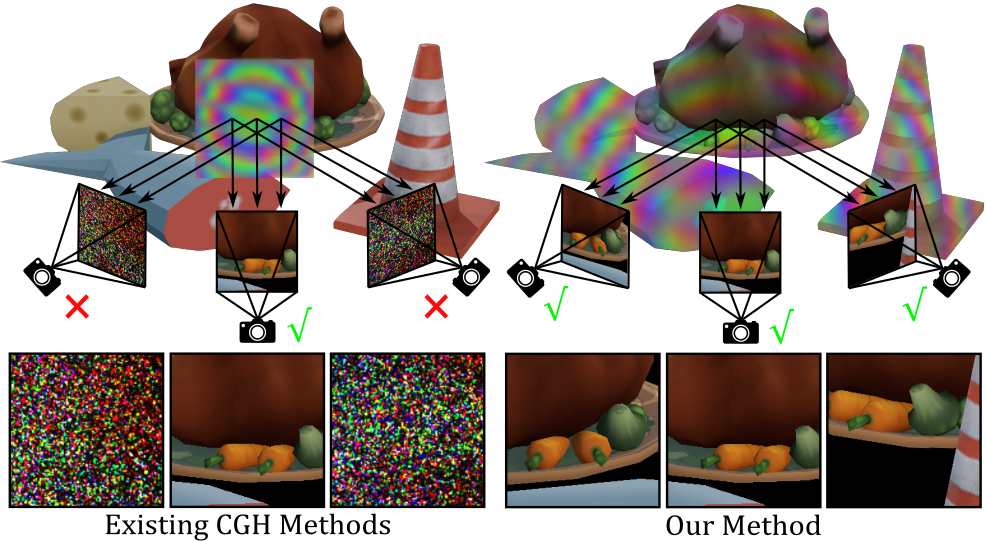
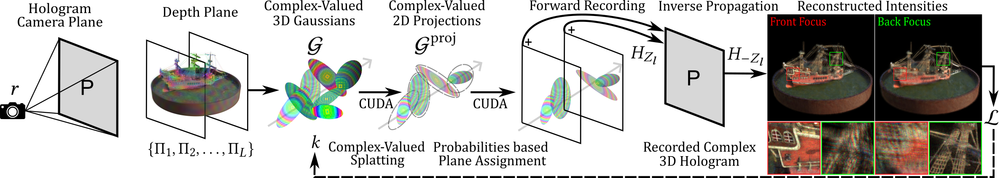
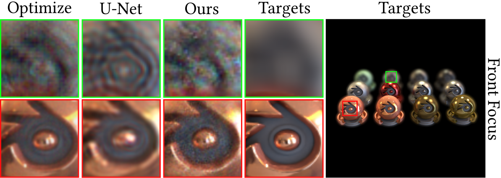

# Complex-Valued Holographic Radiance Fields

## People
<table class=""  style="margin: 10px auto;">
  <tbody>
    <tr>
      <td>  &nbsp;&nbsp;&nbsp;&nbsp;</td>
      <td>  &nbsp;&nbsp;&nbsp;&nbsp;</td>
      <td>  &nbsp;&nbsp;&nbsp;&nbsp;</td>
      <td>  &nbsp;&nbsp;&nbsp;&nbsp;</td>
    </tr>
    <tr>
      <td>
<a href="https://albertgary.github.io/">Yicheng Zhan</a>1
</td>
      <td>
<a href="https://dhsh.in/">Dong-Ha Shin</a>2
</td>
      <td>
<a href="https://www.shbaek.com/">Seung-Hwan Baek</a>2
</td>
      <td>
<a href="https://kaanaksit.com">Kaan Akşit</a>1
</td>
    </tr>
  </tbody>
</table>

1University College London,
2Pohang University of Science and Technology (POSTECH)

<b>ACM Transactions on Graphics</b>

<b>(Presented at SIGGRAPH 2026)</b>

## Resources
:material-newspaper-variant: [Manuscript](https://www.kaanaksit.com/assets/pdf/ZhanEtAl_ACMTOG_Complex_valued_holographic_radiance_fields.pdf)
:material-newspaper-variant: [Supplementary](https://www.kaanaksit.com/assets/pdf/ZhanEtAl_ACMTOG_Supplementary_Complex_valued_holographic_radiance_fields.pdf)
:material-file-code: [Code](https://github.com/complight/Complex_Valued_Holographic_Radiance_Fields)

??? info ":material-tag-text: Bibtex"
        @article{zhan2025complexvalued,
        author = {Zhan, Yicheng and Shin, Dong-Ha and Baek, Seung-Hwan and Ak\c{s}it, Kaan},
        title = {Complex-Valued Holographic Radiance Fields},
        year = {2026},
        publisher = {Association for Computing Machinery},
        address = {New York, NY, USA},
        issn = {0730-0301},
        journal = {ACM Transactions on Graphics (Presented in SIGGRAPH 2026)},
        month = mar,
        note = {},
        keywords = {Novel View Synthesis, Radiance Fields, 3D Gaussians, Computer-Generated Holography},
        location = {Los Angeles, California, USA},
        doi = {10.1145/3804450},
        url = {https://doi.org/10.1145/3804450},
        }

## Abstract
Modeling wave properties of light is an important milestone for advancing physically-based rendering.
We propose complex-valued holographic radiance fields, a method that optimizes scenes without relying on intensity-based intermediaries.
By leveraging multi-view images, our method directly optimizes a scene representation using complex-valued Gaussian primitives representing amplitude and phase values aligned with the scene geometry.
Our approach eliminates the need for computationally expensive holographic rendering that typically utilizes a single view of a given scene.
This accelerates holographic rendering speed by 30x-10,000x while achieving on-par image quality with state-of-the-art holography methods, representing a promising step towards bridging the representation gap between modeling wave properties of light and 3D geometry of scenes.

## Motivation
Existing computer-generated holography (CGH) methods treat hologram synthesis as a post-processing step after conventional rendering.
Because holograms are computed at the camera plane rather than tied to 3D scene geometry, changing the viewpoint requires expensive recomputation.
Without this recomputation, a hologram generated for one view degrades into noise-like artifacts under a new view.

<figure markdown>
  { width="700" }
</figure>

Our method unifies 3D Gaussian Splatting and holographic rendering in a complex-valued representation.
Unlike Eulerian CGH methods that recompute the complex field at every spatial location for each viewpoint, we use a Lagrangian formulation in which amplitude and phase are intrinsic scene properties.

## Method

### Overview
Given a camera pose and a target hologram plane, we partition the scene volume into multiple depth planes.
At each depth plane, we render our learnable complex-valued 3D Gaussians into corresponding 2D projections.
During projection, we utilize learnable probabilities for our 3D Gaussians that determine whether a Gaussian contributes to a selected depth plane.
Once the appropriate 2D projections for each layer are determined, we propagate the complex field from each layer towards the camera to construct the hologram.

<figure markdown>
  { width="900" }
</figure>

### Complex-Valued 3D Gaussians

In standard 3D Gaussian Splatting, the shape of a 3D Gaussian is defined as

$$
\mathcal{G}(\mathbf{x}, \mathbf{R}, \mathbf{S}) = \exp\!\left(-\tfrac{1}{2}\,\mathbf{x}^{\top}\,\Sigma^{-1}\,\mathbf{x}\right),
$$

where the covariance is parameterized as $\Sigma = \mathbf{R}\,\mathbf{S}\,\mathbf{S}^{\top}\,\mathbf{R}^{\top}$, with rotation matrix $\mathbf{R}$ and scaling matrix $\mathbf{S}$.
Given $N$ ordered Gaussians overlapping a pixel, the accumulated color is

$$
\mathbf{C}_{N} = \sum_{n=1}^{N} \mathbf{c}_{n}\,\mathbf{\alpha}_{n} \prod_{j=1}^{n-1}\!\left(1 - \mathbf{\alpha}_{j}\right).
$$

To represent holographic radiance fields, we extend each Gaussian primitive as

$$
k = (\mathbf{c}_n,\; \mathbf{x}_n,\; \mathbf{R}_n,\; \mathbf{S}_n,\; \mathbf{\alpha}_n,\; \underline{\mathbf{\varphi}_n},\; \underline{\mathbf{\rho}_n}),
$$

where $\mathbf{\varphi}_n \in \mathbb{R}^3$ denotes the intrinsic phase across wavelengths, and $\mathbf{\rho}_n \in \mathbb{R}^{L}$ denotes the assignment weights over $L$ depth planes.
Under this formulation, $\mathbf{c}_n$ represents wave amplitude rather than color.
The complex field of the projected Gaussian $U_n$ is

$$
U_n = \mathbf{c}_n\, \mathcal{G}_{n}^{\text{proj}}\, \exp(j\,\mathbf{\varphi}_n).
$$

### Forward Recording and Inverse Propagation

The complex field on depth plane $\Pi_l$ is given by

$$
U_{\Pi_{l}} = \sum_{n=1}^{N} \mathbf{\rho}_{n,l}\, U_n\, \mathbf{\alpha}_{n} \prod_{j=1}^{n-1} \left(1 - \mathbf{\alpha}_{j}\right) \mathbf{\rho}_{j,l}.
$$

Here, $\alpha_n$ modulates the emitted wave amplitude, while the transmittance term $\prod_{j=1}^{n-1}(1-\alpha_j)$ accounts for attenuation from preceding Gaussians.
Each populated depth plane is then propagated to the hologram plane $P$ using the band-limited Angular Spectrum Method (ASM), which we term **Forward Recording**:

$$
U_{\Pi_{l} \to P} = \mathcal{F}^{-1}\!\left\{H_{Z_l}(f_x, f_y) \cdot \mathcal{F}\{U_{\Pi_{l}}\}\right\},
$$

where $Z_l$ is the distance from depth plane $\Pi_l$ to the hologram plane $P$, and $H_z$ is the band-limited ASM transfer function

$$
H_{z}(f_x, f_y) =
\begin{cases}
\exp\!\left(j2\pi z\sqrt{\tfrac{1}{\lambda^2} - (f_x^2 + f_y^2)}\right), & \text{if } f_x^2 + f_y^2 \leq \tfrac{1}{\lambda^2}, \\
0, & \text{otherwise.}
\end{cases}
$$

The final hologram field is obtained by summing contributions from all depth planes:

$$
P = \sum_{l=1}^{L} U_{\Pi_{l} \to P}.
$$

We then perform **Inverse Propagation** from $P$ back to each depth plane and compute the reconstructed intensity as $I_l = |U_{P \to \Pi_l}|^2$.

### Scene Geometry-Aware Amplitude and Phase

Unlike prior methods, the per-Gaussian phase $\mathbf{\varphi}_n$ is modeled as an intrinsic phase reference in the scene coordinate frame, rather than a view-dependent quantity.
It remains fixed across viewpoints, while viewpoint-dependent interference emerges through projection and propagation.
For two viewpoints with projection matrices $\mathbf{J}_1, \mathbf{W}_1$ and $\mathbf{J}_2, \mathbf{W}_2$, the projected complex fields are

$$
\begin{aligned}
U_n^{(1)} &= \mathbf{c}_n\, \mathcal{G}_{n}^{\text{proj}}(\mathbf{J}_1, \mathbf{W}_1)\, \exp(j\,\mathbf{\varphi}_n), \\
U_n^{(2)} &= \mathbf{c}_n\, \mathcal{G}_{n}^{\text{proj}}(\mathbf{J}_2, \mathbf{W}_2)\, \exp(j\,\mathbf{\varphi}_n).
\end{aligned}
$$

This Lagrangian formulation avoids the costly per-frequency accumulation used in Eulerian methods and decomposes computation into two GPU-efficient stages:

- **Tile-based complex-valued rasterization**: extending the 3DGS rasterizer to accumulate complex-valued Gaussians directly in image space, with rasterization cost scaling as $O(N_{\text{primitives}})$.
- **FFT-based layer propagation**: aggregating Gaussians onto $L$ depth planes and propagating them to the hologram plane with 2D FFTs, yielding a propagation cost of $O(L \times N_{\text{res}} \log N_{\text{res}})$, independent of the number of primitives.

## Results

### Inference Speed
Our method achieves 30x-10,000x speedup compared to existing Gaussian-based CGH methods while maintaining view consistency.

| Method | Number of Gaussians | Inference Time |
|--------|-------------------|----------------|
| Our Method | 200K | 10 ms |
| Our Method | 5M | 69 ms |
| 3DGS + U-Net | 200K | 8 ms |
| 3DGS + U-Net | 5M | 29 ms |
| GWS (Fast) | 200K | > 40 s |
| GWS (Exact) | 200K | > 13 min |

### Experimental Captures
We validate our results on a holographic display prototype using a phase-only Spatial Light Modulator (Jasper JD7714, 2400×4094 pixels, 3.74 μm pitch) with three laser wavelengths (639, 532, and 473 nm).
Below we show novel-view comparisons between our method and the 3DGS + U-Net baseline on multiple scenes from the NeRF Synthetic and LLFF datasets, including both simulated results and experimentally captured results.

<figure markdown>
  { width="900" }
</figure>

<figure markdown>
  { width="900" }
</figure>

### Interactive Viewer
Use the sliders below to interactively compare the amplitude, phase, and reconstruction results across different depth planes.
If the GIFs become unsynced, please click *Reset Media*.

    <!-- Top bar: scene buttons + reset -->
    

        <button class="cv-scene-btn" data-scene="chair" style="padding:6px 16px;background:#3498db;color:#fff;border:none;border-radius:4px;cursor:pointer;font-size:13px;font-weight:bold;">Chair</button>
        <button class="cv-scene-btn" data-scene="lego" style="padding:6px 16px;background:#7f8c8d;color:#fff;border:none;border-radius:4px;cursor:pointer;font-size:13px;">Lego</button>
        <button class="cv-scene-btn" data-scene="materials" style="padding:6px 16px;background:#7f8c8d;color:#fff;border:none;border-radius:4px;cursor:pointer;font-size:13px;">Materials</button>
        <button class="cv-scene-btn" data-scene="ship" style="padding:6px 16px;background:#7f8c8d;color:#fff;border:none;border-radius:4px;cursor:pointer;font-size:13px;">Ship</button>
        <button class="cv-scene-btn" data-scene="fern" style="padding:6px 16px;background:#7f8c8d;color:#fff;border:none;border-radius:4px;cursor:pointer;font-size:13px;">Fern</button>
        <button class="cv-scene-btn" data-scene="flower" style="padding:6px 16px;background:#7f8c8d;color:#fff;border:none;border-radius:4px;cursor:pointer;font-size:13px;">Flower</button>
        
        <button id="cv-reset-btn" style="padding:6px 14px;background:#e74c3c;color:#fff;border:none;border-radius:4px;cursor:pointer;font-size:13px;">Reset Media</button>
    

    <!-- Row 1: Amplitude vs Phase -->
    

        
Amplitude vs Phase

        

            

                

                    

                    

                    

                

            

        

        

            <input type="range" id="cv-ap-slider" min="0" max="100" value="50" style="width: 100%; cursor: pointer;">
            
AmplitudePhase

        

    

    <!-- Row 2: Reconstruction Plane 1 vs Plane 2 -->
    

        
Reconstruction

        

            

                

                    

                    

                    

                

            

        

        

            <input type="range" id="cv-recon-slider" min="0" max="100" value="50" style="width: 100%; cursor: pointer;">
            
Plane 1Plane 2

        

    

    <!-- Row 3: Raw Amplitude Plane 1 vs Plane 2 -->
    

        
Raw Amplitude

        

            

                

                    

                    

                    

                

            

        

        

            <input type="range" id="cv-rawamp-slider" min="0" max="100" value="50" style="width: 100%; cursor: pointer;">
            
Plane 1Plane 2

        

    

    <!-- Row 4: Raw Phase Plane 1 vs Plane 2 -->
    

        
Raw Phase

        

            

                

                    

                    

                    

                

            

        

        

            <input type="range" id="cv-rawphase-slider" min="0" max="100" value="50" style="width: 100%; cursor: pointer;">
            
Plane 1Plane 2

        

    

### Natural Defocus Blur
Our method generates perceptually more plausible defocus blur compared to existing learned CGH methods, which often suffer from structured fringing effects.
The defocus blur produced by ours resembles that of optimization-based methods.

<figure markdown>
  { width="700" }
</figure>

## Relevant research works
Here are relevant research works from the authors:

- [Multi-color Holograms improve Brightness in Holographic Displays](multi_color.md)
- [Realistic Defocus for Multiplane Computer-Generated Holography](realistic_defocus_cgh.md)
- [Optimizing Vision and Visuals: Lectures on Cameras, Displays, and Perception](../teaching/siggraph2022_optimizing_vision_and_visuals.md)
- [Odak](https://github.com/kaanaksit/odak)

## Outreach
We host a Slack group with more than 250 members.
This Slack group focuses on the topics of rendering, perception, displays and cameras.
The group is open to public and you can become a member by following [this link](../outreach/index.md).

## Contact Us
!!! Warning
    Please reach us through [email](mailto:kaanaksit@kaanaksit.com) to provide your feedback and comments.

## Acknowledgements
The authors thank Dr. Josef Spjut and Dr. Mike Roberts for providing valuable suggestions in the early phases.
Seung-Hwan acknowledges funding from the National Research Foundation of Korea (NRF) grants funded by the Korea government (MSIT) (RS-2024-00438532, RS-2023-00211658) and the Ministry of Education through the Basic Science Research Program (2022R1A6A1A03052954), as well as grants from the Institute of Information & Communications Technology Planning & Evaluation (IITP) funded by the Korea government (MSIT) (No. RS-2024-0045788) and the IITP-ITRC program (IITP-2026-RS-2024-00437866).
