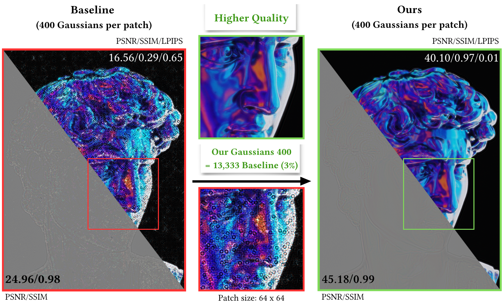
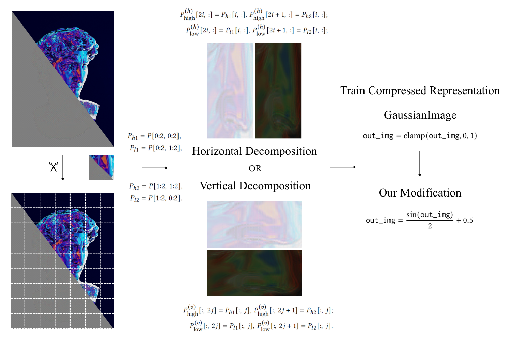
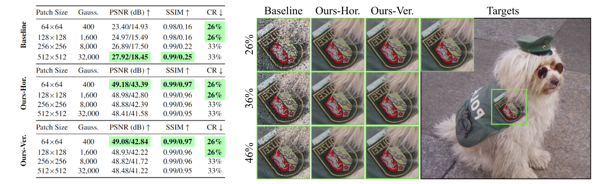
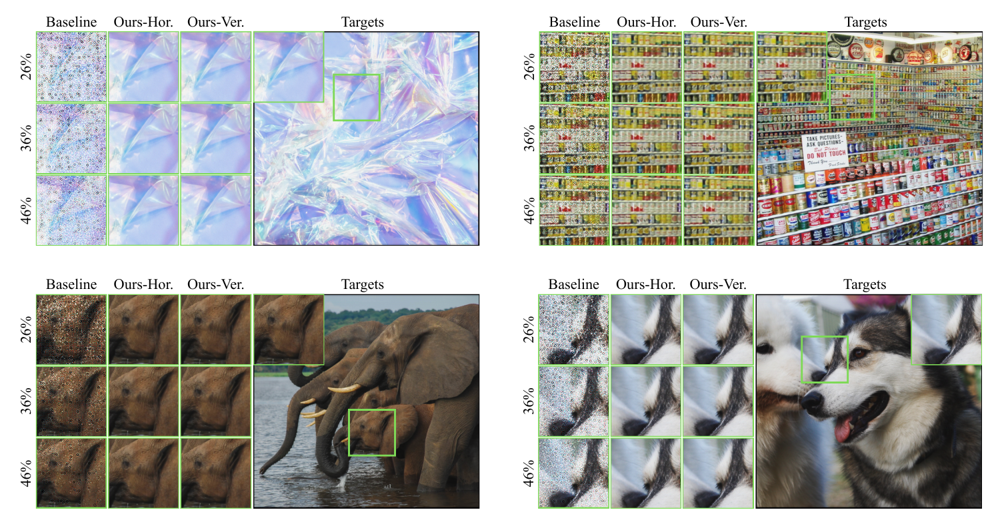

# Compressing Double Phase Holograms using 2D Gaussians

## People
<table class=""  style="margin: 10px auto;">
  <tbody>
    <tr>
      <td>  &nbsp;&nbsp;&nbsp;&nbsp;&nbsp;&nbsp;&nbsp;</td>
      <td>  &nbsp;&nbsp;&nbsp;&nbsp;</td>
      <td>  &nbsp;&nbsp;&nbsp;&nbsp;</td>
      <td>  &nbsp;&nbsp;&nbsp;&nbsp;</td>
    </tr> 
    <tr>
      <td>
<a href="https://merryxyfan.github.io">Xiaoyue Fan</a>1
</td>
      <td>
<a href="http://albertgary.github.io">Yicheng Zhan</a>1
</td>
      <td>
<a href="https://amritamaz.net">Amrita Mazumdar</a>2
</td>
      <td>
<a href="https://kaanaksit.com">Kaan Akşit</a>1
</td>
    </tr>
  </tbody>
</table>

1University College London,
2NVIDIA

<b>Eurographics 2026 Poster</b>

## Resources 
:material-newspaper-variant: [Manuscript](https://www.kaanaksit.com/assets/pdf/xxx.pdf)
:material-newspaper-variant: [Poster](https://www.kaanaksit.com/assets/pdf/xxx.pdf)
:material-newspaper-variant: [Supplementary](https://www.kaanaksit.com/assets/pdf/xxx.pdf)
:material-file-code: [Code](https://github.com/merryxyfan/Compressing_Double_Phase_Holograms_using_2D_Gaussians)
??? info ":material-tag-text: Bibtex"
        @inproceedings{fan2026comdph2dgs,
          author = {Xiaoyue Fan and Yicheng Zhan and Amrita Mazumdar and Kaan Ak{\c{s}}it},
          title = {Compressing Double Phase Holograms using 2D Gaussians},
          booktitle = {Eurographics 2026 Posters},
          year = {2026},
          location = {Aachen, Germany},
          <!-- publisher = {ACM}, -->
          <!-- address = {New York, NY, USA} -->
          pages = {2},
          <!-- doi = {https://doi.org/10.1145/3757374.3771423}, -->
          <!-- month = {December 16--18} -->
          note = {to appear}
        }

## Video
<video controls>
<source src="https://kaanaksit.com/assets/video/xxx.mp4" id="" type="video/mp4">
</video>

## Abstract
Effective compression of double-phase holograms remains an unresolved challenge due to their high-frequency nature, impeding the practicality of holographic displays. To address this challenge, we propose a hologram compression method by modifying the GaussianImage. Our method decomposes phase-only holograms into two components based on their intrinsic checkerboard pattern, separately optimizing each with a reduced set of 2D Gaussians. Our best case reduces the primitive count to only 3% of the baseline, achieving a compression ratio of 26% while preserving Mean PSNR = 43.39 dB in the reconstructed scenes.

<figure markdown>
  { width="900" }
</figure>

## Proposed Method
Our baseline compresses double-phase holograms using a patch based framework built on GaussianImage, a Gaussian Splatting (GS)-based image representation method where each Gaussian is defined by its position, covariance, color coefficients, and opacity. However,hardclamping during rendering distorts the underlying distribution, causing blob artifacts as illustrated in the lower-left corner of the above teaser. Our frame work replaces it with a sinusoidal constraint, which smoothly controls the value range yielding artifact-free perceptual quality.

The high-frequency nature of double-phase holograms poses challenges for Gaussian primitive representation, as Gaussians struggle to capture rapid phase oscillations across pixels, leading to suboptimal results. To improve this, we employ directional decomposition as a preprocessing step that separates high- and low-value components, allowing the model to bypass the high-frequency pattern from the outset. The decomposition is performed along vertical and horizontal directions, dividing checkerboard pixels into four groups by value. Both high- and low-value components undergo the same procedure: vertical decomposition reorganizes sparse pixels into denser images by interleaving columns, while horizontal decomposition interleaves the rows.

<figure markdown>
  { width="800" }
</figure>

Consequently, each decomposed image preserves half the spatial resolution on one axis allowing us to train the GS-based model for each decomposed image independently. The final compressed image is recombined by reversing the decomposition process, restoring the complete double-phase hologram.

## Conclusion

We evaluate the PSNR and SSIM for compressed holograms, experimenting with patch sizes from 64×64 to 512×512 to find the optimal balance between the compression ratio and fidelity. We employ the free-space light propagator from odak to numerically reconstruct holograms over three focal planes spanning a 5 mm depth range and evaluate 3D reconstruction by averaging PSNR, SSIM, and LPIPS across focal planes. As shown in our teaser, our approach achieves 40.10 dB PSNR with a 26% compression ratio, whereas our baseline, GaussianImage, suffers from severe distortions and low perceptual quality.

Unlike conventional learned methods treating holograms as regular images operating on 64×64 patches (~10s each) and requiring ~26 minutes for 512×512 holograms, our approach enables efficient sequential compression of two components in only ~4 minutes, regardless of resolution, without compromising reconstruction fidelity. Both vertical and horizontal decompositions perform comparably, as shown in the table. 

<figure markdown>
  { width="800" }
</figure>

<figure markdown>
  { width="800" }
</figure>

In our best case, our decomposition utilizes 3% primitive counts compared to the baseline, achieving a compression ratio of 26% while preserving Mean PSNR = 43.39 dB, 0.97 SSIM, and 0.016 LPIPS in the reconstructed scenes. Compared with the baseline, our modification effectively eliminates blob artifacts and inter-patch boundary lines, while introducing moderate computational overhead, doubling the runtime.

<!-- ## Photo gallery -->

## Relevant research works
Here are relevant research works from the authors:

- [Gaussianimage: 1000 fps image representation and compression by 2d gaussian splatting](https://arxiv.org/abs/2403.08551)
- [Assessing learned models for phase-only hologram compression](https://complightlab.com/publications/assess_hologram_compression/)
- [Computer-generated double phase holograms](https://opg.optica.org/ao/abstract.cfm?uri=ao-17-24-3874)
- [Multi-color holograms improve brightness in holographic displays](https://arxiv.org/abs/2301.09950)
- [Odak](https://github.com/kaanaksit/odak)

## Outreach
We host a Slack group with more than 250 members.
This Slack group focuses on the topics of rendering, perception, displays and cameras.
The group is open to public and you can become a member by following [this link](../outreach/index.md).

## Contact Us
!!! Warning
    Please reach us through [email](mailto:kaanaksit@kaanaksit.com) to provide your feedback and comments.
