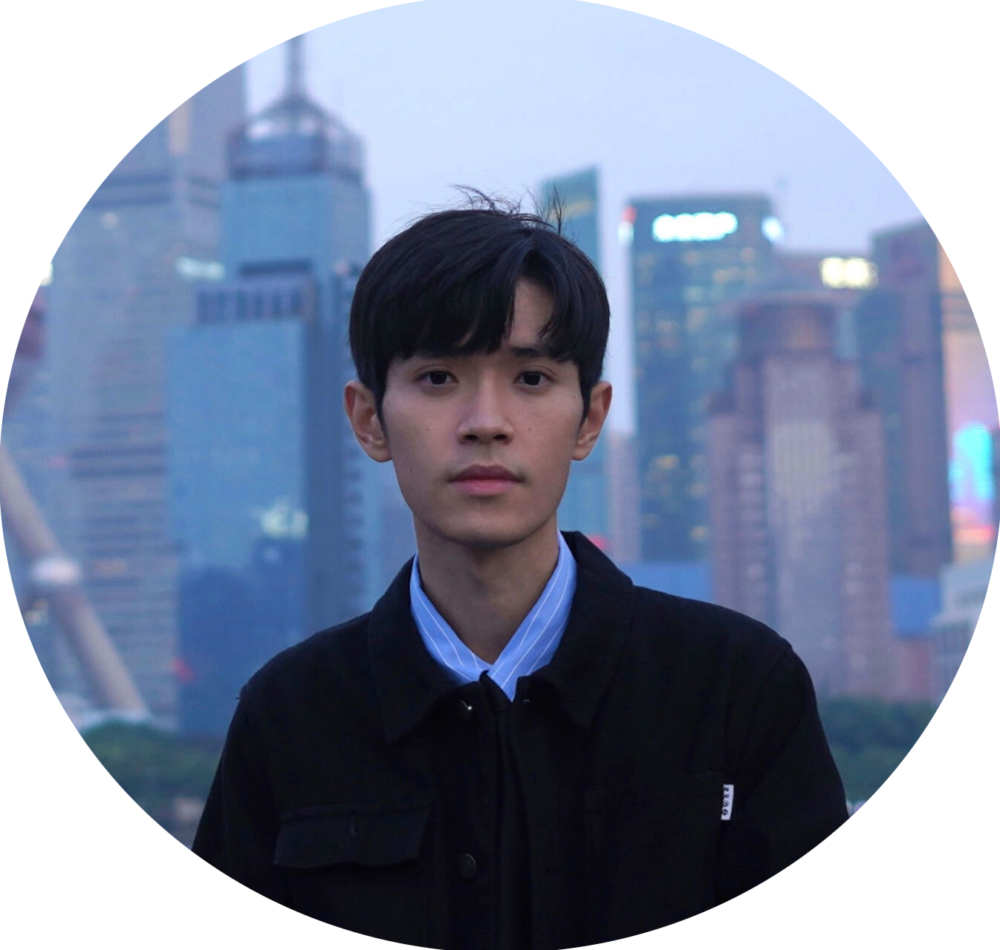
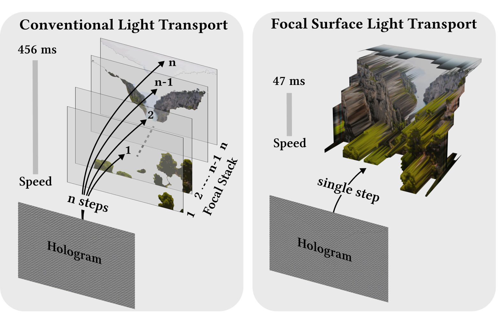
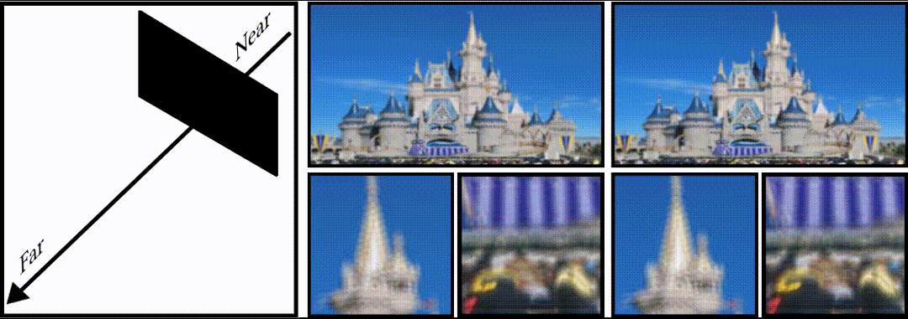
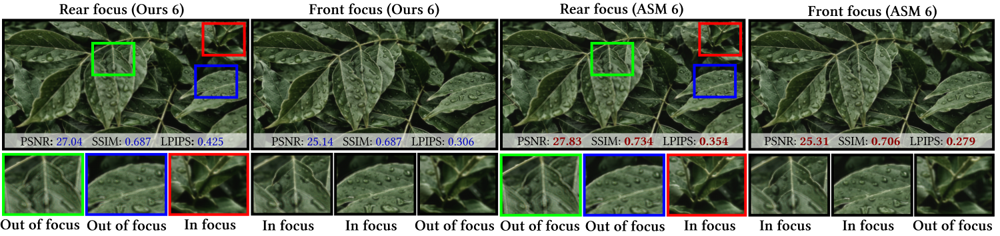
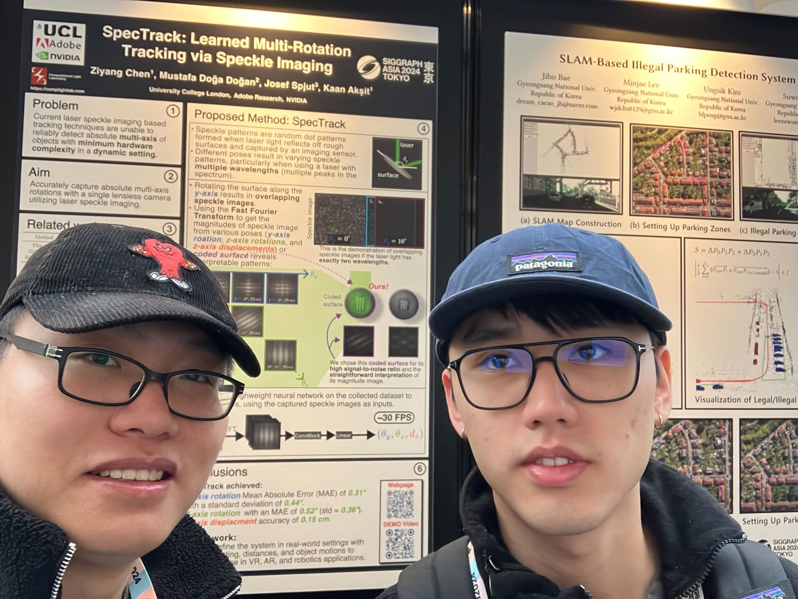
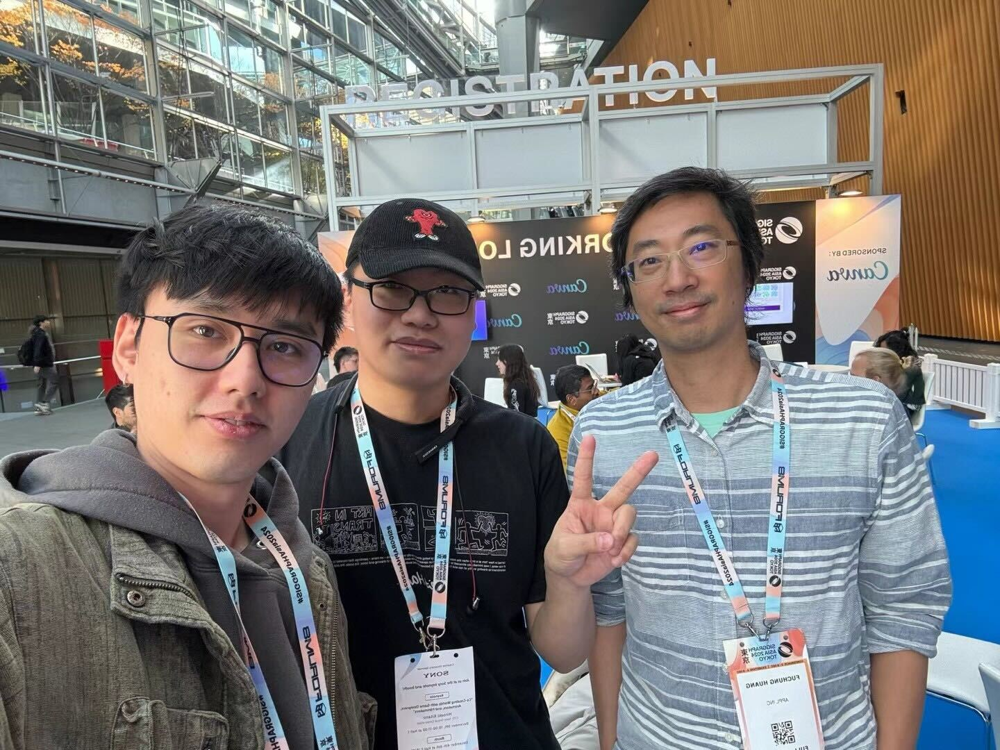
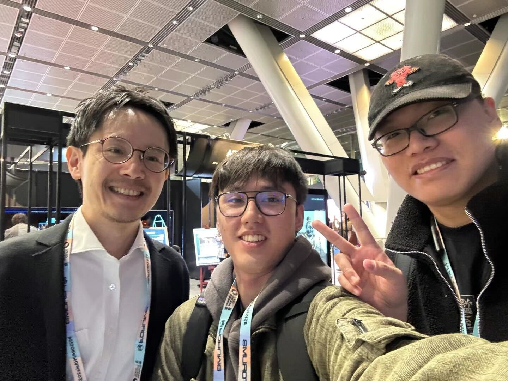

# Focal Surface Holographic Light Transport using Learned Spatially Adaptive Convolutions

## People
<table class=""  style="margin: 10px auto;">
  <tbody>
    <tr>
      <td>  &nbsp;&nbsp;&nbsp;&nbsp;</td>
      <td>  &nbsp;&nbsp;&nbsp;&nbsp;</td>
      <td>  &nbsp;&nbsp;&nbsp;&nbsp;</td>
      <td>  &nbsp;&nbsp;&nbsp;&nbsp;</td>
      <td>  &nbsp;&nbsp;&nbsp;&nbsp;</td>
    </tr>
    <tr>
      <td>
<a href="https://scholar.google.com.hk/citations?user=9Jk_LC8AAAAJ&hl=zh-CN">Chuanjun Zheng</a>1
</td>
      <td>
<a href="https://scholar.google.com/citations?hl=zh-CN&user=x2ptSYUAAAAJ">Yicheng Zhan</a>1
</td>
      <td>
<a href="https://people.csail.mit.edu/liangs/">Liang Shi</a>2
</td>
      <td>
<a href="https://scholar.google.com/citations?user=xZLjeAMAAAAJ&hl=en">Ozan Cakmakci</a>3
</td>
      <td>
<a href="https://kaanaksit.com">Kaan Akşit</a>1
</td>
    </tr>
  </tbody>
</table>

1University College London,
2Massachusetts Institute of Technology,
3Google

<b>SIGGRAPH Asia 2024 Technical Communications </b>

## Resources
:material-newspaper-variant: [Manuscript](https://kaanaksit.com/assets/pdf/ZhengEtAl_SigAsia2024_Focal_surface_holographic_light_transport_using_learned_spatially_adaptive_convolutions.pdf)
:material-newspaper-variant: [Supplementary](https://kaanaksit.com/assets/pdf/ZhengEtAl_SigAsia2024_Supplementary_Focal_surface_holographic_light_transport_using_learned_spatially_adaptive_convolutions.pdf)
:material-file-code: [Code](https://github.com/complight/focal_surface_holographic_light_transport)

[//]: # (:material-video-account: [Project video]&#40;https://kaanaksit.com/assets/video/KavakliSigAsia2023Multicolor.mp4&#41;)
??? info ":material-tag-text: Bibtex"
        @inproceedings{zheng2024focalholography,
          title={Focal Surface Holographic Light Transport using Learned Spatially Adaptive Convolutions},
          author={Chuanjun Zheng, Yicheng Zhan, Liang Shi, Ozan Cakmakci, and Kaan Ak{\c{s}}it},
          booktitle = {SIGGRAPH Asia 2024 Technical Communications (SA Technical Communications '24)},
          keywords = {Computer-Generated Holography, Light Transport, Optimization},
          location = {Tokyo, Japan},
          series = {SA '24},
          month={December},
          year={2024},
          doi={https://doi.org/10.1145/3681758.3697989}
        }

[//]: # (## Video)

[//]: # (<video controls>)

[//]: # (<source src="https://kaanaksit.com/assets/video/KavakliSigAsia2023Multicolor.mp4" id="“ type="video/mp4">)

[//]: # (</video>)

## Abstract
Computer-Generated Holography (CGH) is a set of algorithmic methods for identifying holograms that reconstruct Three-Dimensional (3D) scenes 
in holographic displays. CGH algorithms decompose 3D scenes into multiplanes at different depth levels and rely on simulations
of light that propagated from a source plane to a targeted plane. Thus, for $n$ planes, CGH typically optimizes holograms using $n$ plane-to-plane 
light transport simulations, leading to major time and computational demands. Our work replaces multiple planes with a focal surface and introduces 
a learned light transport model that could propagate a light field from a source plane to the focal surface in a single inference. Our model leverages 
spatially adaptive convolution to achieve depth-varying propagation demanded by targeted focal surfaces. The proposed model reduces the hologram 
optimization process up to $1.5x$, which contributes to hologram dataset generation and the training of future learned CGH models.

## Focal Surface Holographic Light Transport
Simulating light propagation among multiple planes in a 3D volume is computationally 
demanding, as a 3D volume is represented with multiple planes and each plane requires
a separate calculation of light propagation to reconstruct the target image. Thus, 
for $n$ planes, conventional light transport simulation methods require $n$ plane-to-plane 
simulations, leading to major time and computational demands. Our work replaces multiple
planes with a focal surface and introduces a learned light transport model that could 
propagate a light field from a source plane to the focal surface in a single inference,
reducing simulation time by $10x$.

<figure markdown>
  { width="700" }
</figure>

## Results
When simulating a full-color, all-in-focus 3D image across a focal surface, conventional 
Angular Spectrum Method (ASM) requires eighteen forward passes to simulate the 3D image 
with six depth planes given there are three color primaries. 

<figure markdown>
  { width="680" }
</figure>

Our work enables a new way to overcome this computational complexity 
arising from plane to plane treatment, and unlocks a new rendering method that could
propagate light beams from a plane to a focal surface.
This new model could help reduce computational complexity in simulating light.
Specifically, it could help verify and calculate holograms for
holographic displays with much ease and lesser computation.

<figure markdown>
  { width="700" }
</figure>

 We utilize our model for a 3D phase-only hologram optimization application under
 $0 mm$ propagation distance. Optimizing holograms with six target planes using ASM
 is denoted as ASM 6, while Ours 6 represents optimizing holograms using our model with six
 focal surfaces. When comparing the simulation results, all holograms are reconstructed using ASM for performance assessment. 
Ours 6 achieves comparable results with about $70\%$ of the optimization time compared to ASM 6.

<figure markdown>
  { width="800" }
</figure>

We also apply our model for a 3D phase-only hologram optimization application under $10 mm$ propagation distance.

<figure markdown>
  { width="800" }
</figure>

## Photo gallery
Here, we release photographs from our visit to the conference, highlighting parts of our SIGGRAPH ASIA 2024 experience.

<figure markdown>
  { width="390", align=left }
  { width="390", align=left }
  { width="390", align=left }
  { width="390", align=left }
  { width="390", align=left }
  { width="390", align=left }
  { width="390", align=left }
  { width="390", align=left }
  { width="390", align=left }
</figure>

## Relevant research works
Here are relevant research works from the authors:

- [Multi-color Holograms Improve Brightness in Holographic Displays](multi_color.md)
- [HoloBeam: Paper-Thin Near-Eye Displays](holobeam.md)
- [Realistic Defocus for Multiplane Computer-Generated Holography](realistic_defocus_cgh.md)
- [Optimizing Vision and Visuals: Lectures on Cameras, Displays, and Perception](../teaching/siggraph2022_optimizing_vision_and_visuals.md)
- [Learned Holographic Light Transport](https://github.com/complight/realistic_holography)
- [Metameric Varifocal Holograms](https://github.com/complight/metameric_holography)
- [Odak](https://github.com/kaanaksit/odak)

[//]: # (## External Other Links)

[//]: # (Here are links related to our project such as videos, articles or podcasts:)

[//]: # ()
[//]: # (- [ACM SIGGRAPH Asia 2023, Technical Papers Fast Forward &#40;Preview the presentations on 13 Dec, Day 2&#41;]&#40;https://youtu.be/dMsD_xXOEKA?feature=shared&t=332&#41;)

## Outreach
We host a Slack group with more than 250 members.
This Slack group focuses on the topics of rendering, perception, displays and cameras.
The group is open to public and you can become a member by following [this link](../outreach/index.md).

## Contact Us
!!! Warning
    Please reach us through [email](mailto:chuanjunzhengcs@gmail.com) to provide your feedback and comments.

