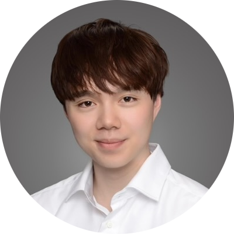
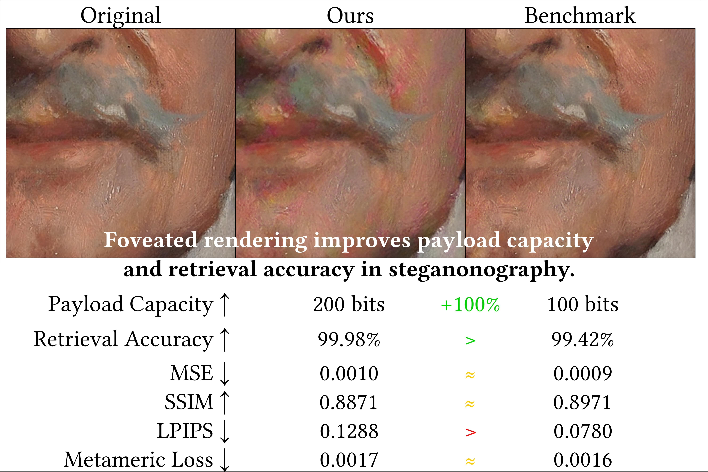
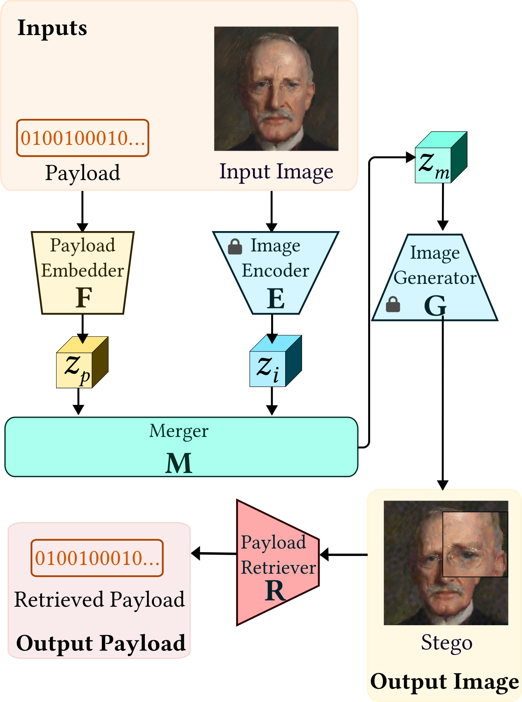
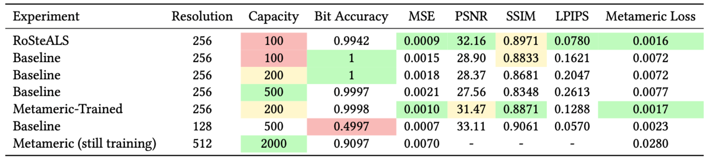
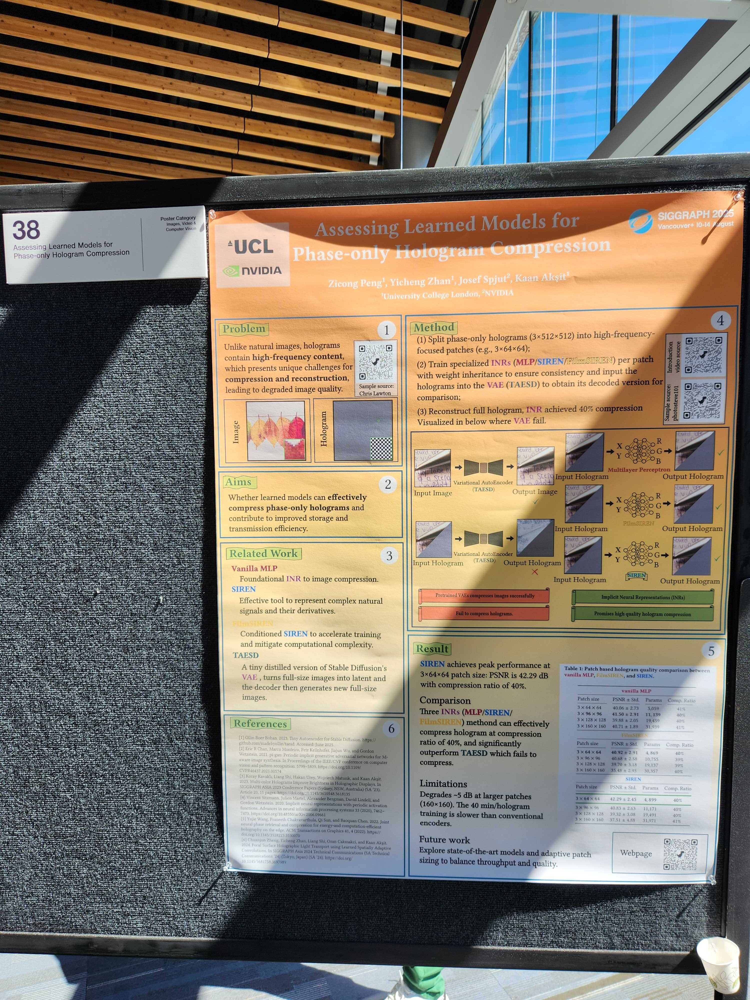
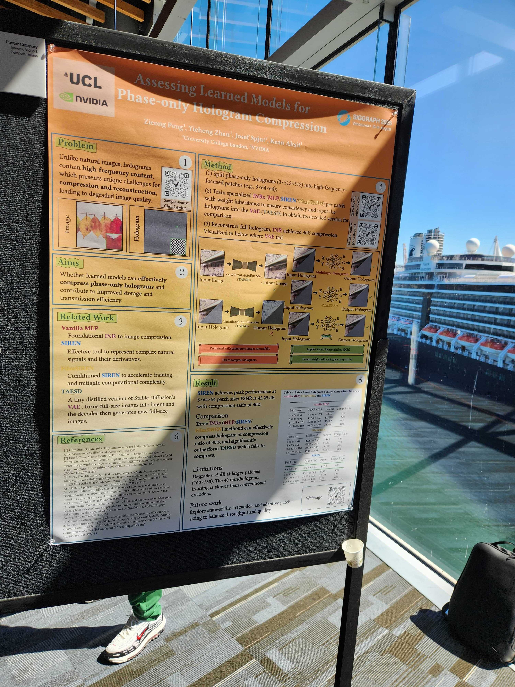
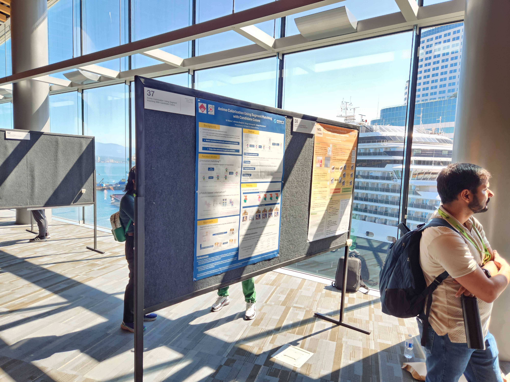
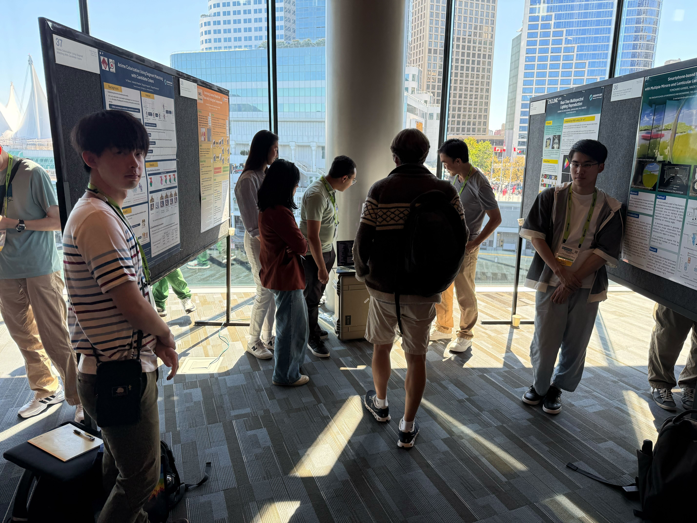
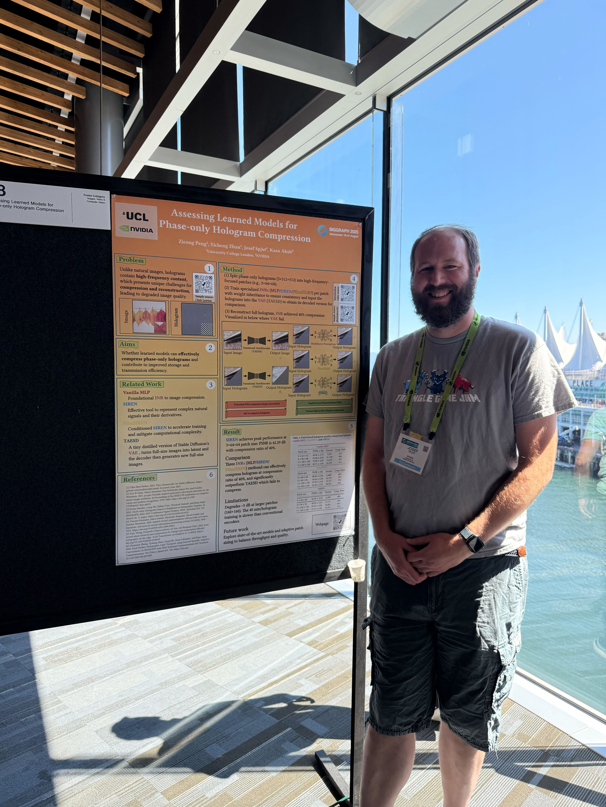

# Foveation Improves Payload Capacity in Steganography

## People
<table class=""  style="margin: 10px auto;">
  <tbody>
    <tr>
      <td>  &nbsp;&nbsp;&nbsp;&nbsp;&nbsp;&nbsp;&nbsp;</td>
      <td>  &nbsp;&nbsp;&nbsp;&nbsp;</td>
      <td>  &nbsp;&nbsp;&nbsp;&nbsp;</td>
      <td>  &nbsp;&nbsp;&nbsp;&nbsp;</td>
    </tr> 
    <tr>
      <td>
<a href="https://github.com/Gnefil">Lifeng Qiu Lin</a>1
</td>
      <td>
<a href="http://gulpinhenry.github.io">Henry Kam</a>2
</td>
      <td>
<a href="http://qisun.me">Qi Sun</a>2
</td>
      <td>
<a href="https://kaanaksit.com">Kaan Akşit</a>1
</td>
    </tr>
  </tbody>
</table>

1University College London,
2New York University

<b>SIGGRAPH Asia 2025 Poster</b>

## Resources 
:material-newspaper-variant: [Manuscript](https://www.kaanaksit.com/assets/pdf/LinEtAl_SiggraphAsia2025_Foveation_improves_payload_capacity_in_steganography.pdf)
:material-newspaper-variant: [Poster](https://www.kaanaksit.com/assets/pdf/LinEtAl_SiggraphAsia2025_Poster_Foveation_improves_payload_capacity_in_steganography.pdf)
<!-- TODO: upload materials here -->
:material-newspaper-variant: [Supplementary]()
:material-file-code: [Code](https://github.com/complight/foveation_steganography)
??? info ":material-tag-text: Bibtex"
        @inproceedings{qiu2025foveation,
          author = {Lifeng Qiu Lin and Henry Kam and Qi Sun and Kaan Ak{\c{s}}it},
          title = {Foveation Improves Payload Capacity in Steganography},
          booktitle = {SIGGRAPH Asia 2025 Posters (SA Posters '25)},
          year = {2025},
          location = {Hong Kong, China},
          publisher = {ACM},
          address = {New York, NY, USA},
          pages = {2},
          doi = {https://doi.org/10.1145/3757374.3771423},
          month = {December 16--18}
        }

## Video
<video controls>
<source src="https://kaanaksit.com/assets/video/LinSigAsia2025FoveatedSteganography.mp4" id="" type="video/mp4">
</video>

## Abstract
Steganography finds its use in visual medium such as providing metadata and watermarking.
With support of efficient latent representations and foveated rendering, we trained models that improve existing capacity limits from 100 to 500 bits, while achieving better accuracy of up to 1 failure bit out of 2000, at 200K test bits.
Finally, we achieve a comparable visual quality of 31.47 dB PSNR and 0.13 LPIPS, showing the effectiveness of novel perceptual design in creating multi-modal latent representations in steganography.

<figure markdown>
  { width="900" }
</figure>

## Proposed Method
Considering a message payload $P \in \{0, 1\}^k$ consisting of $k$ bits and a input image (cover) $I \in \mathbb{R}^{h \times w \times c}$, find two functions $H$ and $R$, to produce an output image (stego), $H(I, P) = I' \in \mathbb{R}^{h \times w \times c}$, and output payload, $R(I') = P' \in \{0, 1\}^k$. The aim is to reduce the distortion between $I$ and $I'$ while maximizing the accuracy between $P$ and $P'$.
Our framework approaches this problem as depicted below:

<figure markdown>
  { width="800" }
</figure>

In the hiding stage, a frozen image encoder, $E$, transforms input image into a latent representation, $E(I) = Z_i$. 
Payload embedder, $F$, creates also a learned representation, $P(I) = Z_p$. 
Together, they are manipulated by the merger, $M$, producing a merged latent, $M(Z_i, Z_p) = Z_m$, which a frozen image generator, $G$, uses to reconstruct the output image,  $G(Z_m) = I'$. 
Finally, a payload retriever, $R$, extracts the output payload, $R(I') = P'$.
The loss function is defined as the combination of payload and image quality losses, being BCE and Metameric Foveated Rendering (defaulted to center) losses respectively.
Formally,$\mathcal{L}_{total} = \mathcal{L}_{payload} + \lambda_i \cdot \mathcal{L}_{image} \nonumber = \operatorname{BCE}(P, P') + \lambda_i \cdot (MetamericLoss(I, I')),$
where $\lambda_i$ controls the trade-off between the two losses.

The dataset is a balanced mixture of 2000 training, 400 validation, and 400 test images from MetFaces and CLIC datasets. 
For preprocessing, images are randomly cropped and padded to the size of input and normalized as autoencoder requires. 
Notably, this dataset is much smaller than typical datasets used for the same purpose, but is found sufficient to learn performing 100-bits steganography, within controlled computing resources, about two hours on a single RTX 4090 GPU.

## Conclusion
The frozen pair of image encoder and image generator to create a high-quality latent representation, is the F4-with-attention version autoencoder from LDM VQGAN series.
After evaluating empirically, we found its high reconstruction quality is suitable for the embedding process. Compared to other backbones, this one converges slower at payload embedding, but achieves better image quality in the end.
Keeping payload embedder as a fully connected layers is sufficient to encode the information after experimentation. 
For merger, the best performing architecture is adding two convolutional layer sandwiching the sum of image and payload latent, to soften the transition. 
Finally, ResNet50 was used as payload retriever as a popular and well-studied architecture. 

Apart from common metrics, we also report Metameric Loss, which is a perceptual criterion akin to foveated gaze.
Modeling the human visual system, this loss is more forgiving of visual distortions in the periphery and more harsh in the fovea.

The main results are shown below: 
<figure markdown>
  { width="800" }
</figure>
Our baseline is trained in multiple resolutions and payload capacities, including the native resolution of RoSteALS, the benchmarked method.
The baseline in the smallest setting achieves a bit accuracy of 99.99\%, failing to decode only 4 out of 40K test bits. 
Noticeably, we achieve 100\% recovery in the same setting as the benchmark, while other settings also all exceed 99.95\% compared to benchmark failing to reach 99.5\%.
Nevertheless, RoSteALS has better perceptual image quality, although it could be explained with lack of incorporation of LPIPS and finer-grained optimization in the training.

Another important observation is that Metameric Loss consistently and significantly improves the quality of the reconstructed images while keeping same level of bit accuracy. 
This shows effectiveness of this visual technique in enhancing perceptual fidelity of images.

Despite successfully unlocking higher message length, we notice tangible limits of payload capacity, such as failing to learn 500-bit payload at 128 resolution.
Resolution bounds the upper payload capacity under similar perceptual fidelity of images, and we hope to enhance this by introducing gaze as a new parameter.
This work provides a light-weighted, human-centered, latent-based steganography framework which boosts payload capacity and accuracy while maintaining image quality.
By satiating the need of large capacity in transmitting messages, we step towards practical applications of steganography in real-world scenarios.

<!-- ## Photo gallery
Here, we release photographs from our visit to the conference, highlighting parts of our SIGGRAPH Asia 2025 experience. -->

<!-- TODO -->
<!-- <figure markdown>
  { width="390", align=left }
  { width="390", align=left }
  { width="390", align=left }
  { width="390", align=left }
  { width="390", align=left }
</figure> -->

## Relevant research works
Here are relevant research works from the authors:

- [ChromaCorrect: Prescription Correction in Virtual Reality Headsets through Perceptual Guidance](https://complightlab.com/ChromaCorrect)
- [Metameric Inpainting for Image Warping](https://doi.org/10.1109/tvcg.2022.3216712)
- [Metameric Varifocal Holograms](https://vr.cs.ucl.ac.uk/research/pipelines/metameric-varifocal-holography/)
- [Optimizing vision and visuals: lectures on cameras, displays and perception](../teaching/siggraph2022_optimizing_vision_and_visuals.md)
- [Beyond blur: ventral metamers for foveated rendering](https://www.homepages.ucl.ac.uk/~ucabdw0/beyondblur.html)
- [Foveated AR: dynamically-foveated augmented reality display](https://dl.acm.org/doi/10.1145/3306346.3322987)
- [Odak](https://github.com/kaanaksit/odak)

## Outreach
We host a Slack group with more than 250 members.
This Slack group focuses on the topics of rendering, perception, displays and cameras.
The group is open to public and you can become a member by following [this link](../outreach/index.md).

## Contact Us
!!! Warning
    Please reach us through [email](mailto:kaanaksit@kaanaksit.com) to provide your feedback and comments.

<!-- ## Acknowledgements -->

<!-- 

Kaan Akşit is supported by the Royal Society's RGS\R2\212229 - Research Grants 2021 Round 2 in building the hardware prototype. Kaan Akşit is also supported by Meta Reality Labs inclusive rendering initiative 2022. Liang Shi is supported by Meta Research PhD fellowship (2021-2023).
 
 
 
 
 
 
 

Hakan Urey is supported by the European Innovation Council’s HORIZON-EIC-2021-TRANSITION-CHALLENGES program Grant Number 101057672 and Tübitak’s 2247-A National Lead Researchers Program, Project Number 120C145.
 
 
 
 
 
 
  -->

