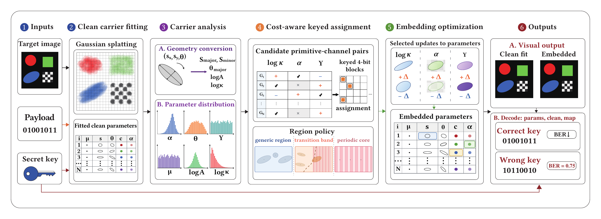
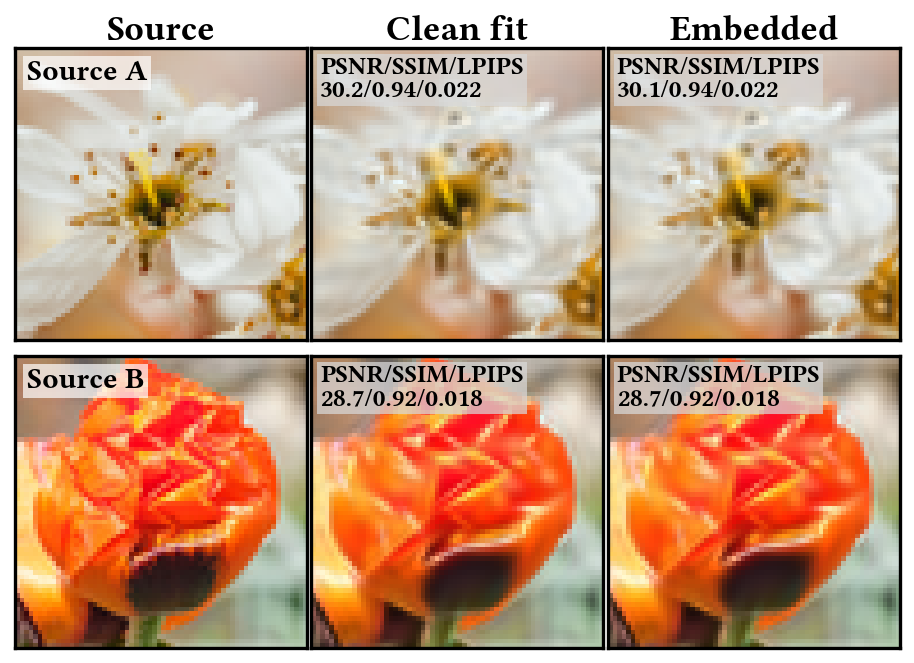
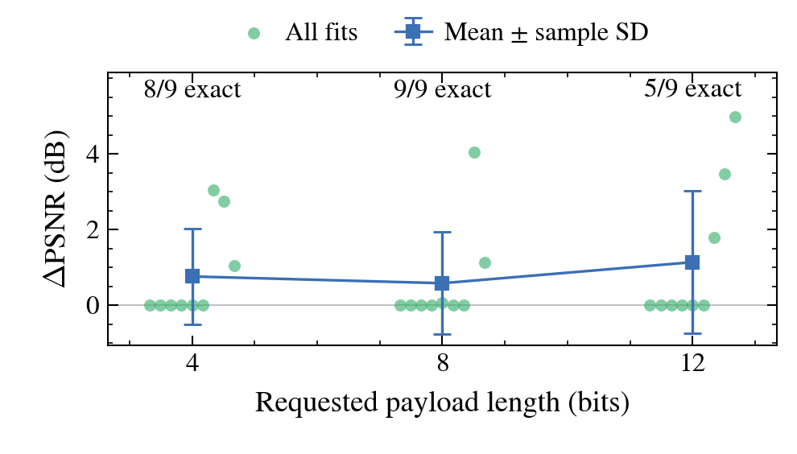

# Gaussian Image Steganography via Parameter-Domain Keyed Embeddings

## People

  

    
     <a href="https://tongwu-research.github.io/">Tong Wu</a>1
     <small>1 East China University of Science and Technology Shanghai, China</small>
  

  

    
     <a href="https://aidcheng.github.io/">Runze Cheng</a>2,3
     <small>2 University of Cambridge 3 Computational Light Laboratory, University College London</small>
  

  

    
     <a href="https://merryxyfan.github.io/">Xiaoyue Fan</a>4
     <small>4 University College London London, United Kingdom</small>
  

  

    
     <a href="https://kaanaksit.com/">Kaan Akşit</a>4
     <small>4 University College London London, United Kingdom</small>
  

<strong>SIGGRAPH Asia 2026 Technical Communications</strong>

## Resources

:material-newspaper-variant: [Manuscript](https://www.kaanaksit.com/assets/pdf/WuEtAl_SigAsia26_Gaussian_image_steganography_via_parameter_domain_keyed_embeddings.pdf) 
:material-newspaper-variant: [Supplementary material](https://www.kaanaksit.com/assets/pdf/WuEtAl_SigAsia26_Supplementary_Gaussian_image_steganography_via_parameter_domain_keyed_embeddings.pdf) 
:material-file-code: [Code](https://github.com/tongwu-research/gaussian-image-steganography)

??? info ":material-tag-text: BibTeX"

    <pre><code>&#64;inproceedings{wu2026gaussian,
      author    = {Wu, Tong and Cheng, Runze and Fan, Xiaoyue and Ak{\c{s}}it, Kaan},
      title     = {Gaussian Image Steganography via Parameter-Domain Keyed Embeddings},
      booktitle = {SIGGRAPH Asia 2026 Technical Communications (SA Technical Communications '26)},
      year      = {2026},
      publisher = {Association for Computing Machinery},
      doi       = {10.1145/3829339.3847833}
    }</code></pre>

## Video

<video controls preload="metadata" playsinline style="display:block;width:100%;height:auto;">
  <source src="https://kaanaksit.com/assets/video/WuSigAsia2026GaussianSteganography.mp4" type="video/mp4">
  <a href="https://kaanaksit.com/assets/video/WuSigAsia2026GaussianSteganography.mp4">Download the highlights video</a>.
</video>

## Overview

We embed a short message in the parameters of an image-space 2D Gaussian representation. First, we fit a clean representation to the source image. A secret key defines candidate parameter changes, and a cost-aware assignment chooses edits that encode the message while limiting their effect on the rendered image. We then optimize the selected parameters.

The receiver reads the embedded parameters together with the corresponding clean reference parameters and an assignment map produced by the encoder. We therefore focus on sharing the Gaussian parameter set itself. For the fixed 8-bit payload, we recover the message exactly on all 112 held-out natural images, each represented by 4,096 Gaussians.

<figure markdown>
  { width="100%" }
  <figcaption style="max-width:100%;text-align:left;font-style:normal;"><strong><a href="../media/tc147/figure1.pdf">Figure 1</a>: System overview.</strong> A clean 2D Gaussian carrier is fitted from an input image. Canonical carrier channels are analyzed and scored. Keyed carrier assignment selects signed parameter updates, and decoding compares correct-key recovery against wrong-key behavior.</figcaption>
</figure>

## Motivation

Rather than changing the pixels of a finished image, we ask whether a fitted Gaussian representation can carry a payload through selected changes to its parameters. This matters when the parameter set itself is shared. Changing these parameters can affect image quality and shift the parameter distribution. Our method weighs those effects before choosing edits.

## Method

### Embedding

We start with a clean fit of the target image. Each Gaussian has a position, shape, color, and opacity. We use three possible carrier channels: **log-anisotropy**, which describes how elongated a Gaussian is; **opacity**, which controls its contribution to the render; and **color luminance**, the brightness derived from its RGB color. We leave the number of Gaussians unchanged.

For each possible signed edit, the method estimates rendering sensitivity, distribution shift, visual importance, and an outlier-value penalty. The key generates initial candidate actions and a parity mapping from actions to message bits. Assignment then selects a low-cost combination that satisfies the message constraints. A region policy limits the allowed channels and edit strengths around periodic structure, where changes can be more noticeable. Finally, embedding optimization adjusts the selected parameters while checking message recovery and rendered-image quality. Supplementary Sections S2 and S3 give the extraction rule, region calculation, and optimization details.

### Decoding

Decoding uses three items: the **embedded Gaussian parameters**, their **corresponding clean reference parameters**, and an **assignment map produced by the encoder under the key**. The map identifies the parameter changes to read and how their binary decisions form message bits. The decoder compares each selected parameter with its clean counterpart, checks whether the prescribed change is present, and recovers the message in four-bit blocks using the parity mapping. Supplementary Section S2 states the extraction rule.

## Results

The paper's visual examples show source photographs, clean Gaussian fits, and embedded reconstructions at 64 × 64 pixels.

<figure markdown>
  { width="620" }
  <figcaption style="max-width:100%;text-align:left;font-style:normal;"><strong>Figure 2: Clean Fit vs. Embedded Reconstruction.</strong> We refer to the clean fit as the reconstruction of a source image from our pipeline without payload embedding, whereas the embedded case additionally applies the keyed embedding pipeline. Images are 64 × 64 pixels. Source photographs are by Christian Widell and Christian J. Leuner, respectively.</figcaption>
</figure>

For the natural-image test, we prepared 124 images at 256 × 256 pixels, used 12 to choose the Gaussian count, and evaluated the remaining 112 with 4,096 Gaussians and a fixed 8-bit payload. An exact recovery means all eight bits are correct. The same clean fits were used for the three methods below. We report exact payload recovery and the drop in peak signal-to-noise ratio (ΔPSNR).

| Method | Exact recovery | Mean ΔPSNR |
| --- | ---: | ---: |
| Matched random | 110/112 | 0.013 dB |
| Greedy no-key | 112/112 | 0.006 dB |
| Ours | **112/112** | **0.009 dB** |

Here ΔPSNR is the nonnegative drop from the clean fit: both the clean and embedded renders are compared with the source image. Matched random uses the key but selects edits at random. Greedy no-key chooses low-cost edits without a key-dependent decoding step. For our method, mean wrong-key bit error rate (BER) was 0.520 on the 16 wrong keys also used during optimization and checkpoint selection. The full variation across images and the other BER values appear in Table 3 of the paper.

## Further Evaluations

### Payload length

The nine-fit development experiment tested requests for 4, 8, and 12 bits on three synthetic targets with three fitting seeds each. Exact recovery occurred in 8/9, 9/9, and 5/9 cases, respectively. Supplementary Figure S3 plots every fit's ΔPSNR, together with the mean and sample standard deviation. The plot includes runs that failed recovery or image-quality checks. All nine 16-bit requests were shortened to an effective length of 8 bits, so none demonstrates recovery of the requested 16 bits. These runs are reported alongside the figure rather than plotted as 16-bit capacity.

<figure markdown>
  { width="560" }
  <figcaption style="max-width:100%;text-align:left;font-style:normal;"><strong>Figure S3: Capacity results on three synthetic targets with three fitting seeds each.</strong> Points show all nine runs per length; the line and bars show the mean and sample standard deviation. Labels give exact recovery counts. The vertical axis is the nonnegative PSNR drop relative to the clean fit.</figcaption>
</figure>

### Message content

Using one fit of each synthetic target, we tested all 256 possible byte values. Exactly 623 of the 768 target–byte combinations were recovered. The periodic stripe target accounted for most failures.

### Cost weights

The assignment cost combines four terms with baseline weights (0.4, 0.3, 0.2, 0.1). In a separate sensitivity experiment, one weight at a time was multiplied by 0.75 or 1.25 and the four weights were renormalized. The baseline and eight variations were each run on nine newly generated synthetic fits, for 81 embeddings. Every setting recovered the fixed 8-bit payload on all nine fits. Mean ΔPSNR nevertheless varied from 0.169 to 0.596 dB across the settings, compared with 0.398 dB at the baseline. Supplementary Section S7 and Table S3 report the individual results.

## Related Work

Related work from the laboratory includes [Gaussian image coding](clustercodebook2DGS.md) and [foveated steganography](foveated_steganography.md). The related [3D-GSW (CVPR 2025)](https://openaccess.thecvf.com/content/CVPR2025/html/Jang_3D-GSW_3D_Gaussian_Splatting_for_Robust_Watermarking_CVPR_2025_paper.html) and [GaussianMarker (NeurIPS 2024)](https://proceedings.neurips.cc/paper_files/paper/2024/hash/39cee562b91611c16ac0b100f0bc1ea1-Abstract-Conference.html) papers watermark three-dimensional Gaussian scenes. 3D-GSW extracts from rendered views; GaussianMarker studies extraction from both renderings and Gaussian parameters. Our experiments concern a fitted two-dimensional image representation and a decoder that also needs the paired clean fit and encoder-produced assignment map. Supplementary Section S5 compares the decoding inputs, payloads, and distortion references.

## Contact

For questions about the paper, contact Tong Wu at [24012920@mail.ecust.edu.cn](mailto:24012920@mail.ecust.edu.cn). The manuscript, supplementary material, code, and citation are linked above.
