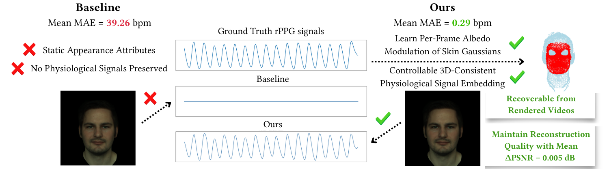
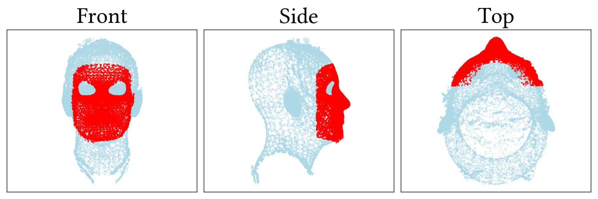
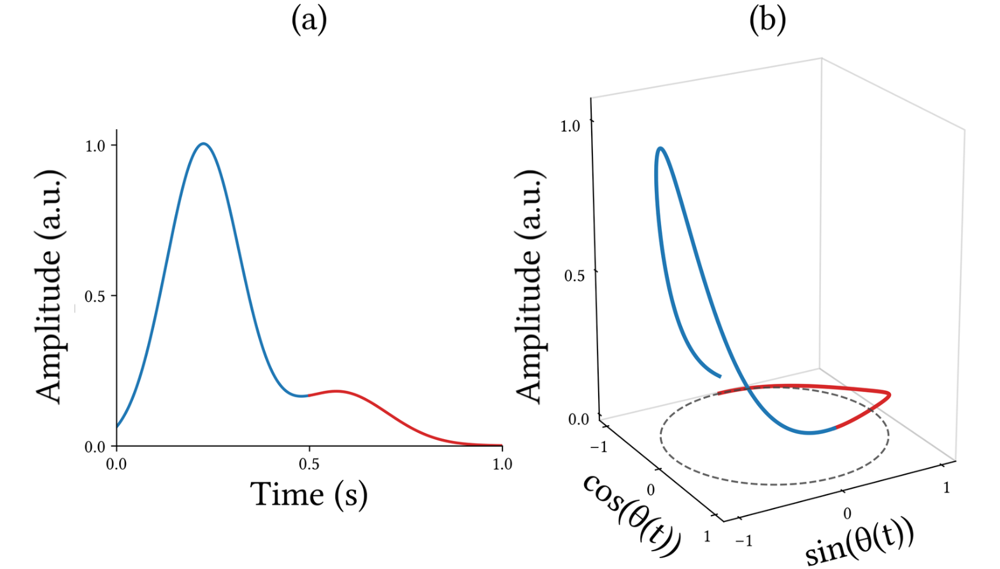
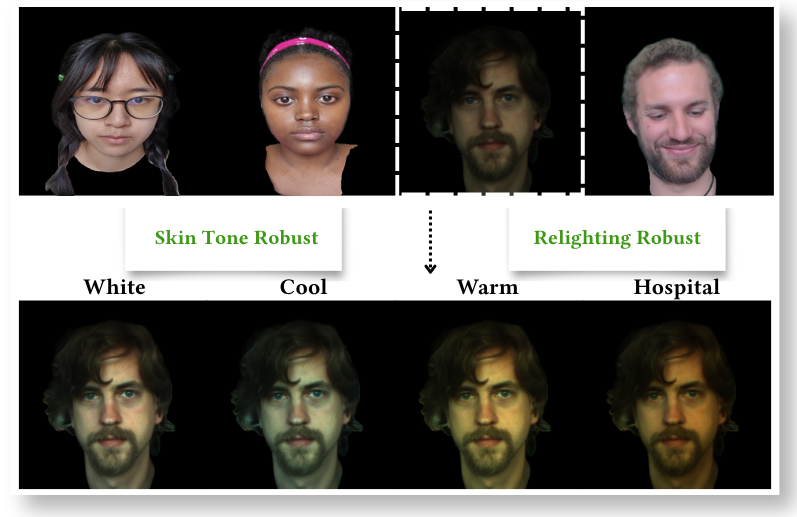

# 💓Heartian: Physiology-Aware Relightable Gaussian Head Avatar

## People
<table class=""  style="margin: 10px auto;">
  <tbody>
    <tr>
      <td>  &nbsp;&nbsp;&nbsp;&nbsp;&nbsp;&nbsp;&nbsp;</td>
      <td>  &nbsp;&nbsp;&nbsp;&nbsp;</td>
      <td>  &nbsp;&nbsp;&nbsp;&nbsp;</td>
      <td>  &nbsp;&nbsp;&nbsp;&nbsp;</td>
    </tr> 
    <tr>
      <td>
<a href="https://merryxyfan.github.io">Xiaoyue Fan</a>1
</td>
      <td>
<a href="https://research.adobe.com/person/jose-echevarria/">Jose Echevarria</a>2
</td>
      <td>
<a href="https://akshayparuchuri.com/">Akshay Paruchuri</a>3
</td>
      <td>
<a href="https://kaanaksit.com">Kaan Akşit</a>1
</td>
    </tr>
  </tbody>
</table>

1University College London,
2Adobe Research
3Stanford University

<b>SIGGRAPH Asia 2026 Technical Communications</b>

## Resources 
:material-newspaper-variant: [Manuscript](https://www.kaanaksit.com/assets/pdf/FanEtAl_SigAsia2026_Heartian_physiology_aware_relightable_gaussian_head_avatar.pdf)
:material-newspaper-variant: [Supplementary](https://www.kaanaksit.com/assets/pdf/FanEtAl_SigAsia2026_Supplementary_Heartian_physiology_aware_relightable_gaussian_head_avatar.pdf)
:material-file-document-outline: [arXiv](https://arxiv.org/abs/2609.28539)
:material-file-code: [Code](https://github.com/complight/Heartian-Physiology_Aware_Relightable_Gaussian_Head_Avatar)
??? info ":material-tag-text: Bibtex"
        @inproceedings{fan2026heartian,
              author = {Fan, Xiaoyue  and Echevarria, Jose  and Paruchuri, Akshay  and Ak{\c{s}}it, Kaan },
              title = {{💓Heartian: Physiology-Aware Relightable Gaussian Head Avatar}},
              booktitle = {SIGGRAPH Asia 2026 Technical Communications (SA Technical Communications '26)},
              year = {2026},
              month = {December 01--04},
              publisher = {Association for Computing Machinery},
              location = {Kuala Lumpur, Malaysia}, 
              pages = {4},
              isbn = {979-8-4007-2841-9/2026/12},
              doi = {10.1145/3829339.3847838},
              url = {https://arxiv.org/abs/2609.28539}
              }

## Video
<video controls>
<source src="https://www.kaanaksit.com/assets/video/FanSigAsia2026Heartian.mp4" id="" type="video/mp4">
</video>

## Abstract
Gaussian head avatars typically model intrinsic facial appearance as temporally static, omitting subtle cardiac-induced skin-color variation. We propose 💓Heartian, a physiology-aware modulation framework that learns cardiac-cycle-dependent per-frame albedo modulation of facial skin-region Gaussians within a relightable head avatar to encode remote photoplethysmography (rPPG) signals. Using synchronized contact PPG supervision, 💓Heartian models the prescribed cardiac waveform as the sum of two Gaussian functions and learns per-frame spatial residuals via a lightweight MLP. Across 152 stationary recordings from UBFC-rPPG, PURE, and MMPD, attribute-space recovery of the supplied signal achieves a pooled recording-level heart-rate MAE of 0.29 bpm and MAPE of 0.38%. The signals remain detectable after rendering by benchmark rPPG methods, with the best tested configuration - a motion-augmented TS-CAN decoder pretrained on UBFC-rPPG - recovering heart rate from the rendered MMPD avatars at 0.97 bpm MAE and 1.21% MAPE. Meanwhile, 💓Heartian maintains reconstruction quality comparable to the baseline, with negligible average PSNR degradation of 0.005 dB. Overall, our work embeds recoverable rPPG signals as controllable material attributes to subject-specific Gaussian head avatars, while retaining reconstruction quality.

<figure markdown>
  { width="900" }
</figure>

## Proposed Method
We propose 💓Heartian, a physiology-aware modulation framework that embeds prescribed rPPG signals into relightable Gaussian head avatars. Building on HRAvatar reconstruction, we optimize per-frame spatial modulation factors acting on the albedo of facial skin-region Gaussians.

<figure markdown>
  { width="500" }
</figure>

For each facial skin-region Gaussian as illustrated in red in the above figure, a spatially varied transient offset is applied to the green channel albedo $c$ on a per-frame basis, while all other attributes remain unchanged. 

$$
\mathbf{c}_i^{\text{m}}(t) = \mathbf{c}_i^{\text{base}}(t) + A \cdot m_i(t),
$$

The PPG waveform within each cardiac cycle characteristically exhibits two distinct peaks, a systolic and a diastolic wave. Their structure can be embedded in phase space by mapping the temporal signal to a unit circle parameterized by the cumulative cardiac phase $\theta(t)$.

<figure markdown>
  { width="500" }
  <figcaption>A typical PPG waveform with systolic (blue) and diastolic waves (red) in the time (a) and phase domains (b).</figcaption>
</figure>

Therefore, the modulation comprises two components: a fundamental waveform modeled as the sum of two Gaussian functions and a lightweight MLP that learns per-frame spatial residuals. 

$$
m_i(t) = \underset{\text{fundamental}}{\sum_{k=1}^{2} A_k \exp\left(-\frac{d(\theta(t), \mu_k)^2}{2\sigma_k^2}\right)} + B \cdot \underset{\text{residual}}{f_{\text{MLP}}(\theta(t), b(t), p_i)\vphantom{\frac{d}{2\sigma_k^2}}}
$$

where $d(\theta, \mu) = \arctan2(\sin(\theta - \mu), \cos(\theta - \mu))$ denotes the shortest angular distance on the unit circle. The fundamental component models the characteristic PPG waveform morphology as a sum of two Gaussian functions in phase space, with learnable centers $\mu_k$, widths $\sigma_k$, and amplitudes $A_k$. $\theta(t)$ is modeled as a learnable initial phase $\phi_0$ accumulated with per-frame increments $\{\delta_k\}$, which are passed through a softplus activation to ensure positivity, and projected onto the unit circle as:

$$
\begin{aligned}
    \phi(t) &= \phi_0 + \sum_{k=0}^{t} \delta_k,\\
    \theta(t) &= \arctan2(\sin(\phi(t)), \cos(\phi(t))).
\end{aligned}
$$

The residual term is a lightweight $f_{\text{MLP}}$ conditioned on $\theta(t)$, a beat index embedding $b(t)$, and the normalized spatial position $p_i$ of each skin-region Gaussian.

The rPPG signal is extracted as the mean green channel intensity after modulation across the skin-region Gaussians, supervised against the ground truth PPG waveform.

## Conclusion

Our method enables the recovery of heart rate from embedded signals with a mean MAE of 0.29 bpm and MAPE of 0.38% against ground truth PPG measurements while preserving comparable reconstruction quality after modulation, with a marginal cost of 0.005 dB, 0.00003, and 0.0003 in average PSNR, SSIM, and LPIPS, respectively. Meanwhile, embedded rPPG signals are vastly preserved in the rendered videos, evaluated with the benchmark methods by rPPG-Toolbox, exhibiting particularly strong performance on the MMPD dataset, as shown in the Table 1 below.

<table>
<caption><b>Table 1. Benchmark Evaluation Results.</b> Performance of benchmark methods on our rendered 💓Heartian videos, evaluated across datasets. Green highlights indicate metrics where embedded signals remain recoverable on par with the original benchmark results on the selected subsets.</caption>
<thead>
<tr>
  <th rowspan="2"><b>Method</b></th>
  <th rowspan="2"><b>Train Set</b></th>
  <th colspan="2">UBFC-rPPG</th>
  <th colspan="2">PURE</th>
  <th colspan="2">MMPD</th>
</tr>
<tr>
  <th>MAE↓</th><th>MAPE↓</th>
  <th>MAE↓</th><th>MAPE↓</th>
  <th>MAE↓</th><th>MAPE↓</th>
</tr>
</thead>
<tbody>
<tr>
  <td><b>POS</b></td><td>-</td>
  <td style="background-color:#d4f4dd">1.23 ± 0.77</td><td style="background-color:#d4f4dd">1.01 ± 0.62</td>
  <td>14.23 ± 6.78</td><td>29.34 ± 13.98</td>
  <td style="background-color:#d4f4dd">1.53 ± 0.63</td><td style="background-color:#d4f4dd">2.66 ± 1.20</td>
</tr>
<tr>
  <td rowspan="2">TS-CAN</td><td>UBFC-rPPG</td>
  <td>-</td><td>-</td>
  <td>10.01 ± 4.52</td><td>17.89 ± 8.68</td>
  <td style="background-color:#d4f4dd">2.59 ± 0.52</td><td style="background-color:#d4f4dd">3.89 ± 0.94</td>
</tr>
<tr>
  <td>PURE</td>
  <td>9.22 ± 7.47</td><td>7.41 ± 5.56</td>
  <td>-</td><td>-</td>
  <td style="background-color:#d4f4dd">2.51 ± 0.57</td><td style="background-color:#d4f4dd">3.87 ± 1.03</td>
</tr>
<tr>
  <td>TS-CAN (MA)</td><td>UBFC-rPPG</td>
  <td>-</td><td>-</td>
  <td style="background-color:#d4f4dd">4.74 ± 4.22</td><td style="background-color:#d4f4dd">5.23 ± 4.67</td>
  <td style="background-color:#d4f4dd">0.97 ± 0.27</td><td style="background-color:#d4f4dd">1.21 ± 0.31</td>
</tr>
<tr>
  <td rowspan="2">PhysFormer</td><td>UBFC-rPPG</td>
  <td>-</td><td>-</td>
  <td>17.40 ± 6.55</td><td>34.29 ± 13.78</td>
  <td style="background-color:#d4f4dd">8.69 ± 1.31</td><td style="background-color:#d4f4dd">13.96 ± 2.21</td>
</tr>
<tr>
  <td>PURE</td>
  <td>5.53 ± 4.44</td><td>4.37 ± 3.32</td>
  <td>-</td><td>-</td>
  <td style="background-color:#d4f4dd">3.12 ± 1.08</td><td style="background-color:#d4f4dd">5.27 ± 1.95</td>
</tr>
<tr>
  <td rowspan="2">FactorizePhys</td><td>UBFC-rPPG</td>
  <td>-</td><td>-</td>
  <td>14.58 ± 6.82</td><td>29.95 ± 14.13</td>
  <td style="background-color:#d4f4dd">2.88 ± 0.98</td><td style="background-color:#d4f4dd">4.83 ± 1.70</td>
</tr>
<tr>
  <td>PURE</td>
  <td>6.41 ± 5.09</td><td>5.05 ± 3.80</td>
  <td>-</td><td>-</td>
  <td style="background-color:#d4f4dd">1.38 ± 0.50</td><td style="background-color:#d4f4dd">2.40 ± 0.99</td>
</tr>
<tr>
  <td colspan="8"><b>Ours vs Baseline</b></td>
</tr>
<tr>
  <td>POS</td><td>-</td>
  <td style="color:#1a7a1a">− 21.97</td><td style="color:#1a7a1a">− 18.88</td>
  <td style="color:#1a7a1a">− 10.72</td><td style="color:#1a7a1a">− 13.78</td>
  <td style="color:#1a7a1a">− 12.72</td><td style="color:#1a7a1a">− 17.78</td>
</tr>
<tr>
  <td>TS-CAN</td><td>PURE</td>
  <td style="color:#1a7a1a">− 26.98</td><td style="color:#1a7a1a">− 24.72</td>
  <td>-</td><td>-</td>
  <td style="color:#1a7a1a">− 12.87</td><td style="color:#1a7a1a">− 16.28</td>
</tr>
<tr>
  <td>TS-CAN (MA)</td><td>UBFC-rPPG</td>
  <td>-</td><td>-</td>
  <td style="color:#1a7a1a">− 15.73</td><td style="color:#1a7a1a">− 25.01</td>
  <td style="color:#1a7a1a">− 13.31</td><td style="color:#1a7a1a">− 17.28</td>
</tr>
<tr>
  <td colspan="8"><small>MAE = Mean Absolute Error in HR estimation (Beats/Min), MAPE = Mean Percentage Error (%).</small></td>
</tr>
</tbody>
</table>

Besides, our approach of embedding rPPG signals directly into the Gaussian albedo offers attribute-level signal preservation. As Table 2 shows, 💓Heartian Heartian recovers the heart rate information missing from the static HRAvatar baseline. Compared with results derived from the rendered videos in Table 1, the extracted signals show stronger fidelity, suggesting that rPPG information is numerically preserved within the avatar representation when it attenuates through rendering or post-processing.

<table>
<caption><b>Table 2. Attribute-level Evaluation.</b> rPPG signal metrics extracted from the Gaussian albedo of baseline and 💓Heartian.</caption>
<thead>
<tr>
  <th rowspan="2">Dataset</th>
  <th colspan="3">Baseline</th>
  <th colspan="3">Ours</th>
</tr>
<tr>
  <th>MAE</th><th>MAPE</th><th>SNR</th>
  <th>MAE↓</th><th>MAPE↓</th><th>SNR↑</th>
</tr>
</thead>
<tbody>
<tr>
  <td>UBFC-rPPG</td>
  <td>59.00</td><td>53.81</td><td>−21.52</td>
  <td>0.00</td><td>0.00</td><td>1.45</td>
</tr>
<tr>
  <td>PURE</td>
  <td>21.53</td><td>25.37</td><td>−7.13</td>
  <td>0.17</td><td>0.27</td><td>3.47</td>
</tr>
<tr>
  <td>MMPD</td>
  <td>39.11</td><td>34.81</td><td>−11.47</td>
  <td>0.33</td><td>0.42</td><td>4.04</td>
</tr>
</tbody>
</table>

Lighting condition and skin tone have been challenging factors for rPPG signal estimation. However, benefiting from our attribute-level embedding strategy, well-learned signals remain largely embedded and recoverable across predefined external conditions. Our pipeline also enables rPPG avatar synthesis under novel illumination environments without compromising recoverable signal quality. 

<figure markdown>
  { width="600" }
</figure>

Furthermore, our strategy enables prescribed waveform and heart-rate control within physiology-aware Gaussian representations, potentially supporting controlled physiological training augmentation and informing future physiology-aware real-time avatar models for applications such as telemedicine.

## Photo gallery
<!-- Here, we release photographs from our visit to the conference, highlighting parts of our Eurographics 2026 experience.

<figure markdown>
  { width="390", align=left }
  { width="390", align=left }
</figure> -->

## Relevant research works
Here are relevant research works from the authors:

- [Editing Physiological Signals in Videos Using Latent Representations](https://complightlab.com/publications/physiolatent/)
- [Heart rate monitoring via remote photoplethysmography with motion artifacts reduction](https://www.kaanaksit.com/assets/pdf/CenniniEtAl_OpticsExpress2010_Heart_rate_monitoring_via_remote_photoplethysmography_with_motion_artifacts_reduction.pdf)

## Outreach
We host a Slack group with more than 250 members.
This Slack group focuses on the topics of rendering, perception, displays and cameras.
The group is open to public and you can become a member by following [this link](../outreach/index.md).

## Contact Us
!!! Warning
    Please reach us through [email](mailto:kaanaksit@kaanaksit.com) to provide your feedback and comments.
