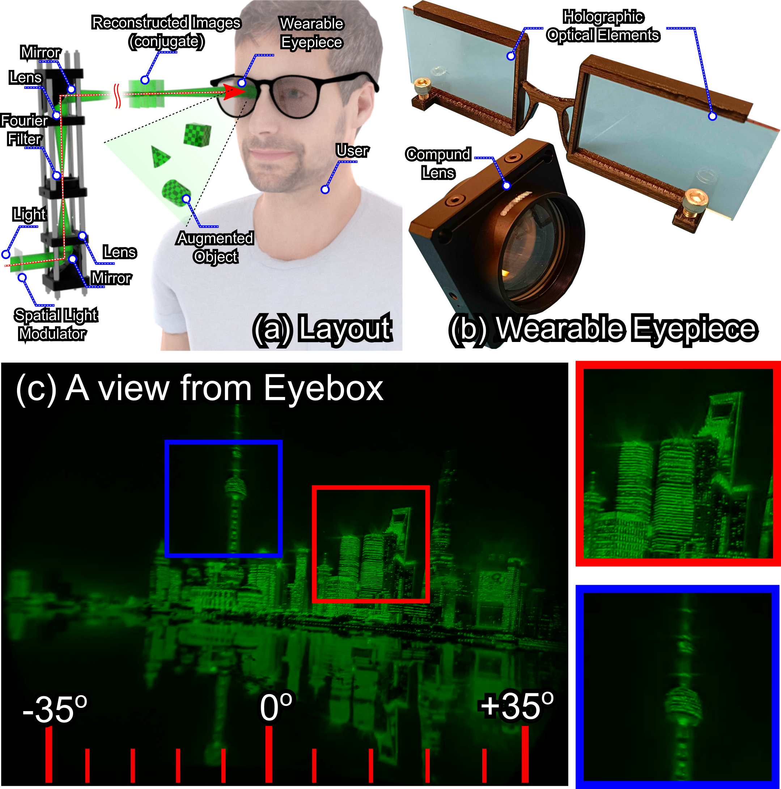

# HoloBeam: Paper-Thin Near-Eye Displays

## People
<table class=""  style="margin: 10px auto;">
  <tbody>
    <tr>
      <td>  &nbsp;&nbsp;&nbsp;&nbsp;</td>
      <td>  &nbsp;&nbsp;&nbsp;&nbsp;</td>
    </tr>
    <tr>
      <td>
<a href="https://kaanaksit.com">Kaan Akşit</a>1
</td>
      <td>
<a href="https://www.ar.c.titech.ac.jp/people/yuta-itoh">Yuta Itoh</a>2
</td>
    </tr>
  </tbody>
</table>

1University College London, 2The University of Tokyo

<b><a href="https://ieeevr.org/2023/">IEEE VR 2023</a></b>

## Resources
:material-newspaper-variant: [Manuscript](https://arxiv.org/pdf/2212.05057.pdf)
:material-file-code: [Code](https://github.com/complight/multiholo)
??? info ":material-tag-text: Bibtex"
        @inproceedings{aksit2022holobeam,
          title = "HoloBeam: Paper-Thin Near-Eye Displays",
          author = "Akşit, Kaan and Itoh, Yuta",
          booktitle ={2023 IEEE Conference Virtual Reality and 3D User Interfaces (VR)},
          pages = {581--591},
          year = {2023},
        }

## Presentation

<iframe width="560" height="315" src="https://www.youtube.com/embed/dDs0rAXX2yk" title="YouTube video player" frameborder="0" allow="accelerometer; autoplay; clipboard-write; encrypted-media; gyroscope; picture-in-picture; web-share" allowfullscreen></iframe>

## Abstract
An emerging alternative to conventional Augmented Reality (AR) glasses designs, Beaming displays promise slim AR glasses free from challenging design trade-offs, including battery-related limits or computational budget-related issues.
These beaming displays remove active components such as batteries and electronics from AR glasses and move them to a projector that projects images to a user from a distance (1-2 meters), where users wear only passive optical eyepieces.
However, earlier implementations of these displays delivered poor resolutions (7 cycles per degree) without any optical focus cues and were introduced with a bulky form-factor eyepiece ($\sim50~mm$ thick).
This paper introduces a new milestone for beaming displays, which we call HoloBeam.
In this new design, a custom holographic projector populates a micro-volume located at some distance (1-2 meters) with multiple planes of images.
Users view magnified copies of these images from this small volume with the help of an eyepiece that is either a Holographic Optical Element (HOE) or a set of lenses.
Our HoloBeam prototypes demonstrate the thinnest AR glasses to date with a submillimeter thickness (\eg HOE film is only $120~\mu m$ thick).
In addition, HoloBeam prototypes demonstrate near retinal resolutions ($24$ cycles per degree) with a $70$ degrees wide field of view.

## Results
As a next step in [Beaming Displays](https://kaanaksit.files.wordpress.com/2021/03/vr2021_beaming_display_revision-1.pdf) , our work offers the thinnest and lightweight near-eye display to date.
Our wearable eyepieces could just be a lens or a holographic optical element.
<figure markdown>
  { width="600" }
</figure>

In order to beam images to our eyepieces, we built a phase-only holographic projector.
<figure markdown>
  { width="600" }
</figure>

We also show that a cheaper alternative of this projector could be built using common spatial light modulators.
<figure markdown>
  { width="600" }
</figure>

In this work, we demonstrate the first [Beaming Displays](https://kaanaksit.files.wordpress.com/2021/03/vr2021_beaming_display_revision-1.pdf) that can generate multiplane images using Computer-Generated Holography.
Below image is a moving animation showing a focal sweep of images.
<figure markdown>
  { width="600" }
</figure>

Although we showed monochrome results mostly, HoloBeam can also show full color images.
<figure markdown>
  { width="600" }
</figure>

## Relevant research works
Here are relevant research works from the authors:

- [Beaming Displays](https://kaanaksit.files.wordpress.com/2021/03/vr2021_beaming_display_revision-1.pdf)
- [Realistic Defocus for Multiplane Computer-Generated Holography](realistic_defocus_cgh.md)
- [Optimizing Vision and Visuals: Lectures on Cameras, Displays, and Perception](../teaching/siggraph2022_optimizing_vision_and_visuals.md)
- [Learned Holographic Light Transport](https://github.com/complight/realistic_holography)
- [Metameric Varifocal Holograms](https://github.com/complight/metameric_holography)
- [Odak](https://github.com/kaanaksit/odak)

## Outreach
We host a Slack group with more than 250 members.
This Slack group focuses on the topics of rendering, perception, displays and cameras.
The group is open to public and you can become a member by following [this link](../outreach/index.md).

## Contact Us
!!! Warning
    Please reach us through [email](mailto:kaanaksit@kaanaksit.com) to provide your feedback and comments.

## Acknowledgements
The authors would like to thank reviewers for their valuable feedback.
The authors wish to thank Koray Kavaklı for fruitful discussions.

Kaan Akşit is supported by the Royal Society's RGS\R2\212229 - Research Grants 2021 Round 2 in building the hardware prototype. Kaan Akşit is also supported by Meta Reality Labs inclusive rendering initiative 2022.
 
 
 
 
 
 
 

Yuta Itoh is supported by the JST FOREST Grant Number JPMJFR206E and JSPS KAKENHI Grant Number JP20J14971, 20H05958, and 21K19788, Japan.
 
 
 
 
 
 
 
