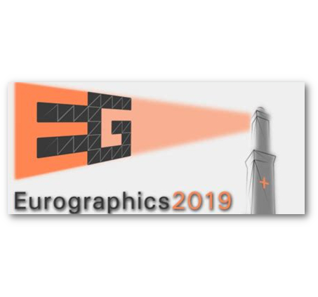
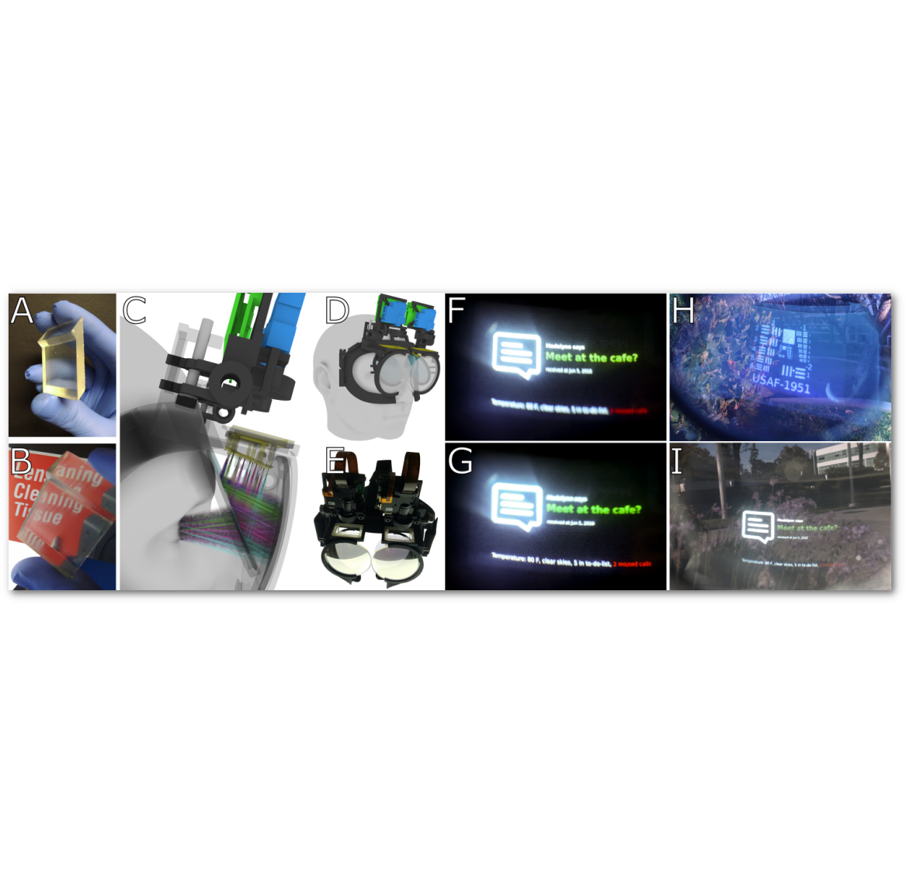
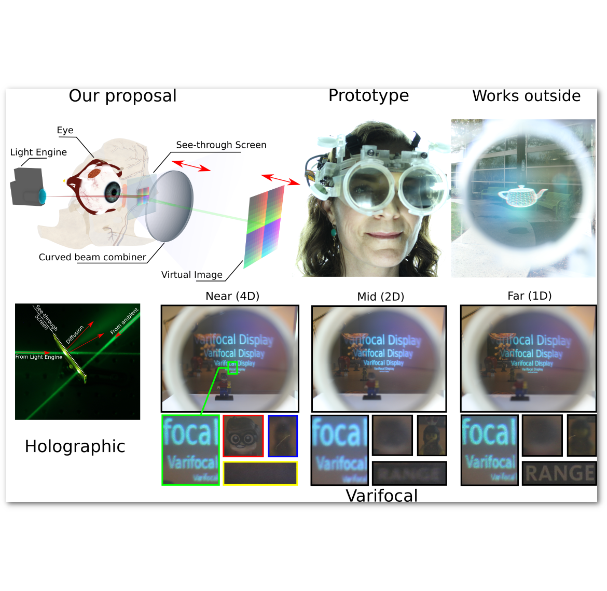
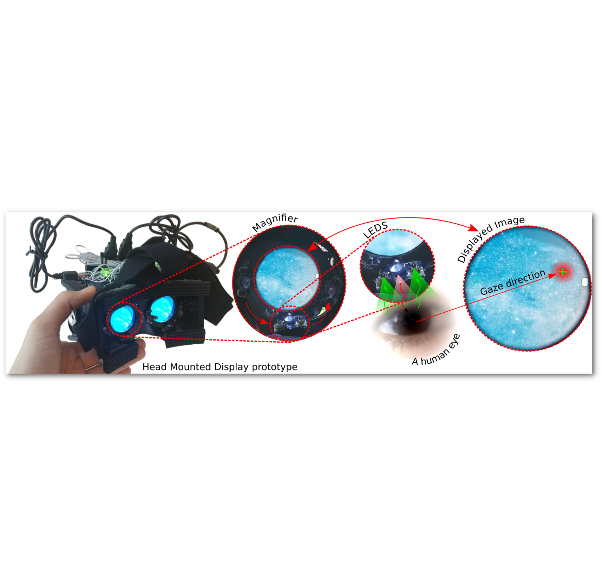
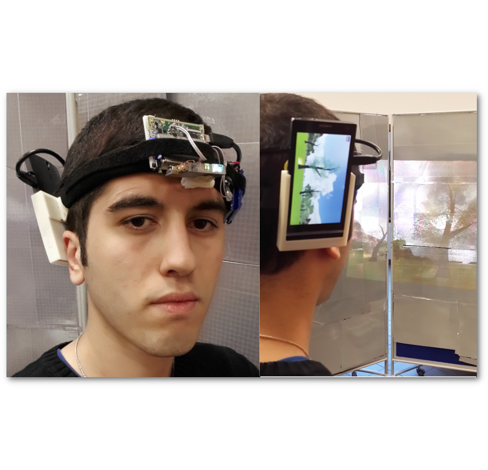
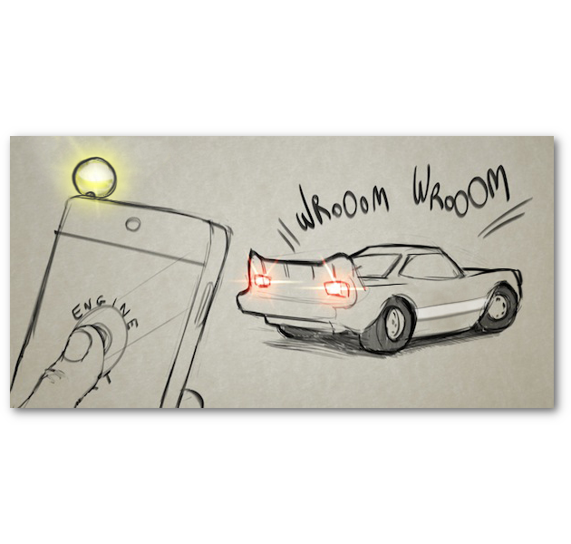

# Publications

## 2021

**Telelife: The Future of Remote Living**

[Jason Orlosky](https://www.jeoresearch.com/research),
[Misha Sra](https://sites.cs.ucsb.edu/~sra/),
[Kenan Bektaş](https://www.unisg.ch/en/personenverzeichnis/dc93dc3e-fad5-45ce-a9dd-fa7bf0b64cd9),
[Huaishu Peng](https://www.cs.umd.edu/people/huaishu),
[Jeeeun Kim](http://www.jeeeunkim.com/),
[Nataliya Kosmyna](https://www.braini.io/),
[Tobias Hollerer](https://sites.cs.ucsb.edu/~holl/),
[Anthony Steed](http://vecg.cs.ucl.ac.uk/),
[Kiyoshi Kiyokawa](https://carelab.info/en/),
and [Kaan Akşit](https://kaanaksit.com)

:material-newspaper-variant: [Manuscript](https://kaanaksit.files.wordpress.com/2021/07/2107.02965.pdf)
<br clear="left"/>


**Learned Holographic Light Transport** :material-star: (INVITED)

Koray Kavaklı,
[Hakan Urey](https://mysite.ku.edu.tr/hurey/)
and [Kaan Akşit](https://kaanaksit.com)

:material-web: [Project site](https://kaanaksit.com/portfolio/learned-holographic-light-transport/)
:material-newspaper-variant: [Manuscript](https://kaanaksit.files.wordpress.com/2021/09/learned_holographic_light_transport.pdf)
:material-file-code: [Code](https://github.com/complight/realistic_holography)
<br clear="left"/>


**SensiCut: Material-Aware Laser Cutting Using Speckle Sensing and Deep Learning**

[Mustafa Doga Dogan](https://www.dogadogan.com/),
Steven Vidal Acevedo Colon,
Varnika Sinha,
[Kaan Akşit](https://kaanaksit.com)
and [Stefanie Mueller](https://hcie.csail.mit.edu/stefanie-mueller.html)

:material-web: [Project site](https://hcie.csail.mit.edu/research/sensicut/sensicut.html)
:material-newspaper-variant: [Manuscript](https://kaanaksit.files.wordpress.com/2021/08/2021-uist-sensicut-paper.pdf)
:material-video-account: [Project video](https://www.youtube.com/watch?v=BdvSAJaukI8)
:material-video-account: [Presentation recording](https://www.youtube.com/watch?v=fxD5GEMQ8kk)
<br clear="left"/>


**Beyond Blur: Ventral Metamers for Foveated Rendering**

[David R. Walton](https://drwalton.github.io/),
Rafael Kuffner Dos Anjos,
Sebastian Friston,
David Swapp,
[Kaan Akşit](https://kaanaksit.com),
[Anthony Steed](http://vecg.cs.ucl.ac.uk/)
and Tobias Ritschel

:material-web-box: [Publisher site](https://doi.org/10.1109/TVCG.2021.3067764)
:material-web: [Project site](https://www.homepages.ucl.ac.uk/~ucabdw0/beyondblur.html)
:material-newspaper-variant: [Manuscript](https://kaanaksit.files.wordpress.com/2021/08/beyond_blur_preprint.pdf)
??? info ":material-tag-text: Bibtex"
	```
	@article{walton2021beyond,
	    author = {David R. Walton and Rafael Kuffner Dos Anjos and Sebastian Friston and David Swapp and Kaan Akşit and Anthony Steed and Tobias Ritschel},
	    title    = {Beyond Blur: Ventral Metamers for Foveated Rendering},
	    journal = {ACM Trans. Graph. (Proc. SIGGRAPH 2021)},
	    year = {2021},
	    volume = {40},
	    number = {4},
	}
	```
<br clear="left"/>


**Beaming Displays**

[Yuta Itoh](https://www.ar.c.titech.ac.jp/people/yuta-itoh),
Takumi Kaminokado
and [Kaan Akşit](https://kaanaksit.com)

:material-web-box: [Publisher site](https://doi.org/10.1109/TVCG.2021.3067764)
:material-web: [Project site](https://kaanaksit.com/portfolio/beaming-displays/)
:material-newspaper-variant: [Manuscript](https://kaanaksit.files.wordpress.com/2021/03/vr2021_beaming_display_revision-1.pdf)
:material-video-account: [Project video](https://www.youtube.com/watch?v=TKl1l3b-LDs)
:material-video-account: [Presentation recording](https://www.youtube.com/watch?v=7_hMGwTGdhg)
??? info ":material-tag-text: Bibtex"
	```
	@article{itoh2021beaming,
	    author = {Yuta Itoh, Takumi Kaminokado, and Kaan Ak{s}it},
	    keywords = {Near-eye displays},
	    publisher = {IEEE VR},
	    title = {Beaming Displays},
	    month = {April},
	    year = {2021}
	}
	```
<br clear="left"/>


## 2020

**Optical Gaze Tracking with Spatially-Sparse Single-Pixel Detectors**

[Richard Li](https://lichard49.github.io),
[Eric Whitmire](https://www.ericwhitmire.com/),
[Michael Stengel](https://graphics.tu-bs.de/people/stengel),
Ben Boudaoud,
[Jan Kautz](https://www.jankautz.com/) 
[David Luebke](https://luebke.us/),
[Shwetak Patel](https://homes.cs.washington.edu/~shwetak/)
and [Kaan Akşit](https://kaanaksit.com)

:material-web-box: [Publisher site](https://doi.org/10.1109/ISMAR50242.2020.00033)
:material-web: [Project site](https://lichard49.github.io/nextgaze.html)
:material-newspaper-variant: [Manuscript](https://arxiv.org/abs/2009.06875)
:material-video-account: [Presentation recording](https://www.youtube.com/watch?v=j0nY4_cauZY&feature=emb_logo)
??? info ":material-tag-text: Bibtex"
	```
	@article{li2020opticalgaze,
	    author = {Richard Li, Eric Whitmire, Michael Stengel, Ben Boudaoud, Jan Kautz, David Luebke, Shwetak Patel, and Kaan Ak{s}it},
	    keywords = {Gaze tracking, eye tracking, LEDs, photodiodes},
	    publisher = {ISMAR},
	    title = {Optical Gaze Tracking with Spatially-Sparse Single-Pixel Detectors},
	    month = {Nov},
	    year = {2020}
	}
	```
<br clear="left"/>


**Patch scanning displays: spatiotemporal enhancement for displays**

[Kaan Akşit](https://kaanaksit.com)

:material-web-box: [Publisher site](https://doi.org/10.1364/OE.380858)
:material-web: [Project site](https://kaanaksit.com/portfolio/patch-scanning-displays-spatiotemporal-enhancement-for-displays/)
:material-newspaper-variant: [Manuscript](https://kaanaksit.files.wordpress.com/2020/01/oe-28-2-2107.pdf)
:material-video-account: [Project video](https://youtu.be/c3okd_gIlrg)
??? info ":material-tag-text: Bibtex"
	```
	@article{aksit2020patch,
	    author = {Kaan Ak\c{s}it},
	    journal = {Opt. Express},
	    keywords = {Digital micromirror devices; Image quality; Image reconstruction; Light sources; Optical components; Three dimensional imaging},
	    number = {2},
	    pages = {2107--2121},
	    publisher = {OSA},
	    title = {Patch scanning displays: spatiotemporal enhancement for displays},
	    volume = {28},
	    month = {Jan},
	    year = {2020},
	    url = {http://www.opticsexpress.org/abstract.cfm?URI=oe-28-2-2107}
	}
	```
<br clear="left"/>


## 2019

**Near-Eye Display and Tracking Technologies for Virtual and Augmented Reality**

[George Alex Koulieris](https://koulieris.com/)
[Kaan Akşit](https://kaanaksit.com),
[Michael Stengel](https://graphics.tu-bs.de/people/stengel),
[Rafał Mantiuk](https://www.cl.cam.ac.uk/~rkm38/),
[Katerina Mania](http://surreal.tuc.gr/)
and [Christian Richardt](https://richardt.name/)

:material-web-box: [Publisher site](https://doi.org/10.1111/cgf.13654)
:material-web: [Project site](https://kaanaksit.com/portfolio/near-eye-display-and-tracking-technologies-for-virtual-and-augmented-reality/)
:material-newspaper-variant: [Manuscript](https://kaanaksit.files.wordpress.com/2019/05/neareyedisplayandtracking-koulierisetal-cgf2019-star.pdf)
:material-video-account: [Project video](https://youtu.be/e-A2dgKV5-I)
??? info ":material-tag-text: Bibtex"
	```
	@article{NearEyeDisplayAndTrackingSTAR,
	author  = {George Alex Koulieris and Kaan Ak{\c{s}}it and Michael Stengel and Rafa{\l} K. Mantiuk and Katerina Mania and Christian Richardt},
	title   = {Near-Eye Display and Tracking Technologies for Virtual and Augmented Reality},
	journal = {Computer Graphics Forum},
	year    = {2019},
	volume  = {38},
	number  = {2},
	url     = {https://richardt.name/nedtt/},
	}
	```
<br clear="left"/>


**Foveated AR: Dynamically-Foveated Augmented Reality Display**

:fontawesome-solid-award: **Emerging Technology best in show award at SIGGRAPH 2019**

[Jonghyun Kim](http://j-kim.kr/),
[Youngmo Jeong](http://www.youngmoj.com/),
[Michael Stengel](https://graphics.tu-bs.de/people/stengel),
[Kaan Akşit](https://kaanaksit.com),
[Rachel Albert](http://www.rachelabrown.com/),
Ben Boudaoud,
Trey Greer,
Joohwan Kim,
Ward Lopes,
Zander Majercik,
[Peter Shirley](https://www.petershirley.com/),
[Josef Spjut](http://josef.spjut.me/),
[Morgan Mcguire](https://casual-effects.com/morgan/index.html)
and [David Luebke](https://luebke.us/)

:material-web-box: [Publisher site](https://doi.org/10.1145/3306346.3322987)
:material-web: [Project site](https://kaanaksit.com/portfolio/foveated-ar-dynamically-foveated-augmented-reality-display/)
:material-newspaper-variant: [Manuscript](https://kaanaksit.files.wordpress.com/2019/07/foveated_ar___v2-15.pdf)
:material-video-account: [Project video](https://www.youtube.com/watch?v=IknBUoRGUkM)
??? info ":material-tag-text: Bibtex"
	```
	@article{kim2019foveated,
	  title={Foveated AR: dynamically-foveated augmented reality display},
	  author={Kim, Jonghyun and Jeong, Youngmo and Stengel, Michael and Ak{\c{s}}it, Kaan and Albert, Rachel and Boudaoud, Ben and Greer, Trey and Kim, Joohwan and Lopes, Ward and Majercik, Zander and others},
	  journal={ACM Transactions on Graphics (TOG)},
	  volume={38},
	  number={4},
	  pages={1--15},
	  year={2019},
	  publisher={ACM New York, NY, USA}
	}
	```
<br clear="left"/>

## 2018

**FocusAR: Auto-focus Augmented Reality Eyeglasses for both Real and Virtual**

:fontawesome-solid-award: **Best paper award at ISMAR 2018**

:material-eye: **Presented at SIGGRAPH ASIA 2018**

[Praneeth Chakravarthula](http://www.cs.unc.edu/~cpk/),
[David Dunn](http://www.qenops.com/), 
[Kaan Akşit](https://kaanaksit.com)
and [Henry Fuchs](https://scholar.google.com/citations?user=guhwcP8AAAAJ&hl=en)

:material-web-box: [Publisher site](https://doi.org/10.1109/TVCG.2018.2868532)
:material-web: [Project site](https://kaanaksit.com/portfolio/684/)
:material-newspaper-variant: [Manuscript](https://kaanaksit.files.wordpress.com/2018/10/10-1109tvcg-2018-2868532.pdf)
:material-video-account: [Presentation recording](https://www.youtube.com/watch?v=6rC_XGXk3CY&feature=emb_logo)
:material-presentation: [Presentation source](https://docs.google.com/presentation/d/1EOhFAtlxEzt3j6aRtu5sEHOLaiWp1amaz7h62PlZx1k/edit?usp=sharing)
??? info ":material-tag-text: Bibtex"
	```
	@article{chakravarthula2018focusar,
	  title={focusar: auto-focus augmented reality eyeglasses for both real and virtual},
	  author={chakravarthula, praneeth and dunn, david and ak{\c{s}}it, kaan and fuchs, henry},
	  journal={ieee transactions on visualization and computer graphics},
	  year={2018},
	  publisher={ieee}
	}
	```
<br clear="left"/>


**Manufacturing Application-Driven Foveated Near-Eye Displays**

:fontawesome-solid-award: **Best paper nominee at IEEE VR 2018**

:fontawesome-solid-award: **Emerging Technology best in show award at SIGGRAPH 2018**

[Kaan Akşit](https://kaanaksit.com),
[Praneeth Chakravarthula](http://www.cs.unc.edu/~cpk/),
[Kishore Rathinavel](https://sites.google.com/site/kishorerathinavel/),
[Youngmo Jeong](http://www.youngmoj.com/),
[Rachel Albert](http://www.rachelabrown.com/),
[Henry Fuchs](https://scholar.google.com/citations?user=guhwcP8AAAAJ&hl=en)
and [David Luebke](https://luebke.us/)

:material-web-box: [Publisher site](https://doi.org/10.1109/TVCG.2019.2898781)
:material-web: [Project site](https://kaanaksit.com/portfolio/manufacturing-application-driven-near-eye-displays/)
:material-newspaper-variant: [Manuscript](https://kaanaksit.files.wordpress.com/2018/08/08642529.pdf)
:material-file-video: [Project video](https://youtu.be/dBUeB8RLYCU)
:material-video-account: [Presentation recording](https://www.youtube.com/watch?v=jYWjqPeMSw8&feature=emb_logo)
:material-presentation: [Presentation source](https://docs.google.com/presentation/d/15mrXj3Rv_dHP7BYUtCid8Mi7FJRl912LOIryE1PDqk8/edit?usp=sharing)
??? info ":material-tag-text: Bibtex"
	```
	@article{akcsit2019manufacturing,
	  title={Manufacturing application-driven foveated near-eye displays},
	  author={Ak{\c{s}}it, Kaan and Chakravarthula, Praneeth and Rathinavel, Kishore and Jeong, Youngmo and Albert, Rachel and Fuchs, Henry and Luebke, David},
	  journal={IEEE transactions on visualization and computer graphics},
	  volume={25},
	  number={5},
	  pages={1928--1939},
	  year={2019},
	  publisher={IEEE}
	}
	```
<br clear="left"/>


## 2017

**Near-Eye Varifocal Augmented Reality Display using See-Through Screens**

[Kaan Akşit](https://kaanaksit.com),
Ward Lopes,
[Jonghyun Kim](http://j-kim.kr/),
[Peter Shirley](https://www.petershirley.com/)
and [David Luebke](https://luebke.us/)

:material-web-box: [Publisher site](https://doi.org/10.1145/3130800.3130892)
:material-web: [Project site](https://kaanaksit.com/portfolio/near-eye-varifocal-augmented-reality-display-using-see-through-screens/)
:material-newspaper-variant: [Manuscript](https://kaanaksit.files.wordpress.com/2017/08/aksitetal_siggraphasia2017_near-eye-varifocal-augmented-reality-display-using-see-through-screens1.pdf)
:material-file-video: [Video](https://www.youtube.com/watch?v=dN-8X0lUig4)
??? info ":material-tag-text: Bibtex"
	```
	@Article{Aksit2017Varifocal,
	Title      = {Near-Eye Varifocal Augmented Reality Display using See-Through Screens},
	Author     = {K. Ak{\c{s}}it and W. Lopes and J. Kim and P. Shirley and D. Luebke},
	journal    = {ACM Trans. Graph. (SIGGRAPH)},
	issue      = {36},
	number     = {6},
	year = {2017}}
	```
<br clear="left"/>


**Wide Field Of View Varifocal Near-Eye Display Using See-Through Deformable Membrane Mirrors**

:fontawesome-solid-award: **Best paper award at IEEE VR 2017**

:fontawesome-solid-award: **SIGGRAPH 2017 Emerging Technologies DCEXPO Special Prize**

[David Dunn](http://www.qenops.com/), 
Cary Tippets, 
Kent Torell, 
[Petr Kellnhofer](https://kellnhofer.xyz/), 
[Kaan Akşit](https://kaanaksit.com), 
[Piotr Didyk](https://www.pdf.inf.usi.ch/people/piotr/), 
[Karol Myszkowski](https://people.mpi-inf.mpg.de/~karol/), 
[D. Luebke](https://luebke.us/), 
[Henry Fuchs](https://scholar.google.com/citations?user=guhwcP8AAAAJ&hl=en)

:material-web-box: [Publisher site](https://doi.org/10.1109/TVCG.2017.2657058)
:material-web: [Project site](https://kaanaksit.com/portfolio/wide-field-of-view-varifocal-near-eye-display-using-see-through-deformable-membrane-mirrors/)
:material-newspaper-variant: [Manuscript](https://kaanaksit.files.wordpress.com/2017/01/dunn_2017_tvcg_membranear.pdf)
:material-file-video: [Video](https://www.youtube.com/watch?v=aRZrtZfVKv0&feature=youtu.be)
??? info ":material-tag-text: Bibtex"
	```
	@article{dunn2017wide,
	title={Wide Field Of View Varifocal Near-Eye Display Using See-Through Deformable Membrane Mirrors},
	author={Dunn, David and Tippets, Cary and Torell, Kent and Kellnhofer, Petr and Ak{\c{s}}it, Kaan and Didyk, Piotr and Myszkowski, Karol and Luebke, David and Fuchs, Henry},
	journal={IEEE Transactions on Visualization and Computer Graphics},
	volume={23},
	number={4},
	pages={1322--1331},
	year={2017},
	publisher={IEEE}
	}}
	```
<br clear="left"/>

## 2016

**Slim near-eye display using pinhole aperture arrays**

[Kaan Akşit](https://kaanaksit.com), 
[Jan Kautz](https://www.jankautz.com/) 
and [David Luebke](https://luebke.us/)

:material-web-box: [Publisher site](https://arxiv.org/abs/2003.08499)
:material-web: [Project site](https://kaanaksit.com/portfolio/gaze-sensing-leds-for-head-mounted-displays/)
:material-newspaper-variant: [Manuscript](https://kaanaksit.files.wordpress.com/2020/02/script.pdf)
:material-file-video: [Video](https://www.youtube.com/watch?v=vV4CiNsfUYY)
??? info ":material-tag-text: Bibtex"
	```
	@article{akcsit2020gaze,
	  title={Gaze-sensing leds for head mounted displays},
	  author={Ak{\c{s}}it, Kaan and Kautz, Jan and Luebke, David},
	  journal={arXiv preprint arXiv:2003.08499},
	  year={2020}
	}
	```
<br clear="left"/>

## 2015

**Slim near-eye display using pinhole aperture arrays**

[Kaan Akşit](https://kaanaksit.com), 
[Jan Kautz](https://www.jankautz.com/) 
and [David Luebke](https://luebke.us/)

:material-web-box: [Publisher site](https://doi.org/10.1364/AO.54.003422)
:material-web: [Project site](https://kaanaksit.com/portfolio/slim-near-eye-display-using-pinhole-aperture-arrays/)
:material-newspaper-variant: [Manuscript](https://kaanaksit.files.wordpress.com/2014/10/slim-near-eye-display-using-pinhole-aperture-arrays.pdf)
:material-file-video: [Video](https://www.youtube.com/watch?v=UYGa6n_0aUs&)
??? info ":material-tag-text: Bibtex"
	```
	@article{Aksit:15, 
	author = {Kaan Ak\c{s}it and Jan Kautz and David Luebke}, 
	journal = {Appl. Opt.}, 
	keywords = {Apertures; Vision - binocular and stereopsis ; Computational imaging},
	number = {11}, 
	pages = {3422--3427}, 
	publisher = {OSA},
	title = {Slim near-eye display using pinhole aperture arrays}, 
	volume = {54}, 
	month = {Apr},
	year = {2015},
	url = {http://ao.osa.org/abstract.cfm?URI=ao-54-11-3422},
	doi = {10.1364/AO.54.003422},
	abstract = {We report a new technique for building a wide-angle, lightweight, thin-form-factor, cost-effective, easy-to-manufacture near-eye head-mounted display (HMD) for virtual reality applications. Our approach adopts an aperture mask containing an array of pinholes and a screen as a source of imagery. We demonstrate proof-of-concept HMD prototypes with a binocular field of view (FOV) of 70\&amp;\#xB0;\&amp;\#xD7;45\&amp;\#xB0;, or total diagonal FOV of 83\&amp;\#xB0;. This FOV should increase with increasing display panel size. The optical angular resolution supported in our prototype can go down to 1.4\&amp;\#x2013;2.1 arcmin by adopting a display with 20\&amp;\#x2013;30\&amp;\#xA0;\&amp;\#x3BC;m pixel pitch.},
	}
	```
<br clear="left"/>


## 2014

**Head-worn Mixed Reality Projection Display Application**

[Kaan Akşit](https://kaanaksit.com),
Daniel Kade,
Oğuzhan Özcan 
and [Hakan Urey](https://mysite.ku.edu.tr/hurey/)

:material-web-box: [Publisher site](https://doi.org/10.1145/2663806.2663826)
:material-web: [Project site](https://kaanaksit.com/portfolio/head-worn-mixed-reality-projection-display-application/)
:material-newspaper-variant: [Manuscript](https://kaanaksit.files.wordpress.com/2014/10/3782.pdf)
:material-file-video: [Video](https://www.youtube.com/watch?v=7F3Z-4UZWUc)
??? info ":material-tag-text: Bibtex"
	```
	@inproceedings{Aksit:2014:HMR:2663806.2663826,
	 author = {Ak\c{s}it, Kaan and Kade, Daniel and \"{O}zcan, O\u{g}uzhan and \"{U}rey, Hakan},
	 title = {Head-worn Mixed Reality Projection Display Application},
	 booktitle = {Proceedings of the 11th Conference on Advances in Computer Entertainment Technology},
	 series = {ACE '14},
	 year = {2014},
	 isbn = {978-1-4503-2945-3},
	 location = {Funchal, Portugal},
	 pages = {11:1--11:9},
	 articleno = {11},
	 numpages = {9},
	 url = {http://doi.acm.org/10.1145/2663806.2663826},
	 doi = {10.1145/2663806.2663826},
	 acmid = {2663826},
	 publisher = {ACM},
	 address = {New York, NY, USA},
	 keywords = {head-mounted projection display, immersive environments, laser projector, mixed reality, motion capture},
	} 
	```
<br clear="left"/>


**Super stereoscopy technique for comfortable and realistic 3D displays**

[Kaan Akşit](https://kaanaksit.com),
Amir Niaki, 
Erdem Ulusoy 
and [Hakan Urey](https://mysite.ku.edu.tr/hurey/)

:material-web-box: [Publisher site](https://doi.org/10.1364/OL.39.006903)
:material-web: [Project site](https://kaanaksit.com/portfolio/super-stereoscopy-technique-for-comfortable-and-realistic-3d-displays/)
:material-newspaper-variant: [Manuscript](https://kaanaksit.files.wordpress.com/2014/10/ol-39-24-6903.pdf)
??? info ":material-tag-text: Bibtex"
	```
	@article{Aksit:14, 
	author = {Kaan Ak\c{s}it and Amir Hossein Ghanbari Niaki and Erdem Ulusoy and Hakan Urey}, 
	journal = {Opt. Lett.}, 
	keywords = {Displays; Vision - binocular and stereopsis ; Visual optics, accommodation},
	number = {24}, 
	pages = {6903--6906}, 
	publisher = {OSA},
	title = {Super stereoscopy technique for comfortable and realistic 3D displays}, 
	volume = {39}, 
	month = {Dec},
	year = {2014},
	url = {http://ol.osa.org/abstract.cfm?URI=ol-39-24-6903},
	doi = {10.1364/OL.39.006903},
	abstract = {Two well-known problems of stereoscopic displays are the accommodation-convergence conflict and the lack of natural blur for defocused objects. We present a new technique that we name Super Stereoscopy (SS3D) to provide a convenient solution to these problems. Regular stereoscopic glasses are replaced by SS3D glasses which deliver at least two parallax images per eye through pinholes equipped with light selective filters. The pinholes generate blur-free retinal images so as to enable correct accommodation, while the delivery of multiple parallax images per eye creates an approximate blur effect for defocused objects. Experiments performed with cameras and human viewers indicate that the technique works as desired. In case two, pinholes equipped with color filters per eye are used; the technique can be used on a regular stereoscopic display by only uploading a new content, without requiring any change in display hardware, driver, or frame rate. Apart from some tolerable loss in display brightness and decrease in natural spatial resolution limit of the eye because of pinholes, the technique is quite promising for comfortable and realistic 3D vision, especially enabling the display of close objects that are not possible to display and comfortably view on regular 3DTV and cinema.},
	}
	```
<br clear="left"/>



**From Sound to Sight: Using Audio Processing to enable Visible Light Communication**

Stefan Schmid, 
D. Schwyn, 
[Kaan Akşit](https://kaanaksit.com), 
Giorgio Corbellini, 
Thomas Gross 
and [Stefan Mangold](https://www.lovefield.ch/)

:material-web-box: [Publisher site](https://doi.org/10.1109/GLOCOMW.2014.7063484)
:material-web: [Project site](https://kaanaksit.com/portfolio/from-sound-to-sight-using-audio-processing-to-enable-visible-light-communication/)
:material-newspaper-variant: [Manuscript](https://kaanaksit.files.wordpress.com/2014/10/from-sound-to-sight-using-audio-processing-to-enable-visible-light-communication-paper.pdf)
??? info ":material-tag-text: Bibtex"
	```
	@INPROCEEDINGS{7063484,
	author={S. Schmid and D. Schwyn and K. Akşit and G. Corbellini and T. R. Gross and S. Mangold},
	booktitle={2014 IEEE Globecom Workshops (GC Wkshps)},
	title={From sound to sight: Using audio processing to enable visible light communication},
	year={2014},
	pages={518-523},
	keywords={audio signal processing;light emitting diodes;mobile handsets;optical communication;photodiodes;protocols;audio jack;audio processing;communication protocols;electrical signals;light signals;microphone input;mobile phones;on-board audio signal processing;passive components;peripheral device;photodiode;visible light communication;Decoding;Hardware;Lifting equipment;Light emitting diodes;Photodiodes;Protocols;Throughput},
	doi={10.1109/GLOCOMW.2014.7063484},
	ISSN={2166-0077},
	month={Dec},}
	```
<br clear="left"/>


**Connecting Networks of Toys and Smartphones with Visible Light Communication**

Giorgio Corbellini, 
[Kaan Akşit](https://kaanaksit.com), 
[Stefan Mangold](https://www.lovefield.ch/)
Stefan Schmid 
and Thomas R. Gross

:material-web-box: [Publisher site](https://doi.org/10.1109/MCOM.2014.6852086)
:material-web: [Project site](https://kaanaksit.com/portfolio/connecting-networks-of-toys-and-smartphones-with-visible-light-communication/)
:material-newspaper-variant: [Manuscript](https://kaanaksit.files.wordpress.com/2014/10/06852086.pdf)
:material-file-video: [Video](https://www.youtube.com/watch?v=10lv_FwlqMo)
??? info ":material-tag-text: Bibtex"
	```
	@ARTICLE{6852086,
	author={G. Corbellini and K. Aksit and S. Schmid and S. Mangold and T. R. Gross},
	journal={IEEE Communications Magazine},
	title={Connecting networks of toys and smartphones with visible light communication},
	year={2014},
	volume={52},
	number={7},
	pages={72-78},
	keywords={light emitting diodes;optical communication;optical receivers;smart phones;LED;VLC systems;brightness;consumer electronics;illumination;light emitting diodes;light receivers;microcontrollers;public environment;residential environment;smartphones;toys;visible light communication;wireless communication interface;Cameras;Commercialization;Frequency measurement;Illumination;Light emitting diodes;Microcontrollers;Receivers;Smart phones;Transceivers},
	doi={10.1109/MCOM.2014.6852086},
	ISSN={0163-6804},
	month={July},}
	```
<br clear="left"/>


## 2013

**Dynamic exit pupil trackers for autostereoscopic displays**

[Kaan Akşit](https://kaanaksit.com), 
Hadi Baghsiahi, 
P. Surman, 
Selim Ӧlçer, 
E. Willman, 
David R. Selviah, 
Sally Day
and [Hakan Urey](https://mysite.ku.edu.tr/hurey/)

:material-web-box: [Publisher site](https://doi.org/10.1364/OE.21.014331)
:material-web: [Project site](https://kaanaksit.com/portfolio/dynamic-exit-pupil-trackers-for-autostereoscopic-displays/)
:material-newspaper-variant: [Manuscript](https://kaanaksit.files.wordpress.com/2014/10/oe-21-12-14331.pdf)
:material-file-video: [Video](https://www.youtube.com/watch?v=Oh1xDgdbvYU)
??? info ":material-tag-text: Bibtex"
	```
	@article{Aksit:13, 
	author = {Kaan Ak\c{s}it and Hadi Baghsiahi and Phil Surman and Selim Ӧl\c{c}er and Eero Willman and David R. Selviah and Sally Day and Hakan Urey}, 
	journal = {Opt. Express}, 
	keywords = {Displays; Optical systems; Optoelectronics; Laser beam shaping; Vision - binocular and stereopsis},
	number = {12}, 
	pages = {14331--14341}, 
	publisher = {OSA},
	title = {Dynamic exit pupil trackers for autostereoscopic displays}, 
	volume = {21}, 
	month = {Jun},
	year = {2013},
	url = {http://www.opticsexpress.org/abstract.cfm?URI=oe-21-12-14331},
	doi = {10.1364/OE.21.014331},
	abstract = {This paper describes the first demonstrations of two dynamic exit pupil (DEP) tracker techniques for autostereoscopic displays. The first DEP tracker forms an exit pupil pair for a single viewer in a defined space with low intraocular crosstalk using a pair of moving shutter glasses located within the optical system. A display prototype using the first DEP tracker is constructed from a pair of laser projectors, pupil-forming optics, moving shutter glasses at an intermediate pupil plane, an image relay lens, and a Gabor superlens based viewing screen. The left and right eye images are presented time-sequentially to a single viewer and seen as a 3D image without wearing glasses and allows the viewer to move within a region of 40 cm {\texttimes} 20 cm in the lateral plane, and 30 cm along the axial axis. The second DEP optics can move the exit pupil location dynamically in a much larger 3D space by using a custom spatial light modulator (SLM) forming an array of shutters. Simultaneous control of multiple exit pupils in both lateral and axial axes is demonstrated for the first time and provides a viewing volume with an axial extent of 0.6{\textminus}3 m from the screen and within a lateral viewing angle of {\textpm} 20{\textdegree} for multiple viewers. This system has acceptable crosstalk (\&lt; 5\%) between the stereo image pairs. In this novel version of the display the optical system is used as an advanced dynamic backlight for a liquid crystal display (LCD). This has advantages in terms of overall display size as there is no requirement for an intermediate image, and in image quality. This system has acceptable crosstalk (\&lt; 5\%) between the stereo image pairs.},
	}
	```
<br clear="left"/>


**Multi-view autostereoscopic projection display using rotating screen**

:material-eye: **[Spotlight on Optics](https://www.osapublishing.org/spotlight/summary.cfm?uri=oe-21-23-29043)**

Osman Eldes, 
[Kaan Akşit](https://kaanaksit.com) 
and [Hakan Urey](https://mysite.ku.edu.tr/hurey/)

:material-web-box: [Publisher site](https://doi.org/10.1364/OE.21.029043)
:material-web: [Project site](https://kaanaksit.com/portfolio/multi-view-autostereoscopic-projection-display-using-rotating-screen/)
:material-newspaper-variant: [Manuscript](https://kaanaksit.files.wordpress.com/2014/10/oe-21-23-29043.pdf)
:material-file-video: [Video](http://youtu.be/853-4knJ2Nc)
??? info ":material-tag-text: Bibtex"
	```
	@article{Eldes:13,
	author = {Osman Eldes and Kaan Ak\c{s}it and Hakan Urey},
	journal = {Opt. Express},
	keywords = {Displays; Diffusers; Vision - binocular and stereopsis ; Autostereoscopic displays; Brightness; Fresnel lenses; Image registration; Pico projectors; Systems design},
	number = {23},
	pages = {29043--29054},
	publisher = {OSA},
	title = {Multi-view autostereoscopic projection display using rotating screen},
	volume = {21},
	month = {Nov},
	year = {2013},
	url = {http://www.osapublishing.org/oe/abstract.cfm?URI=oe-21-23-29043},
	doi = {10.1364/OE.21.029043},
	abstract = {A new technique for multi-view autostereoscopic projection display is proposed, and demonstrated. The technique uses two mobile projectors, a rotating retro-reflective diffuser screen, and a head-tracking camera. As two dynamic viewing slits are created at the viewer's position, the slits can track the position of the eyes by rotating the screen. The display allows a viewer to move approximately 700 mm along the horizontal axis, and 500 mm along the vertical axis with an average crosstalk below 5 \%. Two screen prototypes with different diffusers have been tried, and they provide luminance levels of 60 Cd/m2, and 160 Cd/m2 within the viewing field.},
	}
	```
<br clear="left"/>


## 2012

**Portable 3D Laser Projector Using Mixed Polarization Technique**

:fontawesome-solid-award: **Best 3D product award of International 3D Society (4th year)**

[Kaan Akşit](https://kaanaksit.com), 
Osman Eldeş, 
Selvan Viswanathan, 
Mark Freeman 
and [Hakan Urey](https://mysite.ku.edu.tr/hurey/)

:material-web-box: [Publisher site](https://doi.org/10.1109/JDT.2012.2205664)
:material-web: [Project site](https://kaanaksit.com/portfolio/portable-3d-laser-projector-using-mixed-polarization-technique/)
:material-newspaper-variant: [Manuscript](https://kaanaksit.files.wordpress.com/2014/10/06297485.pdf)
:material-file-video: [Video](http://youtu.be/mZXOTRDEyg0)
??? info ":material-tag-text: Bibtex"
	```
	@ARTICLE{6297485,
	  author={Aksit, Kaan and Eldes, Osman and Viswanathan, Selvan and Freeman, Mark O. and Urey, Hakan},
	  journal={Journal of Display Technology}, 
	  title={Portable 3D Laser Projector Using Mixed Polarization Technique}, 
	  year={2012},
	  volume={8},
	  number={10},
	  pages={582-589},
	  doi={10.1109/JDT.2012.2205664}}
	```
<br clear="left"/>

## 2010

**Heart rate monitoring via remote photoplethysmography with motion artifacts reduction**

Giovanni Cennini, 
Jeremie Arguel, 
[Kaan Akşit](https://kaanaksit.com)
and Arno van Leest

:material-web-box: [Publisher site](https://doi.org/10.1364/OE.18.004867)
:material-web: [Project site](https://kaanaksit.com/portfolio/heart-rate-monitoring-via-remote-photoplethysmography-with-motion-artifacts-reduction/)
:material-newspaper-variant: [Manuscript](https://kaanaksit.files.wordpress.com/2014/10/oe-18-5-4867.pdf)
:material-file-video: [Video](http://youtu.be/5X1clsjqQnw)
??? info ":material-tag-text: Bibtex"
	```
	@article{Cennini:10, 
	author = {Giovanni Cennini and Jeremie Arguel and Kaan Ak\c{s}it and Arno van Leest}, 
	journal = {Opt. Express}, 
	keywords = {Medical optics instrumentation; Optical devices; Optical sensing and sensors},
	number = {5}, 
	pages = {4867--4875}, 
	publisher = {OSA},
	title = {Heart rate monitoring via remote photoplethysmography with motion artifacts reduction}, 
	volume = {18}, 
	month = {Mar},
	year = {2010},
	url = {http://www.opticsexpress.org/abstract.cfm?URI=oe-18-5-4867},
	doi = {10.1364/OE.18.004867},
	abstract = {In this paper, we present a novel photoplethysmographic device that operates remotely, i.e. not in contact with the skin. The device allows for real time measurements of heart rate with motion artifact reduction from a distance of a few centimeters up to several meters. High mobility of users is achieved in assessment of vital body signs, such as heart rate.},
	}
	```
<br clear="left"/>
