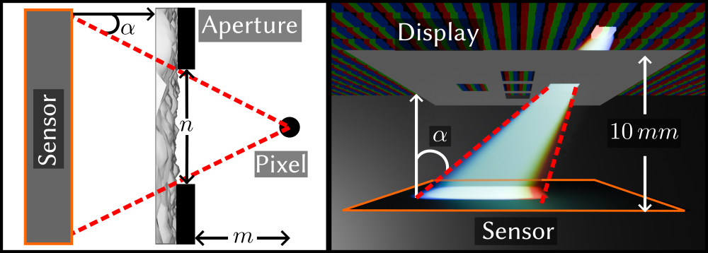

# Learned Display Radiance Fields with Lensless Cameras

## People
<table class=""  style="margin: 10px auto;">
  <tbody>
    <tr>
      <td>  &nbsp;&nbsp;&nbsp;&nbsp;&nbsp;&nbsp;&nbsp;</td>
      <td>  &nbsp;&nbsp;&nbsp;&nbsp;</td>
      <td>  &nbsp;&nbsp;&nbsp;&nbsp;</td>
    </tr> 
    <tr>
      <td>
<a href="https://ziyang.space">Ziyang Chen</a>1
</td>
      <td>
<a href="https://augvislab.github.io/people/yuta-itoh">Yuta Itoh</a>2
</td>
      <td>
<a href="https://kaanaksit.com">Kaan Akşit</a>1
</td>
    </tr>
  </tbody>
</table>

1University College London,
2Institute of Science Tokyo

<b>SIGGRAPH Asia 2025 Technical Communications</b>

## Resources 
:material-newspaper-variant: [Manuscript](https://www.kaanaksit.com/assets/pdf/ChenEtAl_SiggraphAsia2025_Learned_display_radience_fields_with_lensless_camera.pdf)
:material-newspaper-variant: [Supplementary](https://www.kaanaksit.com/assets/pdf/ChenEtAl_SiggraphAsia2025_Supplementary_Learned_display_radience_fields_with_lensless_camera.pdf)
:material-file-code: [Code](https://github.com/complight/learned_display_radiance_fields_with_lensless_cameras)
??? info ":material-tag-text: Bibtex"
        @inproceedings{chen2025lensless,
          author       = {Ziyang Chen and Yuta Itoh and Kaan Ak{\c{s}}it},
          title        = {Learned Display Radiance Fields with Lensless Cameras},
          booktitle    = {SIGGRAPH Asia 2025 Technical Communications (SA Technical Communications '25)},
          year         = {2025},
          month        = {December 16--18},
          publisher    = {ACM},
          location     = {Hong Kong, China},
          pages        = {4},
          doi          = {https://doi.org/10.1145/3757376.3771381},
          keywords     = {lensless imaging, display technology, radiance field, computational optics},
        }

## Video
<video controls>
<source src="https://www.kaanaksit.com/assets/video/ChenEtAlSiggraphAsia2025LearnedDisplayRadienceFieldsWithLenslessCamera.mp4" id="" type="video/mp4">
</video>

<figure markdown>
  { width="900" }
</figure>
<small>
(a) Our lensless camera placed in front of the display captures the light field emitted from the display pixels. 
(b) A conventional camera captures a real-world photograph of the test pattern on the display. 
(c) Our learned model estimates a rendered view from the viewpoint of the real-world photograph displayed in the middle column. 
The right columns in (b) and (c) present the display's angular intensity distributions in spherical coordinates. 
The radius denotes the combined angular deviation from the optical axis, computed from the horizontal and vertical incidence angles. These plots illustrate how the relative intensity changes with viewing angle.
</small>

## Abstract
Calibrating displays is a basic and regular task that content creators must perform to maintain optimal visual experience, yet it remains a troublesome issue. 
Measuring display characteristics from different viewpoints often requires bulky equipment and a dark room, making it inaccessible to most users. 
To avoid such hardware requirements in display calibrations, our work co-designs a lensless camera and an Implicit Neural Representation based algorithm for capturing display characteristics from various viewpoints. 
More specifically, our pipeline enables efficient reconstruction of light fields emitted from a display from a viewing cone of 46.6° × 37.6°. Our emerging pipeline paves the initial steps towards effortless display calibration and characterization.

## Proposed Method
Our method reconstructs the display’s emitted light field from a minimal number of lensless captures. We co-design a compact lensless camera prototype and an Implicit Neural Representation (INR)-based reconstruction network. 
The hardware captures angularly varying point spread functions (PSF) from display pixels, while the software learns a continuous radiance field representing the pixel emission pattern across viewing directions.

### Lensless Camera Design
<figure markdown>
  { width="600" }
</figure>
<small>
The display pixel captured with a microscope (left). The Point Spread Function (PSF) captured with the proposed lensless camera (middle). The captured lensless image from the display pixel (right).
</small>

We employ a phase mask and five-aperture array to record the directional light from each display pixel without using lenses. 
Each pixel on the display emits light rays that, after passing through the diffuser, form unique caustic patterns on the sensor plane. 
By pre-capturing the PSF stack, we expand the Field Of View (FoV) by turning on and off pixels at different locations, which corresponds to different PSF:

<figure markdown>
  { width="500" }
</figure>

Following this idea, we build a setup that contains a $4f$ system and our proposed prototype is positioned on a linear stage. 
We use it to capture the PSFs at different incoming light positions:
<figure markdown>
  { width="900" }
</figure>

### Implicit Neural Representation

<figure markdown>
  { width="500" }
</figure>
<small>
Each MLP layer consists of 32 neurons and a sinusoidal activation function.
  We apply positional encoding with varying frequency levels ($L_f$) to each input coordinate group.
  After concatenating these encoded features, the model processes them to reconstruct the light field.
  We then perform linear convolution between this reconstruction and the pre-captured PSF to generate the predicted lensless image ($\mathbf{I}_\text{pred}$).
  Finally, we compute the loss with $\mathbf{I}_\text{pred}$ and $\mathbf{I}_\text{gt}$.

</small>
To avoid exhaustive angular sampling, we represent the 4D light field $\mathbf{L}(u,v,s,t)$ using a coordinate-based multilayer perceptron (MLP). 
The network takes spatial coordinates $(x, y)$ and angular coordinates $(u, v, s, t)$ as input and outputs predicted radiance values. Positional encodingpreserves high-frequency variations, while convolution with the measured PSF produces the predicted lensless image $\mathbf{I}_\text{pred}$. 
The model is trained end-to-end by minimizing an $L_1$ reconstruction loss with regularization for valid intensity range. 
Once trained with captures from only nine display positions, the model generalizes to unseen viewpoints, reconstructing the display’s angular emission profiles.

<figure markdown>
  { width="500" }
</figure>

## Conclusion
To benchmark our method, we follow the ISO standard (ISO9241-305): align a camera with the display in a dark room, display full-screen white stimuli, and capture images from $-10^\circ$ to $16^\circ$ vertical incident angles.
<figure markdown>
  { width="500" }
</figure>
The above image shows our method reproduces the ISO intensity trend, validating its physical plausibility.
We capture light field data from nine display positions without camera rotation or controlled lighting, reducing measurement time and simplifying view-dependent calibration while maintaining comparable accuracy.

Our $46.6^\circ$ angular coverage remains well below the $240^\circ$ required in professional display calibration.
We could extend this range by co-optimizing the apertures and the diffuser design.
Beyond angular coverage, pixel-wise training hinders scalability for full-panel characterization.
To overcome these constraints, we outline several promising research directions.
First, developing an end-to-end pipeline that eliminates PSF convolutions, cropping, and padding.
Second, hash encoding or Gaussian splatting could model light fields more efficiently.

## Relevant research works
Here are relevant research works from the authors:

- [SpecTrack: Learned Multi-Rotation Tracking via Speckle Imaging](https://complightlab.com/publications/spec_track/)
- [Unrolled Primal-Dual Networks for Lensless Cameras](https://doi.org/10.1364/OE.475521)
- [Odak](https://github.com/kaanaksit/odak)

## Outreach
We host a Slack group with more than 250 members.
This Slack group focuses on the topics of rendering, perception, displays and cameras.
The group is open to public and you can become a member by following [this link](../outreach/index.md).

## Contact Us
!!! Warning
    Please reach us through [email](mailto:kaanaksit@kaanaksit.com) to provide your feedback and comments.

<!-- ## Acknowledgements -->

<!-- 

Kaan Akşit is supported by the Royal Society's RGS\R2\212229 - Research Grants 2021 Round 2 in building the hardware prototype. Kaan Akşit is also supported by Meta Reality Labs inclusive rendering initiative 2022. Liang Shi is supported by Meta Research PhD fellowship (2021-2023).
 
 
 
 
 
 
 

Hakan Urey is supported by the European Innovation Council’s HORIZON-EIC-2021-TRANSITION-CHALLENGES program Grant Number 101057672 and Tübitak’s 2247-A National Lead Researchers Program, Project Number 120C145.
 
 
 
 
 
 
  -->

