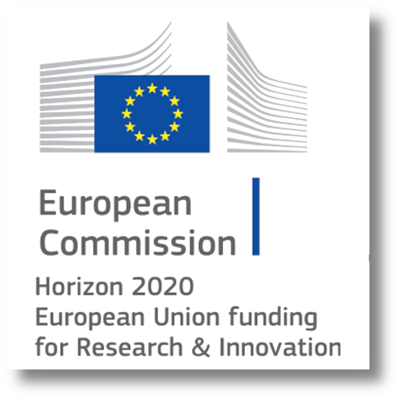

# Multi-color Holograms Improve Brightness in Holographic Displays

## People
<table class=""  style="margin: 10px auto;">
  <tbody>
    <tr>
      <td>  &nbsp;&nbsp;&nbsp;&nbsp;</td>
      <td>  &nbsp;&nbsp;&nbsp;&nbsp;</td>
      <td>  &nbsp;&nbsp;&nbsp;&nbsp;</td>
      <td>  &nbsp;&nbsp;&nbsp;&nbsp;</td>
      <td>  &nbsp;&nbsp;&nbsp;&nbsp;</td>
    </tr>
    <tr>
      <td>
<a href="https://scholar.google.com/citations?user=rn6XtO4AAAAJ&hl=en&oi=ao">Koray Kavaklı</a>1
</td>
      <td>
<a href="https://people.csail.mit.edu/liangs/">Liang Shi</a>2
</td>
      <td>
<a href="https://mysite.ku.edu.tr/hurey/">Hakan Urey</a>1
</td>
      <td>
<a href="https://cdfg.csail.mit.edu/wojciech">Wojciech Matusik</a>2
</td>
      <td>
<a href="https://kaanaksit.com">Kaan Akşit</a>3
</td>
    </tr>
  </tbody>
</table>

1University College London,
2Koç University,
3Massachusetts Institute of Technology

<b>SIGGRAPH Asia 2023</b>

## Resources
:material-newspaper-variant: [Manuscript](https://kaanaksit.com/assets/pdf/KavakliEtAl_SigAsia2023_Multi_color_holograms_improve_brightness_in_holographic_displays.pdf)
:material-file-code: [Code](https://github.com/complight/multi_color)
:material-video-account: [Project video](https://kaanaksit.com/assets/video/KavakliSigAsia2023Multicolor.mp4)
??? info ":material-tag-text: Bibtex"
        @inproceedings{kavakli2023multicolor,
          title={Multi-color Holograms improve Brightness in Holographic Displays},
          author={Kavakl{\i}, Koray and Shi, Liang and Urey, Hakan and Matusik, Wojciech and Akşit, Kaan},
          booktitle={ACM SIGGRAPH ASIA 2023 Conference Proceedings},
          pages={--},
          year={2023},
          doi={https://doi.org/10.1145/3610548.3618135}
        }

## Video
<video controls>
      <source src="https://kaanaksit.com/assets/video/KavakliSigAsia2023Multicolor.mp4" id="“ type="video/mp4">
</video>

## Abstract
Holographic displays generate Three-Dimensional (3D) images by displaying single-color holograms time-sequentially, each lit by a single-color light source.
However, representing each color one by one limits brightness in holographic displays.
This paper introduces a new driving scheme for realizing brighter images in holographic displays.
Unlike the conventional driving scheme, our method utilizes three light sources to illuminate each displayed hologram simultaneously at various intensity levels.
In this way, our method reconstructs a multiplanar three-dimensional target scene using consecutive multi-color holograms and persistence of vision.
We co-optimize multi-color holograms and required intensity levels from each light source using a gradient descent-based optimizer with a combination of application-specific loss terms.
We experimentally demonstrate that our method can increase the intensity levels in holographic displays up to three times, reaching a broader range and unlocking new potentials for perceptual realism in holographic displays.

## Results

Conventional holographic displays use a single Spatial Light Modulator (SLM) and reconstruct full-color images by time-sequentially displaying single-color holograms, each dedicated to a color channel.
When holographic displays reconstruct scenes with brightness levels beyond the peak intensity of their corresponding color channels, the result could often lead to darker images than the intended levels and produce visual distortions or color mismatches (see conventional case below figure).
In such cases, the dynamic range of the target is typically limited to the peak intensity of the light source, which is often not enough to deliver the desired visual experience.
<figure markdown>
  { width="300" }
</figure>

Without altering hardware, we argue that holographic displays could dedicate extra time to each color channel to improve their perceived brightness levels, as demonstrated in below figure.
Our work aims to improve holographic displays' dynamic range by more effectively but aggressively utilizing color primaries and holograms.
For this purpose, we introduce a new Computer-Generated Holography (CGH) driving scheme.
In this scheme, multi-color holograms simultaneously operate over multiple wavelengths of light and provide 3D multiplanar images. 
We calculate multi-color holograms using a Gradient Descent (GD) based solver guided by a combination of application-specific loss functions.
In the meantime, we co-optimize the brightness levels required to illuminate each multi-color hologram.
We experimentally verify our findings using a holographic display prototype by showing reconstructions of brighter scenes with a broader dynamic range in an artifact-free and color-accurate manner.

<figure markdown>
  { width="800" }
</figure>

Below figure shows photographs from our holographic display for conventional and our schemes (more sample results in our supplementary).
For such a scene, our method can safely support up to $\times1.8$ peak brightness without causing significant image distortions or artifacts.
On the other hand, the conventional hologram fails to support peak brightness higher than $\times1.0$.
Beyond $\times1.8$ peak brightness levels, images are typically heavily dominated by noise in the conventional case.

<figure markdown>
  { width="800" }
</figure>

In contrast, our method loses color integrity slightly or generates noises similar to the conventional case's $\times1.2$ peak brightness case.

<figure markdown>
  { width="800" }
</figure>

Our method can also support three-dimensional multiplanar images.

<figure markdown>
  { width="800" }
</figure>

## Relevant research works
Here are relevant research works from the authors:

- [HoloBeam: Paper-Thin Near-Eye Displays](holobeam.md)
- [Realistic Defocus for Multiplane Computer-Generated Holography](realistic_defocus_cgh.md)
- [Optimizing Vision and Visuals: Lectures on Cameras, Displays, and Perception](../teaching/siggraph2022_optimizing_vision_and_visuals.md)
- [Learned Holographic Light Transport](https://github.com/complight/realistic_holography)
- [Metameric Varifocal Holograms](https://github.com/complight/metameric_holography)
- [Odak](https://github.com/kunguz/odak)

## Outreach
We host a Slack group with more than 250 members.
This Slack group focuses on the topics of rendering, perception, displays and cameras.
The group is open to public and you can become a member by following [this link](../outreach/index.md).

## Contact Us
!!! Warning
    Please reach us through [email](mailto:k.aksit@ucl.ac.uk) to provide your feedback and comments.

## Acknowledgements

Kaan Akşit is supported by the Royal Society's RGS\R2\212229 - Research Grants 2021 Round 2 in building the hardware prototype. Kaan Akşit is also supported by Meta Reality Labs inclusive rendering initiative 2022. Liang Shi is supported by Meta Research PhD fellowship (2021-2023).
 
 
 
 
 
 
 

Hakan Urey is supported by the European Innovation Council’s HORIZON-EIC-2021-TRANSITION-CHALLENGES program Grant Number 101057672 and Tübitak’s 2247-A National Lead Researchers Program, Project Number 120C145.
 
 
 
 
 
 
 

