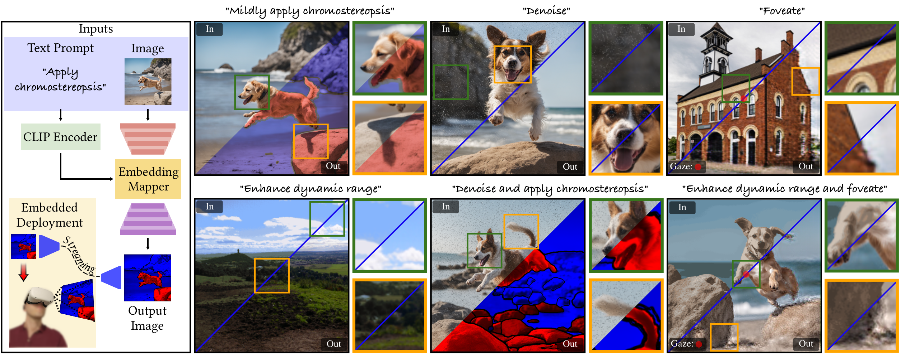

# Learned Single-Pass Multitasking Perceptual Graphics for Immersive Displays

## People
<table class=""  style="margin: 10px auto;">
  <tbody>
    <tr>
      <td>  &nbsp;&nbsp;&nbsp;&nbsp;&nbsp;&nbsp;&nbsp;</td>
      <td>  &nbsp;&nbsp;&nbsp;&nbsp;</td>
      <td>  &nbsp;&nbsp;&nbsp;&nbsp;</td>
      <td>  &nbsp;&nbsp;&nbsp;&nbsp;</td>
      <td>  &nbsp;&nbsp;&nbsp;&nbsp;</td>
    </tr>
    <tr>
      <td>
<a href="https://yilmazdoga.net">Doğa Yılmaz</a>1
</td>
      <td>
<a href="https://drhewang.com">He Wang</a>1
</td>
      <td>
<a href="https://tovacinni.github.io">Towaki Takikawa</a>2
</td>
      <td>
<a href="https://www.duygu-ceylan.com">Duygu Ceylan</a>3
</td>
      <td>
<a href="https://kaanaksit.com">Kaan Akşit</a>1
</td>
    </tr>
  </tbody>
</table>

1University College London,
2University of Toronto,
3Adobe Research

<b>ACM Multimedia 2025</b>

## Resources
:material-newspaper-variant: [Manuscript](https://www.kaanaksit.com/assets/pdf/YilmazEtAl_ACMMM2025_Learned_Single_Pass_Multitasking_Perceptual_Graphics_for_Immersive_Displays.pdf)
:material-newspaper-variant: [Supplementary](https://www.kaanaksit.com/assets/pdf/YilmazEtAl_ACMMM2025_Supplementary_Learned_Single_Pass_Multitasking_Perceptual_Graphics_for_Immersive_Displays.pdf)
:material-file-code: [Code](https://github.com/complight/multitasking_perceptual_graphics)
??? info ":material-tag-text: Bibtex"
        @inproceedings{yilmaz2025perceptual,
          author = {Y{\i}lmaz, Do{\u{g}}a and Wang, He and Takikawa, Towaki and Ceylan, Duygu and Ak{\c{s}}it, Kaan},
          title = {Learned Single-Pass Multitasking Perceptual Graphics for Immersive Displays},
          booktitle = {Proceedings of the 33rd ACM International Conference on Multimedia},
          year = {2025},
          location = {Dublin, Ireland},
          publisher = {ACM},
          address = {New York, NY, USA},
          pages = {9},
          doi = {https://doi.org/10.1145/3746027.3754801},
          month = {October 27--31}
        }

## Video
<video controls>
<source src="https://kaanaksit.com/assets/video/YilmazACMMM2025MultitaskingPerceptualGraphics.mp4" id="" type="video/mp4">
</video>

## Abstract
Emerging immersive display technologies efficiently utilize resources with perceptual graphics methods such as foveated rendering and denoising.
Running multiple perceptual graphics methods challenges devices with limited power and computational resources.
We propose a computationally-lightweight learned multitasking perceptual graphics model.
Given RGB images and text-prompts, our model performs text-described perceptual tasks in a single inference step.
Simply daisy-chaining multiple models or training dedicated models can lead to model management issues and exhaust computational resources.
In contrast, our flexible method unlocks consistent high quality perceptual effects with reasonable compute, supporting various permutations at varied intensities using adjectives in text prompts (e.g. mildly, lightly).
Text-guidance provides ease of use for dynamic requirements such as creative processes.
To train our model, we propose a dataset containing source and perceptually enhanced images with corresponding text prompts.
We evaluate our model on desktop and embedded platforms and validate perceptual quality through a user study.

<figure markdown>
  { width="900" }
</figure>

## Relevant research works
Here are relevant research works from the authors:

- [ChromaCorrect: Prescription Correction in Virtual Reality Headsets through Perceptual Guidance](https://complightlab.com/ChromaCorrect)
- [Metameric Inpainting for Image Warping](https://doi.org/10.1109/tvcg.2022.3216712)
- [Metameric Varifocal Holograms](https://vr.cs.ucl.ac.uk/research/pipelines/metameric-varifocal-holography/)
- [Optimizing vision and visuals: lectures on cameras, displays and perception](../teaching/siggraph2022_optimizing_vision_and_visuals.md)
- [Beyond blur: ventral metamers for foveated rendering](https://www.homepages.ucl.ac.uk/~ucabdw0/beyondblur.html)
- [Foveated AR: dynamically-foveated augmented reality display](https://dl.acm.org/doi/10.1145/3306346.3322987)
- [Odak](https://github.com/kaanaksit/odak)

## Outreach
We host a Slack group with more than 400 members.
This Slack group focuses on the topics of rendering, perception, displays and cameras.
The group is open to public and you can become a member by following [this link](../outreach/index.md).

## Contact Us
!!! Warning
    Please reach us through [email](mailto:kaanaksit@kaanaksit.com) to provide your feedback and comments.

