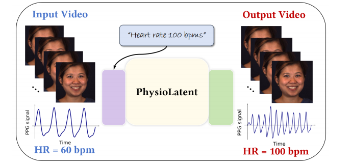
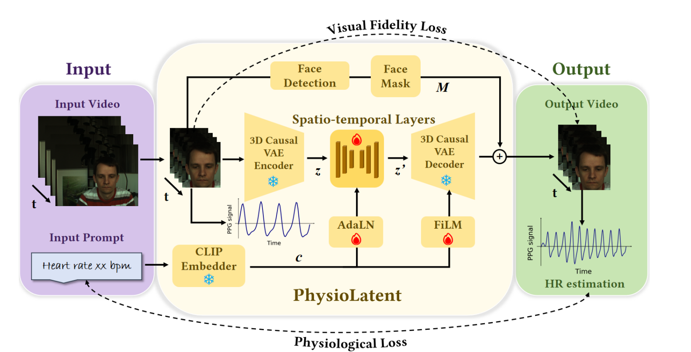
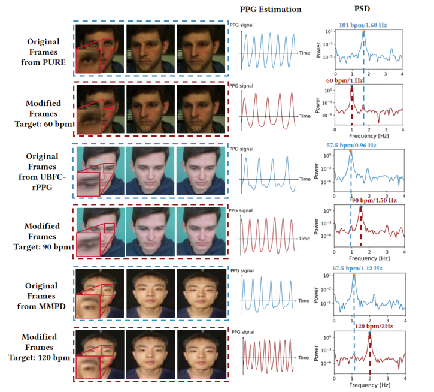
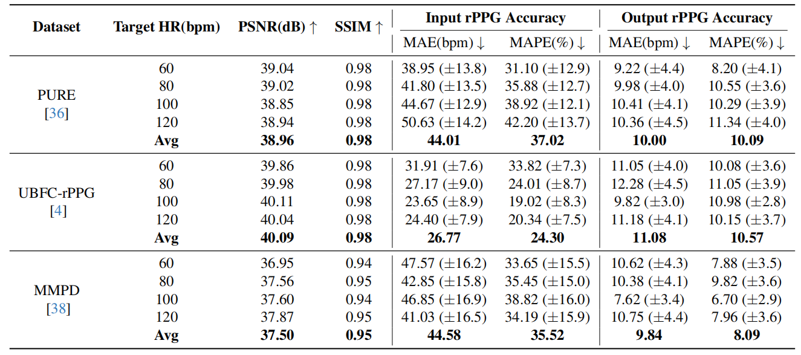

# Editing Physiological Signals in Videos Using Latent Representations

## People
<table class="" style="margin: 10px auto;">
  <tbody>
    <tr>
      <td> &nbsp;&nbsp;&nbsp;&nbsp;&nbsp;&nbsp;&nbsp;</td>
      <td> &nbsp;&nbsp;&nbsp;&nbsp;</td>
      <td> &nbsp;&nbsp;&nbsp;&nbsp;</td>
      <td> &nbsp;&nbsp;&nbsp;&nbsp;</td>
    </tr>
    <tr>
      <td>
<a href="https://zhoutianwen.com/">Tianwen Zhou</a>1
</td>
      <td>
<a href="https://akshayparuchuri.com/">Akshay Paruchuri</a>2
</td>
      <td>
<a href="">Josef Spjut</a>3
</td>
      <td>
<a href="https://kaanaksit.com">Kaan Akşit</a>1
</td>
    </tr>
  </tbody>
</table>

1University College London,
2UNC Chapel Hill,
3NVIDIA

<b>CVPR 2026 Workshop on Subtle Visual Computing</b>

## Resources
:material-newspaper-variant: [Manuscript](https://www.kaanaksit.com/assets/pdf/ZhouEtAl_CVPR2026_SVC_Workshop_Editing_physiological_signals_in_videos_using_latent_representations.pdf)
:material-newspaper-variant: [Supplementary](https://kaanaksit.com/assets/pdf/ZhouEtAl_CVPR2026_SVC_Workshop_Supplementary_Editing_physiological_signals_in_videos_using_latent_representations.pdf)
:material-file-document-outline: [arXiv](https://arxiv.org/abs/2509.25348)
:material-file-code: [Code](https://github.com/complight/PhysioLatent)

??? info ":material-tag-text: Bibtex"
        @inproceedings{zhou2026editing,
          author = {Tianwen Zhou and Akshay Paruchuri and Josef Spjut and Kaan Ak{\c{s}}it},
          title = {Editing Physiological Signals in Videos Using Latent Representations},
          booktitle={Proceedings of the IEEE/CVF Conference on Computer Vision and Pattern Recognition (CVPR) Workshops, 2nd Workshop on Subtle Visual Computing (SVC)},
          month=june,
          year = {2026}
          address={Denver, CO, USA}
        }

## Abstract
Camera-based physiological signal estimation provides a convenient and non-contact way to monitor heart rate, but it also raises serious privacy concerns because facial videos can leak sensitive information about a person’s health and emotional state. We present a learned framework for editing physiological signals in videos while preserving visual fidelity. Our method first encodes an input video into a latent representation using a pretrained 3D Variational Autoencoder, and embeds a target heart-rate prompt through a frozen text encoder. The two representations are fused by trainable spatio-temporal layers with Adaptive Layer Normalization to model the strong temporal coherence of remote photoplethysmography signals. To better preserve subtle physiological variations during reconstruction, we apply Feature-wise Linear Modulation in the decoder and fine-tune its output layer. Across multiple benchmark datasets, our approach preserves visual quality with an average PSNR of 38.96 dB and SSIM of 0.98, while achieving an average heart-rate modulation error of 10.00 bpm MAE and 10.09% MAPE under a state-of-the-art rPPG estimator. These results suggest that our framework is useful for privacy-preserving video sharing, biometric anonymization, and the generation of realistic videos with controllable vital signs.

<figure markdown>
  { width="900" }
</figure>

## Proposed Method
PhysioLatent edits physiological signals in facial videos by operating in the latent space of a pretrained 3D Causal VAE. Given an input video and a target heart-rate prompt, the video is first encoded into a spatio-temporal latent representation, while the text prompt is embedded by a frozen CLIP text encoder. The projected text condition is then fused with the video latent and processed by trainable spatio-temporal layers.

A central challenge of physiological signal editing is that rPPG exhibits two distinctive properties: strong temporal coherence across frames and visually imperceptible intensity variations. To handle the first, we introduce temporal self-attention with AdaLN in the latent fusion block, enabling long-range temporal conditioning and more faithful modulation of the target rhythm. To handle the second, we inject FiLM conditioning into the decoder and fine-tune its output layer so that the reconstructed video can better preserve subtle physiological variations while maintaining appearance.

We additionally use face masking to replace only the facial region with the decoder output, keeping the remaining content unchanged. Training combines visual fidelity losses with physiological supervision, including waveform correlation and frequency alignment, so that the edited video remains visually plausible while matching the desired target heart rate.

<figure markdown>
  { width="900" }
</figure>

## Qualitative Results
The qualitative results demonstrate that PhysioLatent can modify physiological signals while keeping the edited videos visually close to the original inputs. Across datasets, facial appearance, structure, and background remain largely preserved after editing. At the same time, the recovered rPPG signals and corresponding frequency spectra shift toward the desired target heart rates, showing that the model successfully injects controllable physiological dynamics into the reconstructed videos.

Although the 3D VAE backbone introduces slight local distortions in some high-frequency regions such as edges and textures, these artifacts are generally minor and do not substantially affect the perceptual realism of the output. Overall, the results show that our framework achieves a practical balance between biometric signal editing and visual fidelity.

<figure markdown>
  { width="900" }
</figure>

## Quantitative Results
We evaluate PhysioLatent on PURE, UBFC-rPPG, and MMPD using target heart rates of 60, 80, 100, and 120 bpm. The edited videos maintain high visual quality, reaching approximately 39–40 dB PSNR and around 0.95–0.98 SSIM across datasets. At the same time, the modified outputs substantially reduce heart-rate estimation error with respect to the requested target, confirming that the framework effectively edits physiological signals instead of merely reconstructing the input.

On PURE, our method achieves an average PSNR of 38.96 dB and SSIM of 0.98, while reducing the average heart-rate modulation error to 10.00 bpm MAE and 10.09% MAPE under the POS estimator. Similar trends hold on UBFC-rPPG and MMPD, indicating that the approach remains effective across datasets with different motion, illumination, and subject characteristics. Additional experiments with multiple unsupervised and supervised rPPG estimators further show that the edited physiological patterns generalize across different evaluation pipelines.

<figure markdown>
  { width="900" }
</figure>

## Conclusion
We present PhysioLatent, a framework for editing camera-based physiological signals in facial videos while preserving visual fidelity. By combining latent-space video representations, text-conditioned heart-rate control, temporal attention with AdaLN, and FiLM-based decoder conditioning, the method enables controllable and temporally coherent physiological editing. Our experiments show strong visual quality together with accurate heart-rate modulation across multiple benchmark datasets.

Beyond target heart-rate editing, the framework also supports a removal mode that suppresses periodic physiological components, making it useful for privacy-preserving video sharing and biometric anonymization. More broadly, the use of text-driven conditioning and 3D VAE latent representations makes PhysioLatent naturally compatible with emerging video generation and multimodal foundation-model pipelines.

## Relevant research works
Here are relevant research works from the authors:

- [Heart rate monitoring via remote photoplethysmography with motion artifacts reduction](https://kaanaksit.com/assets/pdf/CenniniEtAl_OpticsExpress2010_Heart_rate_monitoring_via_remote_photoplethysmography_with_motion_artifacts_reduction.pdf)

## Outreach
We host a Slack group with more than 250 members.
This Slack group focuses on the topics of rendering, perception, displays and cameras.
The group is open to public and you can become a member by following [this link](../outreach/index.md).

## Contact Us
!!! Warning
    Please reach us through [email](mailto:kaanaksit@kaanaksit.com) to provide your feedback and comments.
