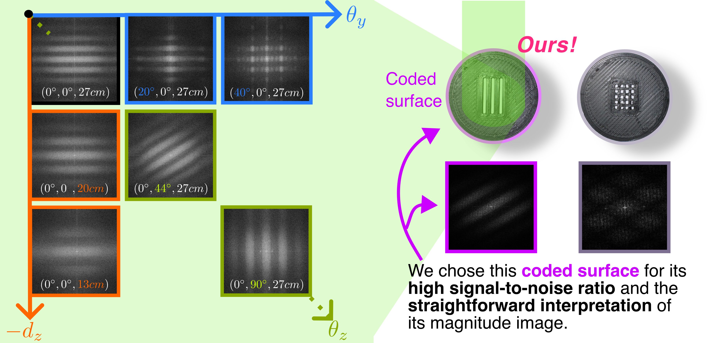
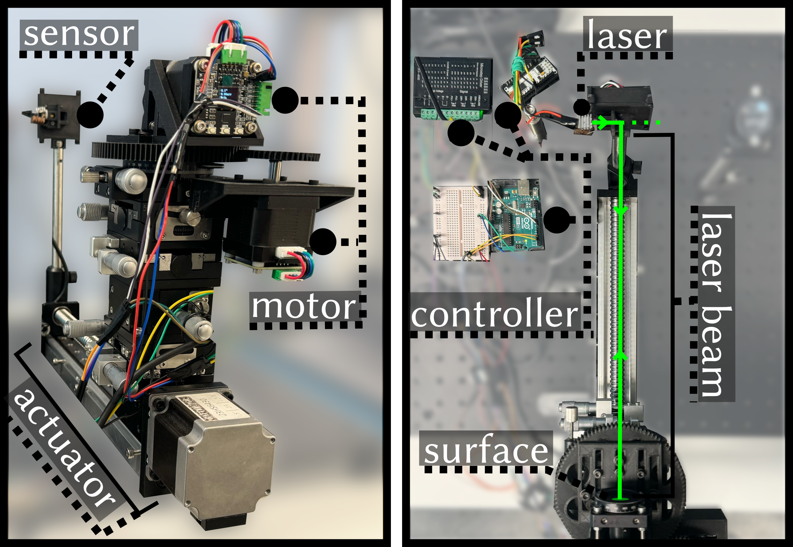

# SpecTrack: Learned Multi-Rotation Tracking via Speckle Imaging

## People
<table class=""  style="margin: 10px auto;">
  <tbody>
    <tr>
      <td>  &nbsp;&nbsp;&nbsp;&nbsp;&nbsp;&nbsp;&nbsp;</td>
      <td>  &nbsp;&nbsp;&nbsp;&nbsp;</td>
      <td>  &nbsp;&nbsp;&nbsp;&nbsp;</td>
      <td>  &nbsp;&nbsp;&nbsp;&nbsp;</td>
    </tr> 
    <tr>
      <td>
<a href="https://ziyang.space/">Ziyang Chen</a>1
</td>
      <td>
<a href="https://www.dogadogan.com/">Doğa Doğan</a>2
</td>
      <td>
<a href="https://josef.spjut.me/">Josef Spjut</a>3
</td>
      <td>
<a href="https://kaanaksit.com">Kaan Akşit</a>1
</td>
    </tr>
  </tbody>
</table>

1University College London,
2Adobe Research,
3NVIDIA

<b>SIGGRAPH Asia 2024 Poster</b>

## Resources
:material-newspaper-variant: [Manuscript](https://kaanaksit.com/assets/pdf/ChenEtAl_SigAsia2024_Abstract_spectrack_learned_multi_rotation_tracking_via_speckle_imaging.pdf)
:material-newspaper-variant: [Poster](https://kaanaksit.com/assets/pdf/ChenEtAl_SigAsia2024_Poster_spectrack_learned_multi_rotation_tracking_via_speckle_imaging.pdf)
:material-newspaper-variant: [Supplementary](https://kaanaksit.com/assets/pdf/ChenEtAl_SigAsia2024_Supplementary_spectrack_learned_multi_rotation_tracking_via_speckle_imaging.pdf)
:material-file-code: [Code](https://github.com/complight/SpecTrack)
<!-- :material-video-account: [Project video](https://kaanaksit.com/assets/video/KavakliSigAsia2023Multicolor.mp4) -->
??? info ":material-tag-text: Bibtex"
        @inproceedings{chen2024spectrack,
          author = {Ziyang Chen and Mustafa Dogan and Josef Spjut and Kaan Ak{\c{s}}it},
          title = {SpecTrack: Learned Multi-Rotation Tracking via Speckle Imaging},
          booktitle = {SIGGRAPH Asia 2024 Posters (SA Posters '24)},
          year = {2024},
          location = {Tokyo, Japan},
          publisher = {ACM},
          address = {New York, NY, USA},
          pages = {2},
          doi = {10.1145/3681756.3697875},
          url = {https://doi.org/10.1145/3681756.3697875},
          month = {December 03--06}
        }

## Video
<video controls>
<source src="https://kaanaksit.com/assets/video/ChenSigAsia2024SpecTrack.mp4" id="“ type="video/mp4">
</video>

<!-- ## Presentation -->
<!-- <video controls>
<source src="https://kaanaksit.com/assets/video/KavakliSigAsia2023MulticolorPresentation.mp4" id="“ type="video/mp4">
</video> -->

## Abstract
Precision pose detection is increasingly demanded in fields such as personal fabrication, Virtual Reality (VR), and robotics due to its critical role in ensuring accurate positioning information.
However, conventional vision-based systems used in these systems often struggle with achieving high precision and accuracy, particularly when dealing with complex environments or fast-moving objects.
To address these limitations, we investigate Laser Speckle Imaging (LSI), an emerging optical tracking method that offers promising potential for improving pose estimation accuracy.
Specifically, our proposed LSI-Based Tracking leverages the captures from a lensless camera and a retro-reflector marker with a coded aperture to achieve multi-axis rotational pose estimation with high precision. Our extensive trials using our in-house built testbed have shown that SpecTrack achieves an accuracy of $0.31^\circ$ (std=$0.43^\circ$)
, significantly outperforming state-of-the-art approaches and improving accuracy up to $200\%$.

## Proposed Method
We aim to remotely obtain multiple absolute rotation angles from a coded retroreflective marker by utilizing the overlapping patterns generated by the multi-wavelength laser.
the laser beam from the source ($S$) hits an arbitrary point ($P$) and diffracts at slightly different angles due to the different wavelengths ($\lambda_0$ and $\lambda_1$).
This phenomenon shows a correlation between the surface rotation angle and the captured speckle image.

The first image below shows the structure of the proposed sensor, which contains a bare sensor, laser source and beam splitter ($10~mm \times 10~mm$).
The beam splitter is placed in front of the bare imaging sensor to ensure that most of the light reflected from the marker covers a large area of the sensor.
Additionally, this co-axial optical layout eliminates the light source's lateral offsets, simplifying the speckle behavior in the rotations.

<figure markdown>
  { width="500" }
</figure>
We can tell from the image below that the captured image formed overlappings in when the surface rotates $10^\circ$ in the y-axis.
<figure markdown>
  { width="500" }
</figure>
Using the Fast Fourier Transform (FFT) to get the magnitudes of speckle image from various poses (y-axis roation, z-axis rotations, and z-axis displacements) or coded surface reveals interpretable patterns:
<figure markdown>
  { width="800" }
</figure>

We employ a shallow neural network to handle the non-linearities of physical aspects and estimate the absolute rotation angles from speckle patterns.
<figure markdown>
  { width="800" }
</figure>
Firstly, we preprocess the captured monochrome speckle frames $I_{speckle}$ ($640\times360$~px) by transforming them into the frequency domain $\mathcal{F}(I_{speckle})$ using the FFT.
Then the frames are central cropped and concatenated into a tensor $[\mathcal{F}(I_{\text{speckle}, i})]_{i=1}^5$ with a shape of $(5,320,180)$.
From our practical experiences, this concatenated frame tensor provides more robust results when the marker is in motion because it incorporates temporal information.
After that, we feed the samples into three convolutional blocks, each comprising a 2D convolution layer, batch normalization, ReLU activation function, and max pooling.
After the convolution, the sample is flattened and inputted into a Multi Layer Perceptron (MLP) containing six linear layers each layer is followed by a batch normalization and ReLu activation function. 
The final layer of MLP outputs the rotation angles $\theta_y$, $\theta_z$ and the arbitrary depth $d_z$.

Since capturing samples in all six Degrees Of Freedom simultaneously is physically difficult, we focus on capturing the speckle imaging as the marker rotates in the z-axis and y-axis.
We add controlled close-loop motors to a rotary stage to automatically capture the speckle images when the marker is rotated in various axes, as shown below.
During the data collection, we control the motors to rotate the marker from $0^\circ$ to $40^\circ$ on the y-axis and $0^\circ$ to $90^\circ$ the z-axis.
Besides the rotations, we repeat the experiment in different depths from $16~cm$ to $28~cm$.
<figure markdown>
  { width="500" }
</figure>
## Conclusions
### Baseline
We compare our work with the state-of-the-art from Gibson et al.
However, we lack direct access to accurate measurements, such as the wavelengths emitted by the off-the-shelf laser diode.
We subsequently employed a gradient descent-based optimization with a captured training set to get the unknown variables: dominant wavelength $\lambda_0$, wavelength differences $\Delta \lambda$, where $\Delta \lambda = \lambda_0 - \lambda_1 \ll \lambda_0$, and light source position $S$ in the 3D space.
Following this, we tested the analytical model proposed by the authors with the test set that contains the speckle images captured when the marker rotates from $0^\circ$ to $40^\circ$ in the y-axis.
The baseline result indicates the Mean Absolute Error (MAE) of $0.60^\circ$ ($std=0.35^\circ$) on our testbed.

SpecTrack achieved a lower MAE and std: $\mathbf{0.31^\circ}$, $\mathbf{0.44^\circ}$, respectively.
At the same time, the model can estimate the z-axis rotations rotation with a MAE $\mathbf{0.52^\circ}$ ($std=\mathbf{0.36^\circ}$).
Furthermore, the model adapts to varying depths, showing an accuracy of $0.15~cm$. 
### Future work 
Testing and optimizing the system in real-world environments, considering varying lighting, distances, and object motions, is crucial for successful operation in various applications including VR, AR, and robotics.

## Relevant research works
Here are relevant research works from the authors:

- [Optimizing Vision and Visuals: Lectures on Cameras, Displays, and Perception](../teaching/siggraph2022_optimizing_vision_and_visuals.md)
- [Unrolled Primal-Dual Networks for Lensless Camera](https://github.com/complight/unrolled_primal_dual_networks)
- [Odak](https://github.com/kaanaksit/odak)

<!-- ## External Other Links
Here are links related to our project such as videos, articles or podcasts:

- [ACM SIGGRAPH Asia 2023, Technical Papers Fast Forward (Preview the presentations on 13 Dec, Day 2)](https://youtu.be/dMsD_xXOEKA?feature=shared&t=332) -->

## Outreach
We host a Slack group with more than 250 members.
This Slack group focuses on the topics of rendering, perception, displays and cameras.
The group is open to public and you can become a member by following [this link](../outreach/index.md).

## Contact Us
!!! Warning
    Please reach us through [email](mailto:kaanaksit@kaanaksit.com) to provide your feedback and comments.

<!-- ## Acknowledgements -->

<!-- 

Kaan Akşit is supported by the Royal Society's RGS\R2\212229 - Research Grants 2021 Round 2 in building the hardware prototype. Kaan Akşit is also supported by Meta Reality Labs inclusive rendering initiative 2022. Liang Shi is supported by Meta Research PhD fellowship (2021-2023).
 
 
 
 
 
 
 

Hakan Urey is supported by the European Innovation Council’s HORIZON-EIC-2021-TRANSITION-CHALLENGES program Grant Number 101057672 and Tübitak’s 2247-A National Lead Researchers Program, Project Number 120C145.
 
 
 
 
 
 
  -->

