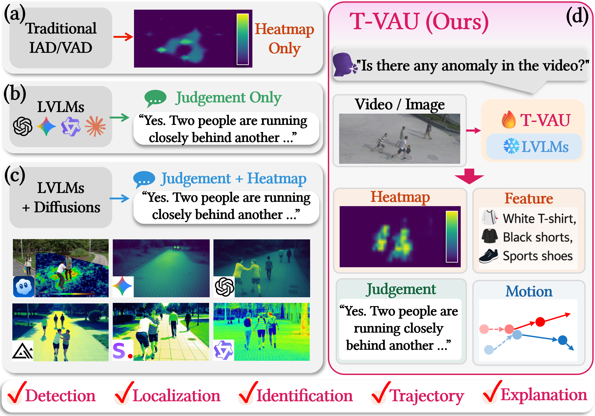
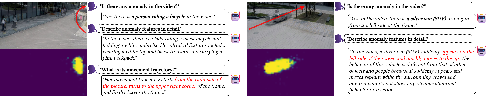
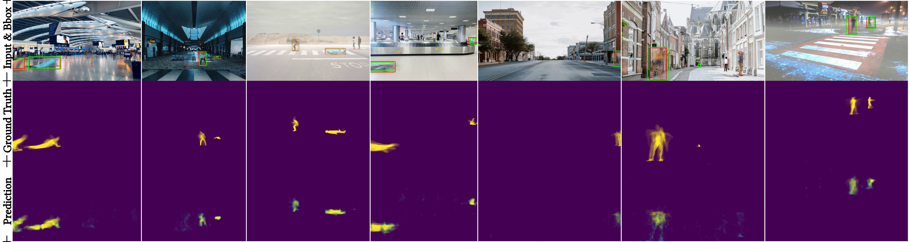

# **Text-guided Fine-Grained Video Anomaly Understanding**

## People

<table class=""  style="margin: 10px auto;">
  <tbody>
    <tr>
      <td>  &nbsp;&nbsp;&nbsp;&nbsp;&nbsp;&nbsp;&nbsp;</td>
      <td>  &nbsp;&nbsp;&nbsp;&nbsp;</td>
      <td>  &nbsp;&nbsp;&nbsp;&nbsp;</td>
      <td>  &nbsp;&nbsp;&nbsp;&nbsp;</td>
    </tr> 
    <tr>
      <td><p style="text-align:center;"><a href="https://momiji-bit.github.io">Jihao (Geo) Gu</a><sup>1</sup></p></td>
      <td><p style="text-align:center;"><a href="https://scholar.google.com/citations?user=UQ_bInoAAAAJ">Kun Li</a><sup>2</sup></p></td>
      <td><p style="text-align:center;"><a href="https://drhewang.com">He Wang</a><sup>1</sup></p></td>
      <td><p style="text-align:center;"><a href="https://kaanaksit.com">Kaan Akşit</a><sup>1</sup></p></td>
    </tr>
  </tbody>
</table>
<p style="text-align:center;">
<sup>1</sup>University College London,
<sup>2</sup>United Arab Emirates University
</p>
<p style="text-align:center;"><b>CVPR 2026 SVC Workshop</b></p>

## Resources

:material-newspaper-variant: [Manuscript](https://www.kaanaksit.com/assets/pdf/GuEtAl_CVPR2026_SVC_Workshop_Text_guided_fine_grained_video_anomaly_understanding.pdf)
:material-file-code: [Code](https://github.com/momiji-bit/T-VAU)
:material-file-code: [Dataset](https://huggingface.co/datasets/Geo2425/T-VAU)
??? info ":material-tag-text: Bibtex"
	```
	@inproceedings{gu2026tvau,
  	  author = {Gu, Jihao and Li, Kun and Wang, He and Ak{\c{s}}it, Kaan},
  	  title = {Text-guided Fine-Grained Video Anomaly Understanding},
  	  booktitle = {Proceedings of the IEEE/CVF Conference on Computer Vision and Pattern Recognition (CVPR) Workshops, 2nd Workshop on Subtle Visual Computing (SVC)},
  	  year = {2026},
  	  address = {Denver, CO, USA},
      url = {https://openaccess.thecvf.com/content/CVPR2026W/SVC/html/Gu_Text-guided_Fine-Grained_Video_Anomaly_Understanding_CVPRW_2026_paper.html},
	}
	```

## Abstract

Subtle abnormal events in videos often manifest as weak spatio-temporal cues that are easily overlooked by conventional anomaly detection systems. Existing video anomaly detection approaches typically provide coarse binary anomaly decisions without interpretable evidence, while large vision-language models (LVLMs) can produce textual judgments but lack precise localization of subtle visual signals. To address this gap, we propose **Text-guided Fine-Grained Video Anomaly Understanding (<strong><span style="color: rgb(216, 27, 96);">T-VAU</span></strong>)**, a framework that grounds subtle anomaly evidence into multimodal reasoning. Specifically, we introduce an **Anomaly Heatmap Decoder (<strong><span style="color: rgb(0, 158, 115);">AHD</span></strong>)** that performs visual-textual feature alignment to extract pixel-level spatio-temporal anomaly heatmaps from intermediate visual representations. We further design a **Region-aware Anomaly Encoder (<strong><span style="color: rgb(230, 159, 0);">RAE</span></strong>)** that converts these heatmaps into structured prompt embeddings, enabling the LVLM to perform anomaly detection, localization, and semantic explanation in a unified reasoning pipeline. To support fine-grained supervision, we construct a target-level fine-grained video-text anomaly dataset derived from ShanghaiTech and UBnormal with detailed annotations of object appearance, localization, and motion trajectories. Extensive experiments demonstrate that <strong><span style="color: rgb(216, 27, 96);">T-VAU</span></strong> significantly improves anomaly localization and textual reasoning performance on both benchmarks, achieving strong results in BLEU-4 metrics and Yes/No decision accuracy while providing interpretable pixel-level spatio-temporal evidence for anomaly understanding.

<figure markdown>
  { width="900" }
</figure>

## Proposed Method

### Model Design

The proposed <strong><span style="color: rgb(216, 27, 96);">T-VAU</span></strong> model. The framework consists of three modules:

1. **Text Encoder** ($E_t$) that generates class-specific text embeddings $\mathbf{S}_c$ from binary prompts  

2. **Anomaly Heatmap Decoder (<strong><span style="color: rgb(0, 158, 115);">AHD</span></strong>)** that fuses $\mathbf{S}_c$ with visual features $\mathcal{V}$ to produce spatio-temporal pixel-level anomaly heatmaps $\mathbf{H}$  

3. **Region-aware Anomaly Encoder (<strong><span style="color: rgb(230, 159, 0);">RAE</span></strong>)** that projects $\mathbf{H}_c$ into the LoRA-tuned LVLM semantic space and integrates it with video $\mathcal{V}$ and a sequence of incrementally refined questions $\mathbf{Q}_{\leq t}$ to yield the final anomaly understanding response $\mathbf{A}_t$

<figure markdown>
  { width="900" }
</figure>

### Fine-grained Anomaly Understanding

Fine-grained anomaly dataset construction pipeline. Starting from existing datasets with only pixel-level anomaly labels (*e.g.*, **ShanghaiTech** and **UBnormal**), we build a structured video–text dataset through three stages:

1. **Frame-level structured prompting** to extract target attributes and spatial information and aggregate them into target timelines  

2. **Anomaly-focused refinement** using anomaly masks and background suppression to emphasize abnormal evidence  

3. **Cross-modal consistency verification** between appearance and motion cues  

The resulting dataset provides aligned annotations of **appearance**, **spatial localization**, and **motion trajectory** for fine-grained anomaly understanding.

<figure markdown>
  { width="900" }
</figure>

## Experimental Results

**Anomaly Detection Results.** Experimental results on **UBnormal**. We report micro-/macro-averaged frame-level AUC, RBDC, and TBDC (%). PT, FT, and 1S denote pre-trained, fine-tuned, and one-shot; SR denotes frame sampling rate. Best results are highlighted in **bold**.

| Method                                                       | Micro AUC ↑                                                 | Macro AUC ↑                                                 | RBDC ↑                                                       | TBDC ↑                                                       |
| ------------------------------------------------------------ | ----------------------------------------------------------- | ----------------------------------------------------------- | ------------------------------------------------------------ | ------------------------------------------------------------ |
| Georgescu et al.                                             | 58.5                                                        | <span style="background-color: #d9f2d9;">94.4</span>        | 18.580                                                       | 48.213                                                       |
| Georgescu et al. (FT)                                        | 68.2                                                        | <span style="background-color: #a6e3a1;"><b>95.3</b></span> | 28.654                                                       | 58.097                                                       |
| Sultani et al. (PT)                                          | 61.1                                                        | 89.4                                                        | 0.001                                                        | 0.012                                                        |
| Sultani et al. (FT)                                          | 51.8                                                        | 88.0                                                        | 0.001                                                        | 0.001                                                        |
| Bertasius et al. (FT, SR=1/32)                               | 86.1                                                        | 89.2                                                        | 0.008                                                        | 0.021                                                        |
| Bertasius et al. (FT, SR=1/8)                                | 83.4                                                        | 90.6                                                        | 0.009                                                        | 0.023                                                        |
| Bertasius et al. (FT, SR=1/4)                                | 78.5                                                        | 89.2                                                        | 0.006                                                        | 0.018                                                        |
| <strong><span style="color: rgb(0, 158, 115);">AHD</span></strong> (1S) | <span style="background-color: #d9f2d9;">94.5</span>        | 85.2                                                        | <span style="background-color: #d9f2d9;">64.300</span>       | <span style="background-color: #d9f2d9;">74.400</span>       |
| <strong><span style="color: rgb(0, 158, 115);">AHD</span></strong> (FT) | <span style="background-color: #a6e3a1;"><b>94.8</b></span> | 87.8                                                        | <span style="background-color: #a6e3a1;"><b>67.800</b></span> | <span style="background-color: #a6e3a1;"><b>76.700</b></span> |

**Multi-turn Dialogue Results.** One-shot evaluation results of representative LVLMs on our constructed dataset. “Size” denotes model parameters (billions). BLEU-4 is reported for Target and Trajectory, and Accuracy for Yes/No.

| Method                                                       | Size ↓ | Target (ST) ↑                                                | Trajectory (ST) ↑                                            | Yes/No (ST) ↑                                                | Target (UB) ↑                                                | Trajectory (UB) ↑                                            | Yes/No (UB) ↑                                                |
| ------------------------------------------------------------ | ------ | ------------------------------------------------------------ | ------------------------------------------------------------ | ------------------------------------------------------------ | ------------------------------------------------------------ | ------------------------------------------------------------ | ------------------------------------------------------------ |
| Qwen2.5-VL (zero-shot)                                       | 7B     | 18.74                                                        | 27.33                                                        | 61.03%                                                       | 16.20                                                        | 24.18                                                        | 65.62%                                                       |
| Qwen2.5-VL (one-shot)                                        | 7B     | 50.42                                                        | 78.91                                                        | 92.36%                                                       | 44.35                                                        | 70.82                                                        | 87.24%                                                       |
| LLaVA-1.6 (one-shot)                                         | 7B     | 47.68                                                        | 75.42                                                        | 91.07%                                                       | 42.11                                                        | 68.07                                                        | 85.91%                                                       |
| MiniCPM-V 2.6 (one-shot)                                     | 7B     | 52.34                                                        | 80.41                                                        | 93.11%                                                       | 46.70                                                        | <span style="background-color: #d9f2d9;">72.88</span>        | 86.94%                                                       |
| Idefics2 (one-shot)                                          | 8B     | 44.29                                                        | 73.84                                                        | 90.12%                                                       | 39.51                                                        | 65.92                                                        | 84.03%                                                       |
| InternVL (one-shot)                                          | 8B     | <span style="background-color: #d9f2d9;">55.73</span>        | <span style="background-color: #d9f2d9;">82.65</span>        | <span style="background-color: #d9f2d9;">94.28%</span>       | <span style="background-color: #d9f2d9;">49.84</span>        | 71.63                                                        | <span style="background-color: #d9f2d9;">88.65%</span>       |
| **<strong><span style="color: rgb(230, 159, 0);">RAE</span></strong> (Ours)** | 7B     | <span style="background-color: #a6e3a1;"><b>62.67</b></span> | <span style="background-color: #a6e3a1;"><b>88.84</b></span> | <span style="background-color: #a6e3a1;"><b>97.67%</b></span> | <span style="background-color: #a6e3a1;"><b>50.32</b></span> | <span style="background-color: #a6e3a1;"><b>78.10</b></span> | <span style="background-color: #a6e3a1;"><b>89.73%</b></span> |

**Ablation Studies.** Results of different **T-VAU** variants. Heatmap metrics include RBDC and TBDC. BLEU-4 is reported for Target and Trajectory. Accuracy is Yes/No classification.

| Method                                                       | Params ↓ | RBDC ↑ | TBDC ↑ | Target ↑ | Trajectory ↑ | Yes/No ↑ |
| ------------------------------------------------------------ | -------- | ------ | ------ | -------- | ------------ | -------- |
| <strong><span style="color: rgb(216, 27, 96);">T-VAU</span></strong> w/o <strong><span style="color: rgb(0, 158, 115);">AHD</span></strong> | 8299M    | --     | --     | 61.82    | 85.47        | 95.38%   |
| <strong><span style="color: rgb(216, 27, 96);">T-VAU</span></strong> w/o <strong><span style="color: rgb(230, 159, 0);">RAE</span></strong> | 8317M    | 67.8   | 76.7   | --       | --           | --       |
| <strong><span style="color: rgb(216, 27, 96);">T-VAU</span></strong> w/o <strong><span style="color: rgb(0, 158, 115);">AHD</span></strong> & <strong><span style="color: rgb(230, 159, 0);">RAE</span></strong> | 8274M    | --     | --     | 61.82    | 85.47        | 95.38%   |
| <strong><span style="color: rgb(216, 27, 96);">T-VAU</span></strong> | 8324M    | 67.8   | 76.7   | 62.67    | 88.84        | 97.67%   |

**Examples of interpretable anomaly detection and multi-turn QA across scenes.** Each group shows the raw frame, pixel-level anomaly heatmaps produced by <strong><span style="color: rgb(0, 158, 115);">AHD</span></strong>, and <strong><span style="color: rgb(216, 27, 96);">T-VAU</span></strong>'s dialogue outputs (anomaly yes/no, appearance/action details, and motion trajectory).

- **Left:** a cyclist (with umbrella and backpack) is localized as the anomalous target, with the trajectory “enter from right $\rightarrow$ turn toward the upper-right corner $\rightarrow$ exit.”  

- **Right:** a silver SUV suddenly appears from the left and moves rapidly; <strong><span style="color: rgb(0, 158, 115);">AHD</span></strong> consistently highlights the vehicle, and the QA module explains the abrupt appearance and fast motion.  

<strong><span style="color: rgb(216, 27, 96);">T-VAU</span></strong> first detects the anomaly, then describes the appearance (white top, grey shorts, green schoolbag) and the change from walking to running. Red arrows indicate the main motion directions, and heatmap intensity reflects anomaly confidence. <strong><span style="color: rgb(230, 159, 0);">RAE</span></strong> encodes the heatmaps into region-aware text prompts that guide the LVLM to produce consistent decisions and descriptions, closing the loop from pixel-level evidence to readable narratives.

<figure markdown>
  { width="900" }
</figure>

**Trajectory visualization by accumulating frame-level outputs.**  The first row shows multi-frame overlays of the original video with green bounding boxes for GT and red bounding boxes for predictions. The second row overlays GT pixel-level masks to form fine-grained trajectories, while the third row overlays predicted pixel-level masks. Both bounding-box and pixel-level trajectories show strong spatial alignment with GT, indicating that our model accurately captures motion paths over time.

<figure markdown>
  { width="900" }
</figure>

## Conclusions

We present <strong><span style="color: rgb(216, 27, 96);">T-VAU</span></strong>, a closed-loop framework that unifies pixel-level anomaly grounding and high-level semantic reasoning by coupling an Anomaly Heatmap Decoder (<strong><span style="color: rgb(0, 158, 115);">AHD</span></strong>) with a Region-aware Anomaly Encoder (<strong><span style="color: rgb(230, 159, 0);">RAE</span></strong>). By aligning visual features with textual prompts, <strong><span style="color: rgb(216, 27, 96);">T-VAU</span></strong> achieves precise, threshold-free spatio-temporal anomaly localization, while its region- and motion-aware prompt design enables LVLMs to perform faithful, structured, and multi-turn anomaly reasoning. This unified formulation goes beyond conventional score-based paradigms, jointly supporting **detection**, **localization**, **target identification**, and **explanation** within a single framework. Extensive experiments on **UBnormal** and **ShanghaiTech** demonstrate consistent improvements over prior methods across localization accuracy, reasoning quality, and dialogue-based evaluation, while ablations confirm the strong complementarity between <strong><span style="color: rgb(0, 158, 115);">AHD</span></strong> and <strong><span style="color: rgb(230, 159, 0);">RAE</span></strong>.

## Outreach

We host a Slack group with more than 250 members.
This Slack group focuses on the topics of rendering, perception, displays and cameras.
The group is open to public and you can become a member by following [this link](../outreach/index.md).

## Contact Us
!!! Warning
    Please reach us through [email](mailto:kaanaksit@kaanaksit.com) to provide your feedback and comments.

## Acknowledgements

We would like to thank Alex Chapiro for insightful discussions and constructive feedback on earlier versions of this manuscript.
