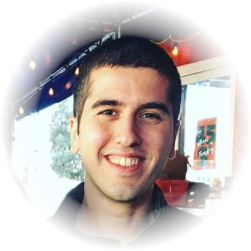

# Timeline

## 2021

### November
#### 1-2 November 2021

In collaboration with Meta Reality Laboratory's Douglas Lanman, we helped organise a successful [augmented reality and virtual reality theme](https://www.frontiersinoptics.com/home/program/theme-virtual-reality/) at [Optica's Frontiers in Optics 2021](https://www.frontiersinoptics.com/home/). [Kaan Akşit](https://kaanaksit.com) presented his work on holographic beaming displays proposal at the same event.
 

### October
#### 1 October 2021 

[Oliver Kingshott](http://oliver.kingshott.com/) joined [University College London's](https://www.ucl.ac.uk) [computer science department](https://www.ucl.ac.uk/computer-science/) as a PhD student.
He is now a member of [Computational light laboratory](https://complight.github.io/) and [Virtual Reality and Computer Graphics group](http://vecg.cs.ucl.ac.uk/academics.html).
His PhD studies will be supervised by [Kaan Akşit](https://kaanaksit.com) and [Tobias Ritschel](https://www.homepages.ucl.ac.uk/~ucactri/).
 

### February
#### 18 February 2021

We appear on [UCL news](https://www.ucl.ac.uk/global/news/2021/feb/second-annual-ucl-osaka-strategic-partner-funds-recipients) for receiving UCL-Osaka university strategic partnership fund.
 

### January
#### 4 January 2021

[Kaan Akşit](https://kaanaksit.com) joined [University College London's](https://www.ucl.ac.uk) [computer science department](https://www.ucl.ac.uk/computer-science/) as an Associate Professor. He is now part of the [Virtual Reality and Computer Graphics group](http://vecg.cs.ucl.ac.uk/academics.html), and he leads the [Computational light laboratory](https://complight.github.io/).
 

## 2020

### November

#### 17 November 2020

[Kaan Akşit](https://kaanaksit.com) and [Jason Orlosky](https://www.jeoresearch.com/research) They have been granted [UCL-Osaka University Strategic Parner Funds](https://www.ucl.ac.uk/global/ucl-osaka-university-strategic-partner-funds) funds. This award is worth `10000 GBP`. The title of our submission is `Development of a joint Telelife technology seminar using virtual reality`.
 

### August

#### 1 August 2020

[Kaan Akşit](https://kaanaksit.com) has left his Senior Research scientist position at NVIDIA in the US, and accepted to join [University College London's](https://www.ucl.ac.uk) [computer science department](https://www.ucl.ac.uk/computer-science/) as an Associate Professor.
 
