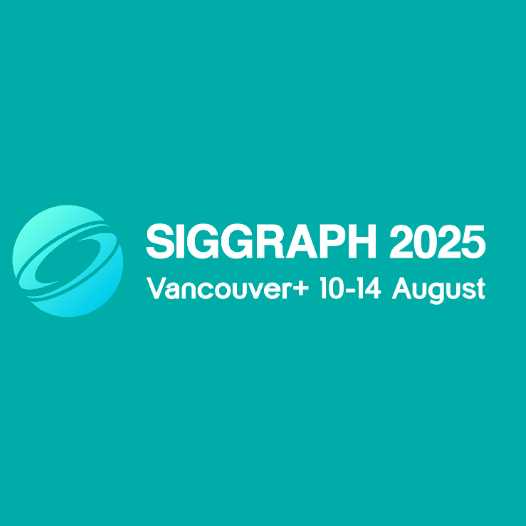
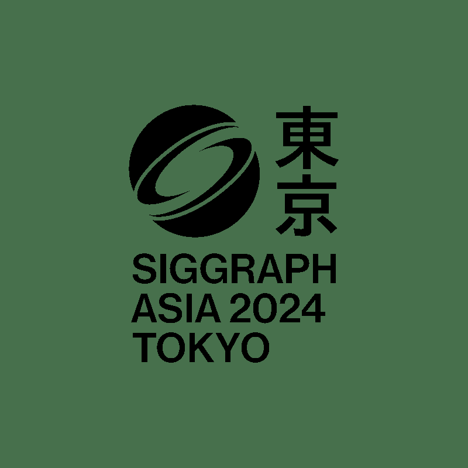
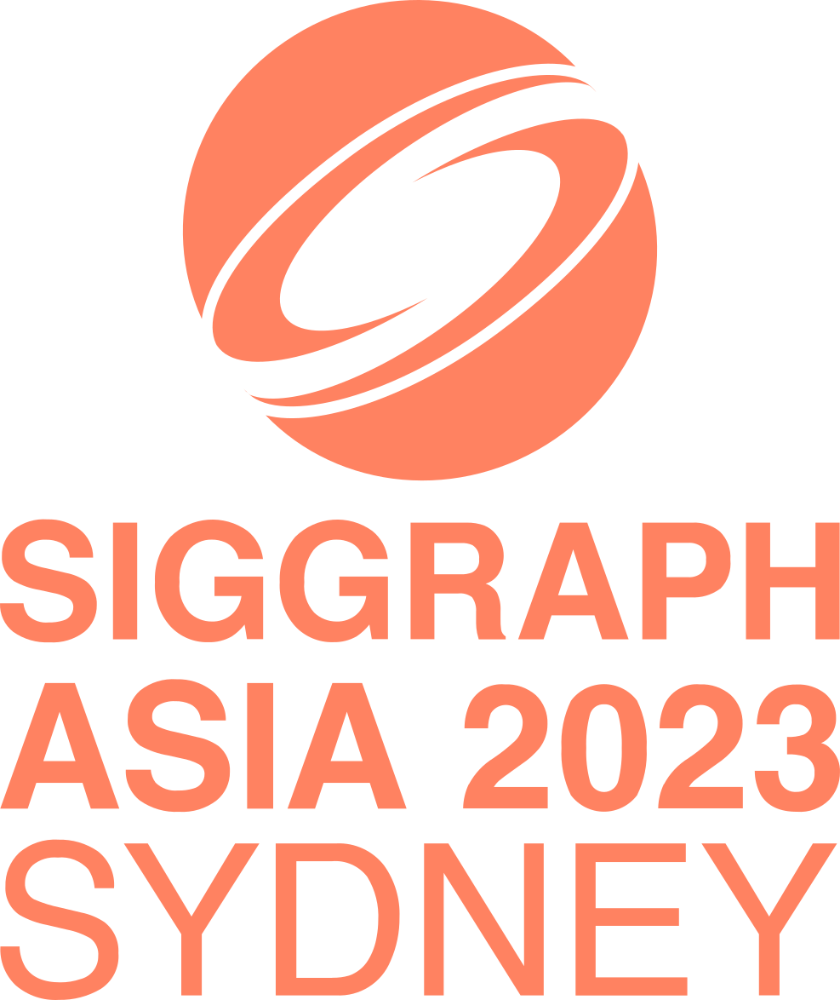
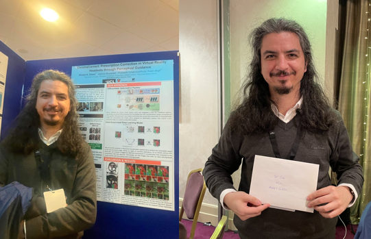
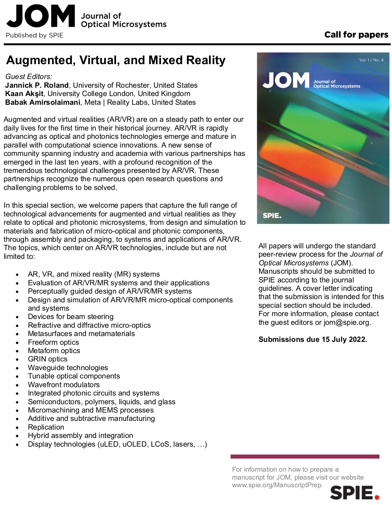

# Timeline

## 2025

### 15 December 2025

⚡ Computational Light Laboratory bridges student potential into scientific success with global academic and industrial partners in 2025. To find out more by visiting [our article](../documentation/year_at_a_glance_2025).

Our work, ["Learned Display Radiance Fields with Lensless Cameras",](../publications/lensless_display_radiance_field.md) is presented under the technical communications program at ACM SIGGRAPH Asia 2025 in Hong Kong, China.
This work is a collaboration with a series of academic partners including
[Ziyang Chen (陈子扬)](https://ziyang.space/),
[Yuta Itoh](https://augvislab.github.io/people/yuta-itoh),
and [Kaan Akşit](https://kaanaksit.com).

Our work, ["Foveation Improves Payload Capacity in Steganography",](../publications/foveated_steganography.md) is presented under the poster program at ACM SIGGRAPH Asia 2025 in Hong Kong, China.
This work is a collaboration with a series of academic partners including
[Lifeng Qiu Lin](https://github.com/Gnefil),
[Henry Kam (甘皓宇)](https://gulpinhenry.github.io/),
[Qi Sun](https://qisun.me/),
and [Kaan Akşit](https://kaanaksit.com).

### 25 November 2025

[Kaan Akşit](https://kaanaksit.com) is pleased to announce that he is elected as a fellow member by the board of directors of Optica (formerly known as The Optical Society (OSA)). [Their decision](https://www.optica.org/about/newsroom/news_releases/2025/optica_announces_2026_fellows_class/) came in the light of Kaan's track record on advanced 3D display and perceptually guided computer graphics techniques.

### 27 October 2025

Our work, ["Learned Single-Pass Multitasking Perceptual Graphics for Immersive Displays",](../publications/multitasking_perceptual_graphics.md) is presented under the oral presentation program at ACM Multimedia 2025 in Dublin, Ireland.
This work is a collaboration with a series of academic and industry partners including
[Doğa Yılmaz](https://yilmazdoga.net/),
[He Wang](https://drhewang.com/),
[Towaki Takikawa](https://tovacinni.github.io/),
[Duygu Ceylan](https://www.duygu-ceylan.com/),
and [Kaan Akşit](https://kaanaksit.com).

### 11 August 2025

Our work, ["Assessing Learned Models for Phase-only Hologram Compression",](../publications/assess_hologram_compression.md) is presented under the posters program at ACM SIGGRAPH 2025 in Vancouver, Canada.
This work is a collaboration with a series of academic and industry partners including
[Zicong Peng](https://scholar.google.com/citations?user=lpi8DvIAAAAJ&hl=zh-CN),
[Yicheng Zhan (战弈诚)](https://albertgary.github.io/),
[Josef Spjut](https://josef.spjut.me/),
and [Kaan Akşit](https://kaanaksit.com).

Our work, ["Efficient Proxy Raytracer for Optical Systems using Implicit Neural Representations",](https://doi.org/10.1145/3721250.3742994) is presented under the posters program at ACM SIGGRAPH 2025 in Vancouver, Canada.
This work is a collaboration with a series of academic partners including
[Shiva Sinaei](https://www.xr.sys.es.osaka-u.ac.jp/en/team/),
[Chuanjun Zheng](https://scholar.google.com.hk/citations?user=9Jk_LC8AAAAJ&),
[Kaan Akşit](https://kaanaksit.com),
and [Daisuke Iwai](https://daisukeiwai.org/).

### 6 February 2025

Our work, ["SpecTrack: Learned Multi-Rotation Tracking via Speckle Imaging",](../publications/spec_track.md) won the honorable mention award under the posters program at ACM SIGGRAPH Asia 2024 in Tokyo, Japan.
These works are collaborations with a series of academic and industry partners including
[Ziyang Chen (陈子扬)](https://ziyang.space/),
[Mustafa Doğa Doğan](https://www.dogadogan.com/),
[Josef Spjut](https://josef.spjut.me/),
and [Kaan Akşit](https://kaanaksit.com).

## 2024

### 3-6 December 2024

[Our innovative research on computational displays and lensless cameras](../documentation/siggraph_asia_2024.md) are presented at ACM SIGGRAPH Asia 2024 in Tokyo, Japan.
These works are collaborations with a series of academic and industry partners including
[Chuanjun Zheng](https://scholar.google.com.hk/citations?user=9Jk_LC8AAAAJ&hl=zh-CN),
[Liang Shi](https://people.csail.mit.edu/liangs/),
[Ozan Cakmakci](https://scholar.google.com/citations?user=xZLjeAMAAAAJ&hl=en), 
[Yicheng Zhan (战弈诚)](https://scholar.google.com/citations?hl=zh-CN&user=x2ptSYUAAAAJ),
[Ziyang Chen (陈子扬)](https://ziyang.space/),
[Mustafa Doğa Doğan](https://www.dogadogan.com/),
[Josef Spjut](https://josef.spjut.me/),
and [Kaan Akşit](https://kaanaksit.com).

### 22 April 2024

Our paper, [`All-optical image denoising using a diffractive visual processor`](https://www.nature.com/articles/s41377-024-01385-6), is recognized as the most downloaded paper in March 2024 by [Nature's Light and Science Applications](https://www.nature.com/lsa/news#mar).
This work is a collaboration between
[Çağatay Işıl](https://cagatayisil.github.io/),
[Tianyi Gan](https://www.linkedin.com/in/tianyi-gan-177214285),
[Fazil Onuralp](https://www.linkedin.com/in/fazil-onuralp-ardic-72a501177),
[Koray Mentesoglu](https://www.linkedin.com/in/korayucla2024/),
[Jagrit Digani](https://www.linkedin.com/in/jagrit06),
[Huseyin Karaca](https://www.linkedin.com/in/huseyinkaraca),
[Hanlong Chen](https://www.linkedin.com/in/%E7%92%90%E5%93%B2-%E9%BB%84-59854b155),
[Jingxi Li](https://scholar.google.com/citations?user=_FMlkBoAAAAJ&hl=en&oi=ao),
[Deniz Mengu](https://scholar.google.com/citations?user=MpYPqXEAAAAJ&hl=en),
[Mona Jarrahi](http://www.seas.ucla.edu/~mjarrahi/mjarrahi.html),
[Kaan Akşit](https://kaanaksit.com),
and [Ozcan Aydogan](https://www.ee.ucla.edu/aydogan-ozcan).
 
 

Our paper, [`Multi-color Holograms Improve Brightness in Holographic Displays`](https://complightlab.com/publications/multi_color/), is awarded with Graphics Replicability Stamp Initiative's [replicability stamp](https://www.replicabilitystamp.org/#https-github-com-complight-multicolor).
This work is a collaboration between
[Koray Kavaklı](https://scholar.google.com/citations?user=rn6XtO4AAAAJ&hl=en&oi=ao),
[Liang Shi](https://people.csail.mit.edu/liangs/),
[Hakan Urey](https://mysite.ku.edu.tr/hurey/),
[Wojciech Matusik](https://cdfg.csail.mit.edu/wojciech),
and [Kaan Akşit](https://kaanaksit.com).
 
 

### 29 January 2024

Our paper, [`AutoColor: Learned Light Power Control for Multi-Color Holograms`](https://complightlab.com/autocolor_/), is presented at [SPIE AR|VR|MR 2024](https://spie.org/conferences-and-exhibitions/ar-vr-mr).
This work is a collaboration between
[Yicheng Zhan(战弈诚)](https://github.com/AlberTgarY),
[Koray Kavaklı](https://scholar.google.com/citations?user=rn6XtO4AAAAJ&hl=en&oi=ao),
[Hakan Urey](https://mysite.ku.edu.tr/hurey/),
[Qi Sun](https://www.immersivecomputinglab.org/),
and [Kaan Akşit](https://kaanaksit.com).
 
 

## 2023

### 13 December 2023

Our paper, 
[`Multi-color Holograms Improve Brightness in Holographic Displays`](https://complightlab.com/publications/multi_color/), 
is presented at 
[SIGGRAPH Asia 2023](https://asia.siggraph.org/2023/).
This work is a collaboration between
[Koray Kavaklı](https://scholar.google.com/citations?user=rn6XtO4AAAAJ&hl=en&oi=ao),
[Liang Shi](https://people.csail.mit.edu/liangs/),
[Hakan Urey](https://mysite.ku.edu.tr/hurey/),
[Wojciech Matusik](https://cdfg.csail.mit.edu/wojciech),
and [Kaan Akşit](https://kaanaksit.com).
 
 

### 30 October 2023

We are pleased to announce an achievement at the [UKRI AI CDT Conference 2023](https://www.ucl.ac.uk/foundational-ai-cdt/foundational-artificial-intelligence-mphilphd) in Bristol, United Kingdom.
[Ahmet Güzel](https://aguzel.github.io/) showcased our research project, [ChromaCorrect](http://complightlab.com/ChromaCorrect/), among a diverse array of over 50 posters at the event.
We are honored to have been awarded **First Prize for Best Poster**, and we thank [Foundational Artificial Intelligence Center at University College London](https://www.ucl.ac.uk/foundational-ai-cdt/foundational-artificial-intelligence-mphilphd). 
 
 

### 12-13 October 2023

Kaan helped organizing [Optical Waveguides: A key to Socially Acceptable Augmented Reality Glasses?](https://www.optica.org/events/incubator_meetings/2023/optical_waveguides_a_key_to_socially_acceptable_ar_glasses/) as an Optica Incubator.
Kaan also gave an invited talk titled `Role of Differentiable Models in Computational Display Research` at the same incubator event.
 
 

### 11 October 2023

Kaan attended and presented at Meta's Academic forum 2023 upon Meta Reality Labs invitation.
Kaan's talk is titled `Unlocking Next-Generation Display Technologies with Holography.`
 
 

### 9-10 October 2023

Kaan helped organizing [Virtual Reality and Augmented Vision theme](https://www.frontiersinoptics.com/home/program/theme-virtual-reality/) at [Optica's Frontiers Optics](https://www.frontiersinoptics.com).
Kaan also gave an invited talk on his group's work, `Headsetless Holographic Virtual Reality Displays` in the same theme.
 
 

### 16 August 2023

We are grateful to Optica for inviting our <a href="https://aguzel.github.io/">Ahmet Hamdi Güzel</a> to present his work at the Vision and Color summer data blast webinar. 
Have you missed it? The recording is now <a href="https://www.optica.org/media_library/?videoId=6334035625112">online</a>.
 
 

### 28 June 2023

Kaan presented an invited talk titled `Could holographic displays be the key to achieving realism?` at [Stanford University](https://scien.stanford.edu/index.php/event/professor-kaan-aksit-univ-college-london-on-holographic-displays/).
 
 

### 1 June 2023

In her latest article, "[The Promise of Holographic Displays](https://cacm.acm.org/news/273481-the-promise-of-holographic-displays/fulltext)," [Sandrine Ceurstemont](https://www.linkedin.com/in/sandrine-ceurstemont-314b701/) gathered perspectives on the promise of holographic displays and provided some space for ours. 
 
 

### 21 April 2023

Our paper, 
[`ChromaCorrect: Prescription Correction in Virtual Reality Headsets through Perceptual Guidance`](http://complightlab.com/ChromaCorrect/), 
is published at [Optica's Biomedical Optics Express](https://opg.optica.org/boe).
This work is a result of a collaboration with 
[Ahmet H. Güzel](https://aguzel.github.io/), 
[Jeanne Beyazian](https://www.linkedin.com/in/jeanne-beyazian/?trk=public_profile_browsemap&originalSubdomain=uk),
[Praneeth Chakravarthula](https://www.cs.unc.edu/~cpk/),
and [Kaan Akşit](https://kaanaksit.com).
 
 

### 28 March 2023

Our paper, 
[`HoloBeam: Paper-Thin Near-Eye Displays`](https://complightlab.com/publications/holobeam/), 
is presented at 
[IEEE VR 2023](https://ieeevr.org/2023/).
This work is a collaboration between
[Yuta Itoh](https://www.ar.c.titech.ac.jp/people/yuta-itoh),
and [Kaan Akşit](https://kaanaksit.com).
 
 
 

Our paper, 
[`Realistic Defocus Blur for Multiplane Computer-Generated Holography`](https://complightlab.com/publications/realistic_defocus_cgh/), 
is presented at 
[IEEE VR 2023](https://ieeevr.org/2023/).
This work is a collaboration between
[Koray Kavaklı](https://scholar.google.com/citations?user=rn6XtO4AAAAJ),
[Yuta Itoh](https://www.ar.c.titech.ac.jp/people/yuta-itoh),
[Hakan Ürey](https://mysite.ku.edu.tr/hurey/),
and [Kaan Akşit](https://kaanaksit.com).
 
 
 

### 15 March 2023

Kaan presented an invited talk titled `Could holographic displays be the key to achieving realism in displays?`.
We are thankful to [Huawei, United Kingdom](https://www.huawei.com/uk/) for their kind hospitality.
 
 

### 6 February 2023

Kaan presented an invited talk titled [`Could holographic displays be the key to achieving realism?`](https://youtu.be/kqOQLFaTZwU?t=702).
We are thankful to [University of Rochester's institute of optics](https://www.hajim.rochester.edu/optics/) for their kind hospitality.
 
 

### 4 January 2023

We are thankful to [TÜBİTAK's](https://tubitak.gov.tr/en/funds/scientific-events/national-support-programmes/content-2224-a-grant-program-for-participation-in-scientific-meetings-abroad) 2224-A support for our valuable member and a PhD student, [Koray Kavaklı](https://scholar.google.com/citations?user=rn6XtO4AAAAJ&hl=en&oi=ao) in presenting his work at [SPIE's Photonics West 2023](https://spie.org/conferences-and-exhibitions/photonics-west?SSO=1).
This fund covers a significant portion of his attendance at SPIE's Photonics West.
 
 

### 3 January 2023

We are thankful to [Oracle](https://www.oracle.com/cloud/compute/gpu/) for offering us to rely on their cloud infrastructure support for our computational needs.
We had to decline their award as we have purchased new computational resources most recently.
 
 

## 2022

### 18 November 2022

Our paper,
[`Unrolled Primal-Dual Networks for Lensless Cameras`](https://github.com/complight/unrolled_primal_dual_networks), 
is published at 
[Optica's Optics Express](https://opg.optica.org/oe).
This work is a result of a collaboration between 
[Oliver Kingshott](https://oliver.kingshott.com/), 
[Nick Antipa](http://nickantipa.com/), 
[Emrah Bostan](https://emrahbostan.com/),
and [Kaan Akşit](https://kaanaksit.com).
 
 

### 25 October 2022

Our paper, 
[`Metameric Inpainting for Image Warping`](https://doi.org/10.1109/TVCG.2022.3216712), 
is published at [IEEE's Transaction on Visualization and Computer Graphics](https://ieeexplore.ieee.org/xpl/RecentIssue.jsp?punumber=2945).
This work is a collaboration between 
[Rafael Kuffner dos Anjos](https://rafaelkuffner.github.io/), 
[David Robert Walton](https://drwalton.github.io/), 
[Sebastian Friston](https://wp.cs.ucl.ac.uk/sebastianfriston/), 
[David Swapp](http://www.cs.ucl.ac.uk/people/D.Swapp/), 
[Anthony Steed](https://wp.cs.ucl.ac.uk/anthonysteed/), 
[Tobias Ritschel](https://www.homepages.ucl.ac.uk/~ucactri/),
and [Kaan Akşit](https://kaanaksit.com).
 
 

### 19 October 2022

In collaboration with Meta Reality Laboratory's [Douglas Lanman](https://alumni.media.mit.edu/~dlanman/), we helped organise a successful [augmented reality and virtual reality theme](https://www.frontiersinoptics.com/home/program/theme-virtual-reality/) at [Optica's Frontiers in Optics 2022](https://www.frontiersinoptics.com/home/).
[Kaan Akşit](https://kaanaksit.com) presented a talk titled `Realistic Image Reconstruction with Multiplane Computer-Generated Holography`, while [Koray Kavaklı](https://scholar.google.com/citations?user=rn6XtO4AAAAJ&hl=en&oi=ao) presented a talk titled `Introduction to Odak: a Differentiable Toolkit for Optical Sciences, Vision Sciences and Computer Graphics`.
 
 

### 3 August 2022

Our course, [Optimizing Vision and Visuals: Lectures on Cameras, Displays and Perception](https://complightlab.com/teaching/siggraph2022_optimizing_vision_and_visuals/) is available and online in [SIGGRAPH 2022](https://s2022.siggraph.org/).
This work is a collaboration between [Koray Kavaklı](https://scholar.google.com/citations?user=rn6XtO4AAAAJ), [David Walton](https://drwalton.github.io/), [Nick Antipa](https://scholar.google.com/citations?user=15xSd1gAAAAJ&hl=en), [Rafał Mantiuk](https://www.cl.cam.ac.uk/~rkm38/), [Douglas Lanman](https://alumni.media.mit.edu/~dlanman/) and [Kaan Akşit](https://kaanaksit.com).
 
 

### 23 June 2022

We are grateful to the Meta Reality Labs for supporting our research through the inclusive rendering initiative 2022.
Their award will enable us to investigate inclusive graphics pipelines in terms of human visual perception.
Their award is worth `75000 USD`.
 
 

### 5 May 2022

Our panel, [`Telelife: A Vision of Remote Living in 2035`](https://programs.sigchi.org/chi/2022/program/session/73405), is presented at [CHI 2022](https://chi2022.acm.org/).
This work is a collaboration between 
[Kenan Bektaş](https://www.unisg.ch/en/personenverzeichnis/dc93dc3e-fad5-45ce-a9dd-fa7bf0b64cd9), 
[Jeeeun Kim](http://www.jeeeunkim.com/), 
[Kiyoshi Kiyokawa](https://carelab.info/en/), 
[Anthony Steed](https://wp.cs.ucl.ac.uk/anthonysteed/), 
[Tobias Höllerer](https://sites.cs.ucsb.edu/~holl/), 
[Nataliya Kosmyna](https://www.media.mit.edu/people/nkosmyna/overview/), 
[Misha Sra](https://sites.cs.ucsb.edu/~sra/), 
[Jason Orlosky](https://www.jeoresearch.com/research), 
and [Kaan Akşit](https://kaanaksit.com).
 
 

### 14 March 2022

We introduce our work, [Metameric Varifocal Holograms](https://vr.cs.ucl.ac.uk/research/pipelines/metameric-varifocal-holography/), at [IEEE VR 2022](https://ieeevr.org/2022/program/papers/#displays).
This work is a collaboration between David R. Walton, Koray Kavakli, Rafael Kuffner dos Anjos, David Swapp, Tim Weyrich, Hakan Urey, Anthony Steed, Tobias Ritschel and Kaan Akşit.
[David Walton](https://drwalton.github.io/) presented the work at the conference. 
 
 

[Kaan Akşit](https://kaanaksit.com) served as [program committee](https://ieeevr.org/2022/committees/program-committee/) for journal papers, and also as [technical achievement and lifetime achievement awards committee member](../media/ieee_vgtc_2022_award.png).
 
 

### 11 March 2022

[Kaan Akşit](https://kaanaksit.com) together with [Jannick Rolland](https://www.hajim.rochester.edu/optics/people/faculty/rolland_jannick/index.html) and [Babak Amirsolaimani](https://www.linkedin.com/in/ACoAAAzN_NcBzf3_TVXGZymiZkuN3dyLA1ZIyMM?lipi=urn%3Ali%3Apage%3Ad_flagship3_detail_base%3Bnca4SqheQuu0wdRw8Kfg4A%3D%3D) is acting as a guest editor for [Journal of Optical Microsystems](https://www.spiedigitallibrary.org/journals/journal-of-optical-microsystems/call-for-papers#navBarAnchor) from [SPIE](https://spie.org/?SSO=1) at a special issue targetting optics research in augmented, virtual and mixed reality.
Here is a [link](../media/jom_ar_vr_mr_call.png) for call flyer and to submit your work, please follow this [link](https://www.spiedigitallibrary.org/journals/journal-of-optical-microsystems/call-for-papers#navBarAnchor).
 
 

### 23 February 2022

[Kaan Akşit](https://kaanaksit.com) serves as a program committee for [EGSR 2022](https://egsr.eu/2022/committee/), which will take place as a hybrid conference, virtual and physically located in Czech Republic's Prag.
 
 

### 24 January 2022

We presented two invited talks at [SPIE's Photonics West](https://spie.org/conferences-and-exhibitions/photonics-west?SSO=1). Our first talk is on [Perceptually guided computer-generated holography](https://spie.org/photonics-west/presentation/Perceptually-guided-computer-generated-holography/12024-4?SSO=1), and our second talk is on [Beaming Displays: Towards Displayless Augmented Reality Near-eye Displays](https://spie.org/photonics-west/presentation/Beaming-Displays-Towards-Displayless-Augmented-Reality-Near-eye-Displays/12019-3).
 
 

### 17 January 2022

We thank the next byte podcast for covering [our collaboration on SensiCut project with MIT](https://t.co/ymdm9KTsUN).
They did a great job in explaining our in their podcast.
You can reach the podcast using [this link](https://the-next-byte-wevolver.simplecast.com/episodes/33-the-solar-panel-that-broke-the-world-record).
 
 

## 2021

### 29 November 2021

Our vision, "Telelife: The Future of Remote Living", is published at [Frontiers in Virtual Reality](https://doi.org/10.3389/frvir.2021.763340). We share our vision for the future, specifically in the year 2035.
 
 

### 12 November 2021

Our invited work, "Learned Holographic Light Transport", is published at [Optica's Applied Optics](https://doi.org/10.1364/AO.439401). We show that light transport can be made more accurate by learning hardware dependent kernels.
 
 

### 8 November 2021

We are grateful to the Royal Society for awarding us with their [research grants 2021 round two scheme](https://royalsociety.org/grants-schemes-awards/grants/research-grants/). Their award will enable us to invent new holographic light transport models in the future. This is award is worth `14994.65 GBP`. The title of our submission is `Learned models for Computer-Generated Holography`.
 
 

### 1-2 November 2021

In collaboration with Meta Reality Laboratory's Douglas Lanman, we helped organise a successful [augmented reality and virtual reality theme](https://www.frontiersinoptics.com/home/program/theme-virtual-reality/) at [Optica's Frontiers in Optics 2021](https://www.frontiersinoptics.com/home/). [Kaan Akşit](https://kaanaksit.com) presented his work on holographic beaming displays proposal at the same event.
 
 

### 18 February 2021

We appear on [UCL news](https://www.ucl.ac.uk/global/news/2021/feb/second-annual-ucl-osaka-strategic-partner-funds-recipients) for receiving UCL-Osaka university strategic partnership fund.
 
 
 

### 4 January 2021

[Kaan Akşit](https://kaanaksit.com) joined [University College London's](https://www.ucl.ac.uk) [computer science department](https://www.ucl.ac.uk/computer-science/) as an Associate Professor. He is now part of the [Virtual Reality and Computer Graphics group](http://vecg.cs.ucl.ac.uk/academics.html), and he leads the [Computational light laboratory](https://complight.github.io/).
 
 

## 2020

### 17 November 2020

[Kaan Akşit](https://kaanaksit.com) and [Jason Orlosky](https://www.jeoresearch.com/research) They have been granted [UCL-Osaka University Strategic Parner Funds](https://www.ucl.ac.uk/global/ucl-osaka-university-strategic-partner-funds) funds. This award is worth `10000 GBP`. The title of our submission is `Development of a joint Telelife technology seminar using virtual reality`.
 
 

### 1 August 2020

[Kaan Akşit](https://kaanaksit.com) has left his Senior Research scientist position at NVIDIA in the US, and accepted to join [University College London's](https://www.ucl.ac.uk) [computer science department](https://www.ucl.ac.uk/computer-science/) as an Associate Professor.
 
 
